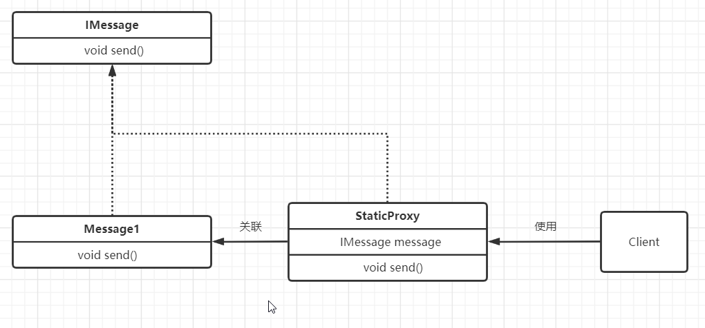

```java
public interface IMessage {
    public void send();
}
```
```java
public class Message1 implements IMessage{
    @Override
    public void send(){
        System.out.println("Message1");
    }
}
```
```java
public class StaticProxy implements IMessage{
    IMessage message;
    public void setMessage(IMessage message){
        this.message=message;
    }
    @Override
    public void send() {
        System.out.println("我们可以在不改变被代理对象的情况下，" +
                "增加一些功能");
        message.send();
        System.out.println("我们可以在不改变被代理对象的情况下，" +
                "增加一些功能");
    }
}
```
```java
public class Client {
    public static void main(String[]args){
        StaticProxy proxy=new StaticProxy();
        proxy.setMessage(new Message1());
        proxy.send();
    }
}
```

上述代码就是一个静态代理模式  
1，**IMessage**为业务接口，**Message1**为业务实现类  ，**StaticProxy**为代理类  
2，StaticProxy与Message1实现了同一个接口  
3，StaticProxy并没有实现具体的业务，而是通过调用Message1的相关方法来实现业务，并且我们可以在StaticProxy中增加一些功能


    
###静态代理设计模式  
* 在编译时，就已经把接口，被代理类，代理类确定下来，编译完成后，静态代理类是一个实际的class文件
* 代理类和被代理类实现同一个接口

###静态代理的优点
可以在不修改**被代理类**的情况下，通过**代理类**增加被代理类的功能


###静态代理的缺点
* 由于代理类和被代理类要实现同一个接口，所以一个接口就要一个静态代理类，冗余
* 不易维护，一旦接口增加方法，被代理类和代理类都要增加方法

