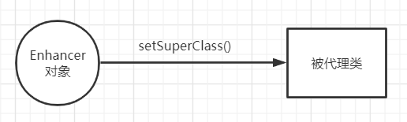
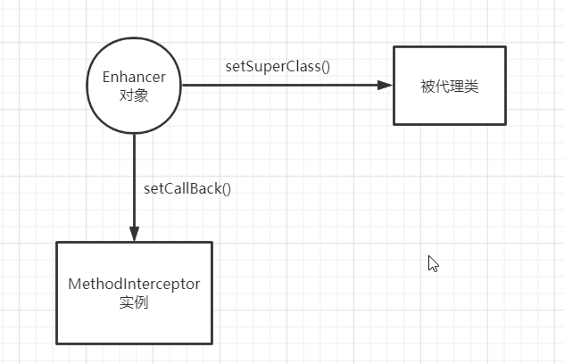
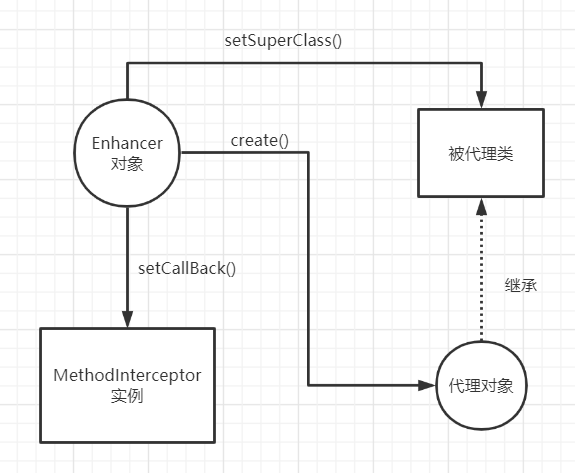
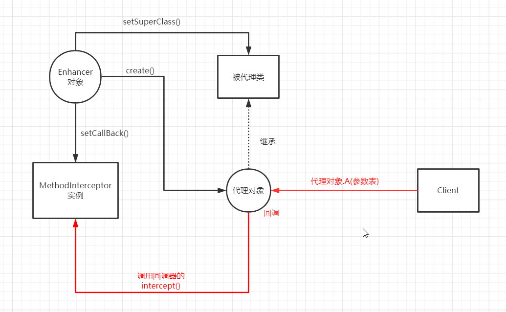

JDK提供的动态代理——基于接口  
cglib提供的动态代理——基于类  
***
**一，MethodInterceptor接口**   
```
public interface MethodInterceptor extends Callback {
    Object intercept(Object o, Method method, Object[] objects, MethodProxy methodProxy) throws Throwable;
}
o:被代理对象  
method：被代理方法的Method对象
objects:参数表
methodProxy:对方法的代理，methodProxy.invokeSuper()表示对被代理方法的调用
```  
**二，Enhancer**   
**1.** 
```
public void setSuperclass(Class superclass)
将被代理类设置为父类
```
**2.**
```
public void setCallback(Callback callback);
MethodInterceptor接口是Callback的子接口，这里一般传入一个MethodInterceptor实例
```
**3.**  
```
public Object create();
返回动态代理对象
```
**三，实现动态代理**   
**1.** 自定义一个实现了MethodInterceptor接口的类
```
public class FoodMethodInterceptor implements MethodInterceptor {
    @Override
    public Object intercept(Object o, Method method, Object[] objects, MethodProxy methodProxy) throws Throwable {
        System.out.println("在代理开始之前");
        System.out.println(method.getName());
        methodProxy.invokeSuper(o,objects);
        System.out.println("代理结束");
        return o;
    }
}
```
**2.** 创建一个Enhancer对象enhancer  
**3.** enhancer.setSuperClass()——为enhancer对象设置父类  
  

**4.** enhancer.setCallBack(new FoodMethodInterceptor)——为enhancer对象设置回调器  
   

**5.** enhancer.create()——获取代理对象   
  


这里获取的代理对象，继承自setSuperClass()中设置的父类  
我们调用代理对象中的方法A(参数表),那么在方法A中，会将取得方法A的Method对象，并生成对应的MethodProxy,并把参数表转换为objects，调用回调器中的intercept()方法，完成代理   
  
***
##代码如下
```java
public class Test {
    public static void main(String[]args){
        //1创建增强器
        Enhancer enhancer=new Enhancer();
        //2设置代理类
        enhancer.setSuperclass(Food.class);
        //3设置回调
        enhancer.setCallback(new FoodMethodInterceptor());
        //4获得代理对象
        Food food=(Food) enhancer.create();
        food.buy();
        food.eat();
    }
}
```