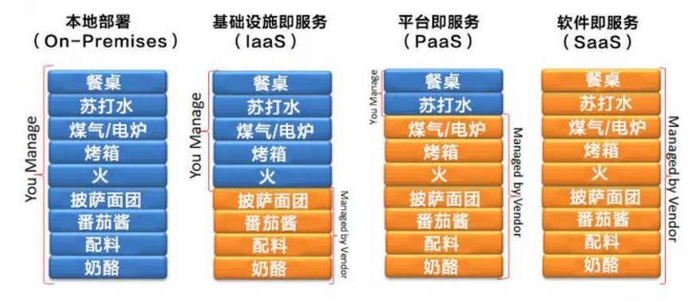
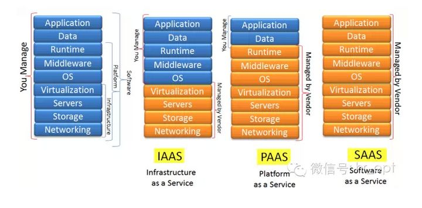

#### 0. 本地部署

如果公司采用本地部署的方式，那么从网络配置，存储配置，购买服务器，配置虚拟机，安装OS，安装中间件，安装运行时环境，准备数据，应用部署全都要自己完成

#### 1. IaaS：Inffrastructure-as-a-Service基础设施即服务

IaaS公司提供基础模块化服务（存储服务，网络服务，服务器等），我们租用即可

#### 2. PaaS：Platform-as-a-Service平台即服务

PaaS公司，提供应用开发所需的基础功能模块（操作系统，运行环境等），我们直接在PaaS提供的环境上进行应用开发即可

#### 3. SaaS：Software-as-a-Service软件即服务

