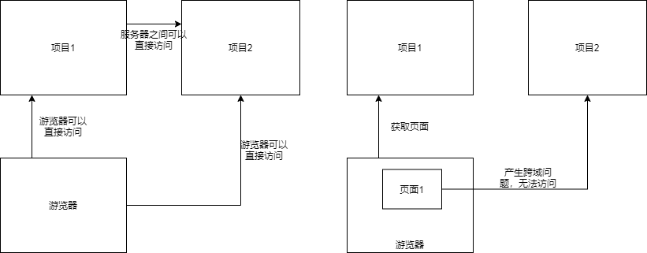
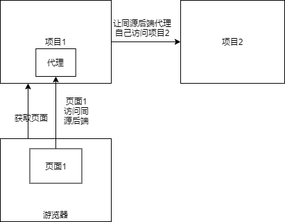

### 1. 跨域问题产生原因

游览器的同源策略

**同源**——协议同，IP同，端口同



如果游览器获得项目1的前端页面，而后项目1的前端页面中有**脚本**可以对项目2发出了请求，会产生跨域问题，CROS ERROR

阻止A域的脚本对其他域发起访问


### 2. HTML解决跨域

在响应报文中加入一些解决跨域问题的Header

* Access-Control-Allow-Origin
* Access-Control-Max-Age
* Access-Control-Allow-Method

```java
    @GetMapping("/hello")
    public String sayHello( HttpServletResponse response ){
        response.addHeader ("Access-Control-Allow-Origin","http://localhost:8081");
        return "hello";
    }
```


SpringBoot提供了@CrossOrigin

```java
    @GetMapping("/hello")
    @CrossOrigin
    public String sayHello(){
        return "hello";
    }
```


### 3. Java反向代理




### 4. Nginx解决跨域

