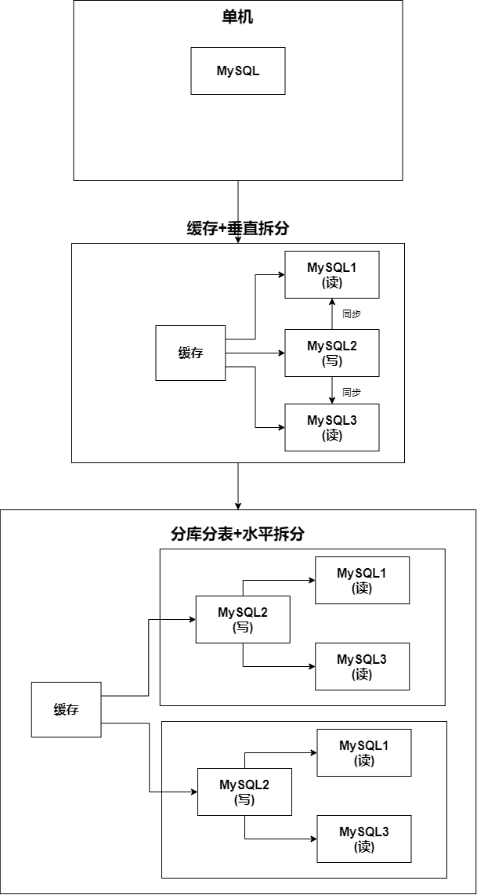

**分库分表+水平拆分**

* 将一个MySQL主库，拆分为多个主库分片
* 每个主库分片都搭建一个主从复制集群

**水平分表**——以行为单位对表进行拆分——解决数据量大的存储问题

**垂直分表**——将一张大表按照列拆分为多张小表

* 让单条记录更小，每页可以容纳更多的行，缩小数据扫描的范围
* 垂直分表的依据
  * 单表数据量可能过千万
  * 字段超过20个且包含了超长的varchar，clog，blog
