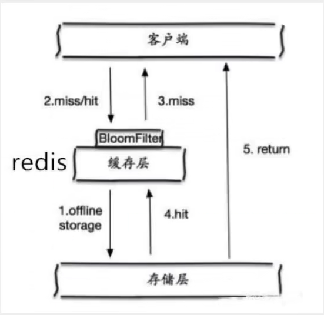
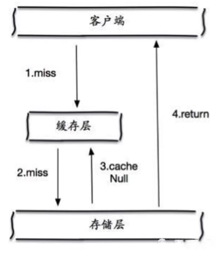
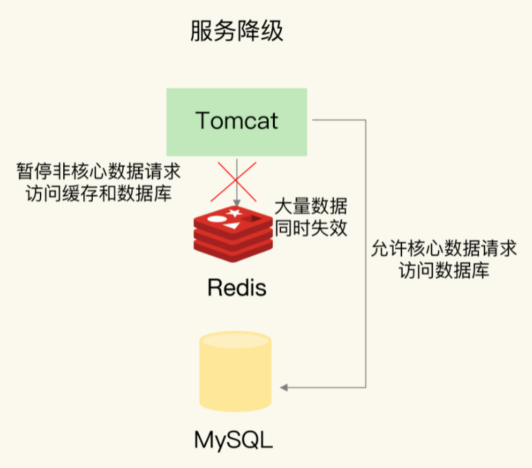
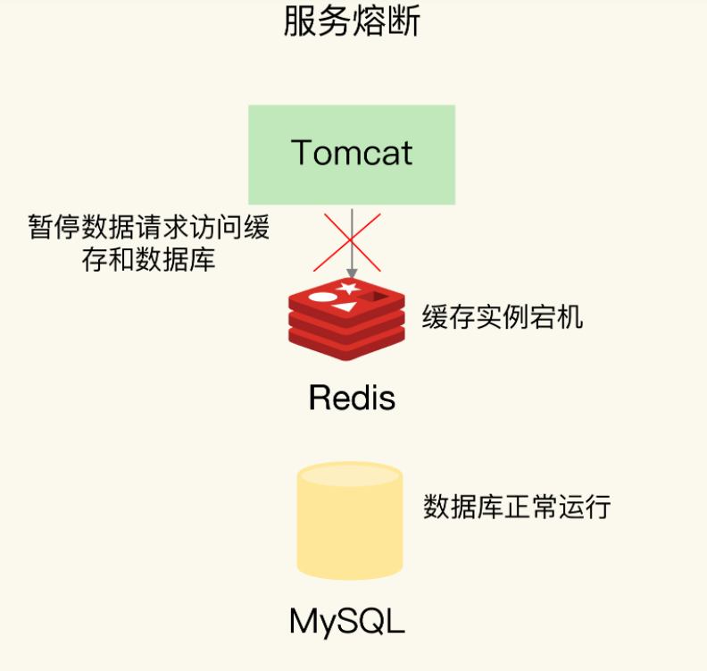
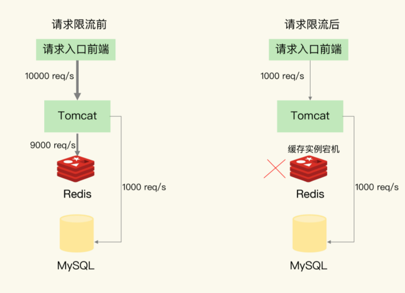

# 1. 缓存穿透

## 1.1 什么是缓存穿透

用户查询一个数据，Redis中没有(缓存没命中)，于是向持久层数据库查询，持久层数据库也没有，并且不将空结果写入缓存

当这样的查询很多时，缓存都没有命中，于是都去请求持久层数据库，失去了缓存保护后端持久层的意义，这就是缓存穿透

## 1.2 解决方案

### 1.2.1 布隆过滤器拦截

布隆过滤器是一种数据结构，对查询使用的所有参数以hash形式存储，在控制层进行校验，判断key是否在数据库中，不存在就直接返回，避免了对底层存储系统的查询压力

### 1.2.2. 缓存空对象

当存储层未命中后，即使返回空对象也存储起来，同时设置一个过期时间

#### **缓存空对象的问题**

1. 如果空值能被缓存起来，这就意味着缓存需要更多的空间存储更多的键

2. 即使对空值设置了过期时间，还是会存在缓存层和存储层的数据有一段时间的不一致
   
   > 例如一个空值设置了过期时间5min，这期间如果持久层中添加了这个数据，那么这段时间缓存层和持久层的数据就不一致

# 2. 缓存击穿

## 2.1 什么是缓存击穿

缓存击穿——指的是一个key非常热点，并发量很大

这个key过期的瞬间，大量的请求并发访问持久层数据库，导致数据库瞬间压力过大，可能让应用崩溃

## 2.2 解决方案

### 2.2.1. 设置热点数据永不过期

* 从缓存层面——不设置过期时间
* 从功能层面——为每个key设置一个逻辑过期时间，当发现超过逻辑过期时间后，使用专门的线程去持久层获取最新的数据来更新key

#### 问题

* 会出现数据不一致的情况，并且代码复杂

### 2.2.2. 加互斥锁

分布式锁，使用分布式锁，保证对于每个key，某一时间只有一个线程去查询持久层数据

#### 问题

* 可能存在死锁和线程池阻塞的风险，但是一致性好

# 3. 缓存雪崩

## 3.1 什么是缓存雪崩

缓存雪崩有2种原因

* **缓存中有大量数据同时过期**
  
  > 例如：马上到双十二零点，这波商品数据集中放入缓存，假设缓存1小时，到了凌晨1点时，这批商品的缓存都过期了，对这批商品的访问，都直接落在了持久层数据库上。

* **Redis宕机，无法处理请求**
  
  > 导致大量请求一次性达到持久层

## 3.2 解决方案

### 3.2.1 缓存中大量数据同时过期的解决方案

* 微调过期时间——避免给大量的数据设置相同的过期时间  

* 数据预热——在大流量访问到达前手动重新缓存key  

* 服务降级
  
  * 业务访问非核心数据，暂时停止从缓存中查询这些数据，而是直接返回预定义信息 or NULL or 错误信息
  * 业务访问核心数据，允许查询缓存，如果缓存缺失，可以继续从持久层查询数据
  
  

### 3.2.2 Redis宕机，无法处理请求

* **在业务中实现服务熔断or请求限流机制**
  
  * **服务熔断**：发生缓存雪崩时，暂停业务对缓存系统的接口调用，等Redis重新恢复服务后，再允许业务调用缓存系统
    
    
  
  * **请求限流**：允许少量请求直接访问持久层数据库
    
    

# 4. 缓存污染

有些数据访问次数非常少，如果这样的数据留在内存中，只会白白占用缓存空间——这就是缓存污染

**我们可以通过设置缓存回收策略解决**

## 4.1 LRU缓存策略

LRU只会关注数据最近一次被访问的时间，在处理 **扫描式单次查询**时，无法解决缓存污染

**扫描时单次查询**——对大量数据进行一次全体读取，每个数据都会被读取，而且只会被读取一次

使用LRU，这些数据会在缓存中存在很长一段时间，造成缓存污染

## 4.2 LFU缓存策略

所以正确的做法应该是使用LFU缓存策略
