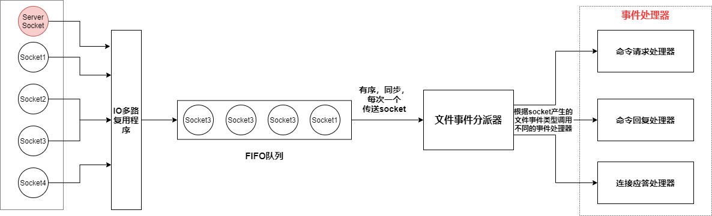

Redis服务器是一个事件驱动程序，需要处理**两类事件**

* **文件事件**
* **时间事件**


# 1. 文件事件与文件事件处理器

## 1.1 文件事件

* 文件事件是Redis对**socket操作的抽象**

* 每当一个socket准备执行connect，read，write，close等操作时，就会产生一个对应的文件事件
  
  * 如果Client通过socket想要执行write操作/close操作——产生 **AE_READABLE事件**
    
    如果Client想要与Redis Server connect——产生 **AE_READABLE事件**
  
  * 如果Client通过socket想执行read操作——产生 **AE_WRITABLE事件**


## 1.2 文件事件处理器

* Redis通过 **文件事件处理器**对文件事件进行处理，其有4个部分
  
  * socket
    * Server Socket（connect）
    
    * 为Client建立的已连接的Socket（write，read，close）
  * IO多路复用程序
  * 文件事件分派器
  * 事件处理器
    * 连接应答处理器——主要处理connect操作
    
    * 命令请求处理器——主要处理write和close操作
    
    * 命令回复处理器——主要处理read操作


## 1.3 文件事件处理器工作流程

1. IO多路复用程序监听多个Socket

2. 当IO多路复用程序监听到某个Socket上由事件达到，将该Socket放入一个FIFO队列

3. IO多路复用程序有序，同步，每次一个地将一个Socket从FIFO队列中取出，传递给文件事件分派器

4. 文件事件分派器接收到Socket后，根据Socket上事件的类型，调用相应的事件处理器




## 1.4 IO多路复用程序

Redis的IO多路复用程序是通过包装**select/poll/epoll/kqueue**实现的

程序在编译时会自动选择系统中性能最高的IO多路复用函数来作为底层实现


## 1.5 事件处理器

### 1.5.1 连接应答处理器

* Redis Server初始化时，会将 连接应答处理器与 server socket的AE_READABLE事件关联起来

* 如果一个Client想与Server建立连接，那么会向server socket发送连接请求，server socket会产生一个 **AE_READABLE事件**，交于连接应答处理器处理
  
  - 连接应答处理器会与Client建立联系，返回一个已连接的Socket
  - 并将Socket的**AE_READABLE事件**与**命令请求处理器**关联，让Client可以向Redis Server发送命令
  - 将client的socket的**AE_WRITABLE事件**与**命令回复处理器**关联，让Client可以接收到Redis Server的回复

### 1.5.2 命令请求处理器

* Redis Server会将为Client建立的已连接的Socket的AE_READABLE事件与 命令请求处理器关联起来，让Client可以向Redis Server发送命令

* 一般处理Client发出的write和close请求

### 1.5.3 命令回复处理器

* Redis Server会将为Client建立的已连接的Socket的AE_WRITABLE事件与命令回复处理器关联起来，让Client可以接收到Redis Server的回复

* 一般处理Client的read请求


## 1.6 完整的服务器与Client示例


1. 一个Redis Client向Redis Server发起建立连接请求，服务器的server socket将产生AE_READABLE事件，交由连接应答处理器处理
   * 连接应答处理器会为Client创建socket
   * 并将client的socket的AE_READABLE事件与命令请求处理器关联，让Client可以向Redis Server发送命令，
   * 将client的socket的AE_WRITABLE事件与命令回复处理器关联，让Client可以接收到Redis Server的回复
2. Client发送命令请求，client的socket产生AE_READABLE事件，交由命令请求处理器处理
3. 当Client尝试读取回复时，client的socket产生AE_WRITABLE事件，交由命令回复处理器处理，命令回复处理器将命令回复写入client的socket中
4. 如果Client要与Redis Server断开连接，那么Redis Server会接触client的socket与命令请求处理器，命令回复处理器的关联

# 2. 时间事件

Redis的时间事件分为

* 定时事件（执行完后删除）
* 周期性事件（执行完后更新when）

```c
typedef struct aeTimeEvent{
    long long id; //全局唯一ID
    long when_sec;//秒级时间戳,时间事件触发时间
    long when_ms;//毫秒级时间戳,时间事件触发时间
    aeTimeProc * timeProc; //时间事件处理器
    aeEventFinalizerProc * finalizerProc; //事件结束回调函数
    void * clientData; //私有数据
    struct aeTimeEvent * prev; //前继节点
    struct aeTimeEvent * next; //后继节点
};
```

* 所有的时间事件组成一个链表，Redis遍历该链表，找到到达的时间事件，调用其相应的时间事件处理器
