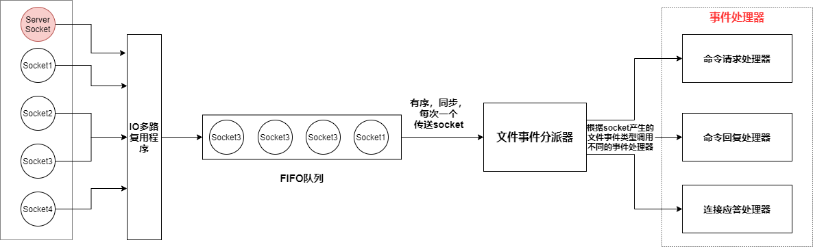

Redis服务器是一个事件驱动程序，需要处理**两类事件**

* **文件事件**
* **时间事件**：Redis Server中的一些操作需要定时执行，时间事件是Server对这些定时任务的抽象

# 1. 文件事件与文件事件处理器

* Redis服务器通过socket与Client进行连接

* 文件事件是服务器对socket操作的抽象

* 每当一个socket准备执行 连接应答，写入，读取，关闭 等操作时，就会产生一个对应的文件事件

  * 如果Client通过socket想要执行write操作/close操作——产生 **AE_READABLE事件**

    如果Client想要与Redis Server建立连接——产生 **AE_READABLE事件**

  * 如果Client通过socket想执行read操作——产生 **AE_WRITABLE事件**

* Redis通过 **文件事件处理器**对文件事件进行处理，其有4个部分

  * socket——包括**为Client连接建立的socket**，和**Redis服务器自己的server socket**
  * IO多路复用程序
  * 文件事件分派器
  * 事件处理器

* IO多路复用程序同时监听多个socket

* IO多路复用程序监听到某个socket准备执行操作，就会将socket放入一个FIFO队列

* 在FIFO队列中，IO多路复用程序有序，同步，每次一个socket向文件事件分派器传送socket，只有上一个socket处理完，IO多路复用程序才会文件事件分派器传送下一个socket

* 文件事件分派器接收到socket后，根据**socket产生的文件事件的类型**，调用相应的事件处理器

## 1.1 IO多路复用程序的实现

Redis的IO多路复用程序是通过包装**select/epoll/evport/kqueue**实现的

程序在编译时会自动选择系统中性能最高的IO多路复用函数来作为底层实现

## 1.2 事件处理器

### 1.2.1 连接应答处理器

Redis Server初始化时，会将 连接应答处理器与 server socket的AE_READABLE事件关联起来

如果一个Client想与Server建立连接，那么会向server socket发送连接请求，server socket会产生一个 **AE_READABLE事件**，交于连接应答处理器处理

### 1.2.2 命令请求处理器

Redis Server会将 Client的socket的AE_READABLE事件与 命令请求处理器关联起来

当Client向Redis Server发送命令请求时，Client的socket会产生AE_READABLE事件，交于命令请求处理器处理，并执行client的socket的读入操作

### 1.2.3 命令回复处理器

服务器会将client的socket的AE_WRITABLE事件与命令回复处理器关联起来

当Client准备好接收服务器传回的命令回复时，会产生AE_WRITABLE事件，交由命令回复处理器处理，并执行client的socket的写入操作

## 1.3 完整的服务器与Client示例

1. 一个Redis Client向Redis Server发起建立连接请求，服务器的server socket将产生AE_READABLE事件，交由连接应答处理器处理
   * 连接应答处理器会为Client创建socket
   * 并将client的socket的AE_READABLE事件与命令请求处理器关联，让Client可以向Redis Server发送命令，
   * 将client的socket的AE_WRITABLE事件与命令回复处理器关联，让Client可以接收到Redis Server的回复
2. Client发送命令请求，client的socket产生AE_READABLE事件，交由命令请求处理器处理
3. 当Client尝试读取回复时，client的socket产生AE_WRITABLE事件，交由命令回复处理器处理，命令回复处理器将命令回复写入client的socket中
4. 如果Client要与Redis Server断开连接，那么Redis Server会接触client的socket与命令请求处理器，命令回复处理器的关联

# 2. 时间事件

Redis的时间事件分为

* 定时时间（执行完后删除）
* 周期性时间（执行完后更新when）

一个时间事件主要有三个属性

* id：服务器为时间事件创建的全局唯一ID
* when：时间戳，时间达到时间
* timeProc：时间事件处理器（到时，执行相应的处理器来处理事件）

Redis把所有的时间事件都放在一个无序链表中，每当时间事件执行器运行时，遍历整个链表，查找所有已达到的时间事件，调用相应的事件处理器

