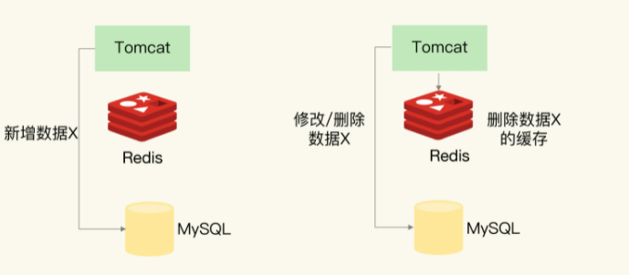
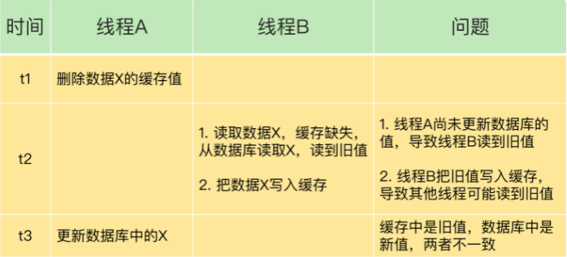
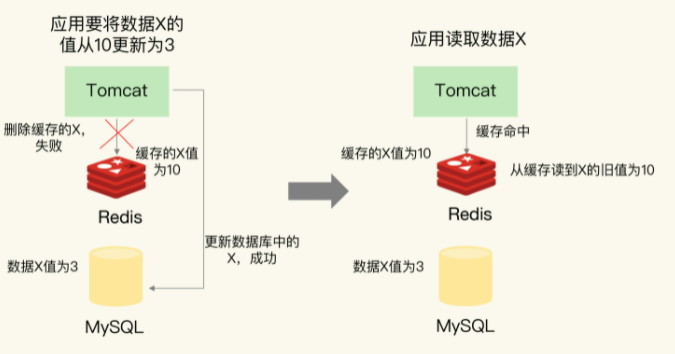
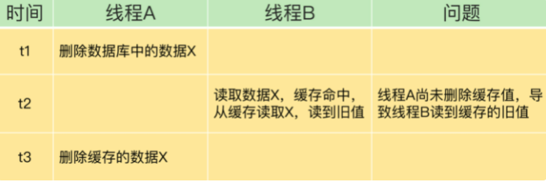
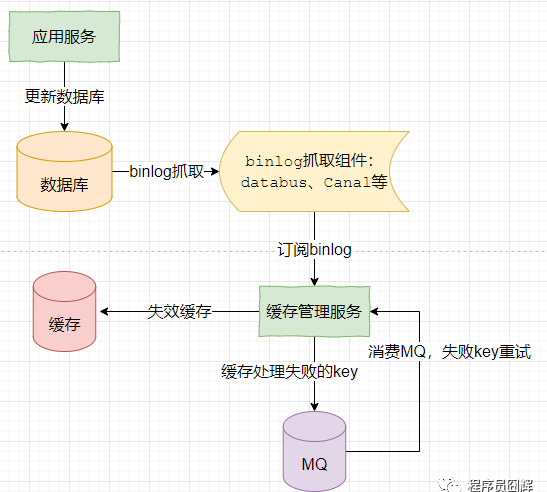

# 1. 数据一致性

数据一致性包含2种情况

* 缓存中有数据——缓存中的数据必须与数据库中的数据相同
* 缓存中无数据——数据库中的值必须是最新的

如果不符合这两种情况，那么缓存与数据库中的数据就不一致了

# 2. 缓存分类

根据是否接收写请求，缓存分为**只读缓存**与**读写缓存**

## 2.1 读写缓存

对于读写缓存

* **读**：从缓存中获取，如果缓存没有，就从数据库获取，然后放入缓存
* **写**：只会对缓存进行写入，由缓存根据 **写回策略**，决定如何将数据写到数据库中**（由缓存抽象层完成数据源和缓存数据的更新**）
  * **写回策略**
    * **同步直写策略**
      * 写缓存时，同步写数据库，缓存与数据库中的数据一致
      * 适用于强一致性的业务场景
      * 在业务上使用时——要使用 **事务机制**，**保证缓存和数据库的更新具有原子性**
    * **异步写回策略**
      * 写缓存时，不同步写数据库，等待缓存中的数据被淘汰时，再写回数据库
      * 如果数据还没有写回缓存，缓存发生了故障，那么数据库就会丢失最新的数据
      * 适用于一致性要求没有那么高的业务场景

## 2.2 只读缓存

* **读**——直接从缓存中读，如果缓存没有，就从数据库获取，然后放入缓存
* **写**
  * **增**——直接插入数据库，不对缓存操作
  * **删**——让缓存中数据失效 and 删除数据库中的数据
  * **改**——让缓存中数据失效 and 修改数据库中的数据

## 千万不要去修改缓存，缓存只能插入or删除

> 在并发下，更新缓存可能会出现下面的情况
> 
> 在该情况下，数据库的数据是写请求B，缓存的数据是写请求A，数据不一致
> 
> 但是如果让缓存失效就不会出现这种数据不一致的情况
> 
> 

# 3. Redis作只读缓存

Redis作为只读缓存时，**插入操作**不会有什么问题(因为只设计对MySQL的操作，不会对Redis进行操作)，但是**删改操作**会有以下问题

## 3.1 先缓存后库

有三种情况

1. 操作Redis失败，流程终止(没有任何数据改变，不会有任何问题)（失败情况）

2. 操作Redis成功，操作MySQL失败（失败情况）

3. 操作Redis成功，操作MySQL成功（成功情况）

第2种和第3种情况，会出现以下问题

### 3.1.1 操作Redis成功，操作MySQL失败

#### 3.1.1.1 问题

这次更新操作失效了，但是不会影响Redis和MySQL的数据一致性

**解决方法——重试**

### 3.1.2 操作Redis成功，操作MySQL也成功

两个操作之间是有时间差的，在高并发的情况下会出现下面的问题

#### 3.1.2.1 问题

整个操作完成后，Redis中是旧数据，MySQL中是新数据，数据不一致（该数据不一致会持续到下一次对该数据进行更新or缓存过期）

**因此，先缓存后库是不被推荐的**

**解决方法——延时双删**

> 更新完数据库后，等待一段时间，然后再次删除缓存（或者使用定时任务，MQ延迟消息等）
> 
> 这样做可以保证延时双删后，缓存和数据库数据一致，但是仍有一段比较长的时间是数据不一致的

## 3.2 先库后缓存

有三种情况

1. 操作MySQL失败，流程终止(没有任何数据改变，不会有任何问题)（失败情况）
2. 操作MySQL成功，操作Redis失败（失败情况）
3. 操作MySQL成功，操作Redis成功（成功情况）

第2种和第3种情况，会出现以下问题

### 3.2.1 操作MySQL成功，操作Redis失败

#### 3.2.1.1 问题

MySQL中是新值，而Redis是中旧值，数据不一致

**解决方法——重试 or 回滚数据库**

### 3.2.2 操作MySQL成功，操作Redis成功(重)

两个操作有时间差，在高并发下这种情况会出现以下问题

#### 3.2.2.1 问题

> 在操作完Redis，到操作完MySQL这段时间内，会有数据不一致的情况，但是这个时间范围很小（只有几毫秒  ）
> 
> 该问题无法避免（除非使用分布式事务or分布式锁），但是数据不一致的时间极短

# 4. 建议

## 4.1 Redis—只读缓存，先数据库后缓存

**我们一般使用Redis作为只读缓存**——建议优先使用**先更新数据库再删除缓存**

* 先删除缓存再更新数据库，有可能导致请求缺失缓存而访问数据库，给数据库带来压力
* 如果业务中读取数据库和写缓存的时间不好估算，延迟双删的等待时间不好设置

## 4.2 遵循Cache-Aside Pattern

我们使用Redis时，要遵循**Cache-Aside Pattern**

# 5. 读取binlog异步删除缓存

还有一种方法可以用来保证缓存和数据库的一致性——**读取binlog异步删除缓存**

1. 更新数据库，产生binlog，被binlog抓取组件抓取发送到MQ中
2. 缓存管理服务订阅和消费binlog，收到binlog后执行失效缓存
3. 如果失效缓存事变，引入重试机制
