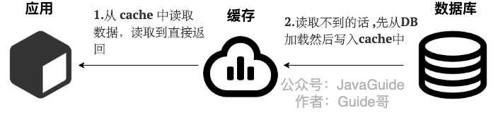
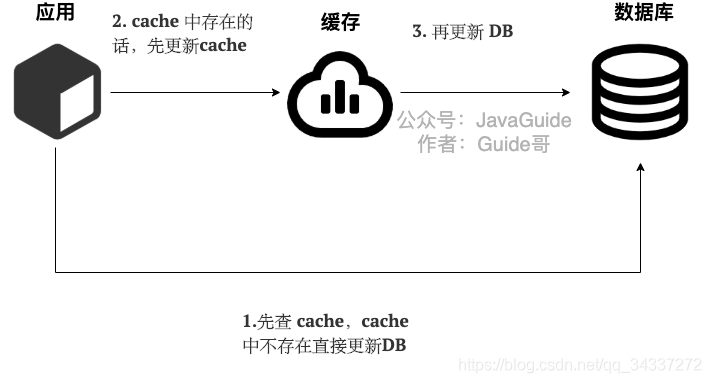

## 1. Cache Aside Pattern(旁路缓存模式)

### 1.1 读

* 从cache读数据，读到就返回
* 如果没读到，就从DB读
* 然后将DB中的数据写入cache

### 1.2 写

## 2. Read/Write Through Pattern(读写穿透)

Read/Write Through Pattern中服务端把Cache作为主要数据存储，从Cache中读取数据，并向Cache写入数据，Cache也会负责将**同步更新**DB

### 2.1 读

1. 从Cache中读数据，读到就直接返回
2. 如果没读到，从DB中加载数据，写入Cache，返回

### 2.2 写

1. 先查Cache，如果Cache中不存在，直接更新DB
2. 如果Cache中存在，就更新Cache，然后由Cache自己**同步更新**DB

## 3. Write Behind Pattern(异步缓存写入)

与Read/Write Through Pattern相似，都是由Cache来负责缓存和DB的读写

但是，Read/Write Through Pattern是同步更新Cache和DB，Write Behind Caching只会更新缓存，不会同步更新DB，而是让Cache采用异步批量的方式来更新DB

缺点——如果Cache的数据还没异步更新DB，Cache服务就宕机了，那么会导致数据丢失

Write Behind Pattern写入性能非常高——适合数据经常变化，但是数据一致性要求不高的吃那场景