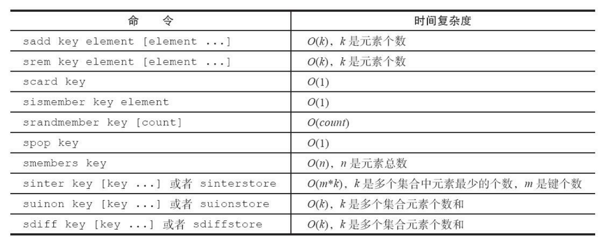
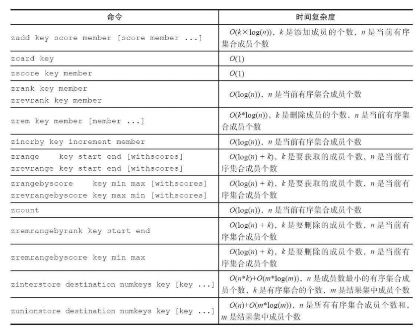

## 1. Redis Key API

### 1.1 查看所有Key

> keys *

### 1.2 Key是否存在

> exists key

### 1.3 移除Key

> move key 1
> del key

### 1.4 键过期

> expire key seconds——键在seconds秒后过期
> 
> expireat key timestamp——键在秒级时间戳timestamp后过期
> 
> pexpire key milliseconds——键在milliseconds毫秒后过期
> 
> pexpireat key milliseconds-timestamp——键在毫秒级时间戳timestamp后过期
> 
> persist key——清除过期时间
> 
> * 如果expire设置的key不存在——返回0
> * 如果过期时间设置为负数——key立即被删除
> * 对于字符串类型键，执行set命令会去掉过期时间

### 1.5 查询过期时间

> ttl key
> //如果key不存在，返回-2
> //如果key存在，但没有设置过期时间，返回-1
> //返回剩余过期时间，单位s

### 1.6 查看数据类型类型

> type key 

### 1.7 查看内部编码

> object encoding key

### 1.8 key重命名

> rename key newName——如果newName原本存在，那么newName的值会被覆盖
> 
> renamenx key newName——只有newName不存在时，才可以rename

### 1.9 随机返回一个key

> randomkey

### 1.10 迁移键

#### 1.10.1 move

> move key db——Redis内部进行数据迁移

#### 1.10.2 dump+restore

> dump key
> 
> restore key ttl value


##### 1.10.2.1 过程

dump+restore可以实现在不同Redis实例之间进行数据迁移

* 在源Redis上，dump命令会将键值序列化，格式采用的是RDB格式
* 在target Redis上，restore会将上面序列化的值进行复原
  * ttl：过期时间，如果ttl=0代表没有过期时间

##### 1.10.2.2 缺点

* 整个迁移过程不是原子性的，而是通过Client分步完成
* 迁移过程中开启了2个Client连接，dump的结果通过Client由Source Redis传输给Target Redis

##### 1.10.2.3 伪代码

```java
Redis sourceRedis=new Redis("sourceMachine",6379);
Redis targetRedis=new Redis("targetMachine",6379);
targetRedis.restore("hello",0,sourceRedis.dump(key));
```

#### 1.10.3 migrate

> migrate host port key|"" destination-db timeout [copy] [replace] [keys key [key ...] ]
> 
> * host：目标Redis的IP
> * port：目标Redis的port
> * key|""：如果迁移一个键，那么此处为要迁移的key；如果要迁移多个key，那么此处为""
> * destination-db：目标Redis的数据库索引
> * timeout：迁移的超时时间(单位毫秒)
> * [copy]：如果添加该选项，那么迁移完成后，Source Redis不删除源key
> * [replace]：如果添加该选项，那么目标Redis如果存在同名Key，会进行数据覆盖
> * [keys key [key ...] ]：迁移多个Key


* migrate将dump，restore，del三个明亮进行组合，简化了操作流程
* migrate具有原子性，整个过程是原子执行的，不需要在多个Redis实例上开启Client，只需要在Source Redis上执行migrate命令即可

### 1.11 遍历键

#### 1.11.1 全量遍历

> keys pattern——支持pattern匹配，对key进行全量遍历
> 
> * pattern使用glob风格的通配符
>   * *代表匹配任意字符
>   * ？代表匹配一个字符
>   * [ ]代表匹配部分字符

**缺点(生产环境不建议使用)**

* 执行keys命令，很可能会导致Redis阻塞

#### 1.11.2 渐进式遍历

* scan采用渐进式的方式来解决keys命令可能带来的阻塞问题

* 返回结果可能有重复，需要客户端去重

* 遍历过程中如果有数据修改，改动后的额数据能不能遍历到是不能确定的

* Redis有全局哈希表(hashtable)，scan采用**高位进位加法**来遍历
  
  > 0000—1000—0100—1100—0010—1010—0110—1110
  
  
  
  > scan cursor [match pattern] [count number]
  > 
  > * cursor：游标，第一次遍历从0开始，每次scan遍历完都会返回当前游标的值，直到游标值为0，表示遍历结束
  > * count number：每次要遍历的key个数(默认是10)
  > 
  > hscan：遍历hash
  > 
  > sscan：遍历set
  > 
  > zscan：遍历zset

## 2. string API

### 2.1 设置值

> set key value [ex secnods] [px milliseconds] [nx|xx]
> 
> * ex seconds: 为键设置秒级过期时间
> * px milliseconds：为键设置毫秒级过期时间
> * nx：键必须不存在才能设置成功
> * xx：键必须存在才能设置成功
> 
> setex key seconds value——同上ex选项
> 
> setnx key value——同上nx选项

### 2.2 追加

> append key content——如果key不存在，相当如set；如果key存在，往value后追加

### 2.3 获取值

> get key

### 2.4 自增和自减

> incr key——自增1
> 
> decr key——自减1
> 
> incrby key n——自增n
> 
> decrby key n——自减n

### 2.5 批量操作

> msetnx/msetex/mset key value[key value.....]——批量设置
> 
> mget key [key ...]——批量获取

### 2.6 获取长度

> strlen key

### 2.7 获取子串

> getrange key begin end——获取字符串 [begin,end]构建的子串,end=-1表示到结尾

### 2.8 替换子串

> setrange key begin xxx——将字符串从begin开始，往后替换为xxx

### 2.9 getset

> getset key value——先get再set

### 2.10 string API的时间复杂度


## 3. hash API

### 3.1 设置值

> hset key field value [field value ...]

### 3.2 获取值

> hget key field

### 3.3 删除field

> hdel key field [field ...]

### 3.4 获取field个数

> hlen key

### 3.5 批量操作

> hmset key field value [field value ...]
> 
> hmget key field [field....]

### 3.6 判断field是否存在

> hexists key field

### 3.7 获取所有的field

> hkeys key

### 3.8 获取所有的value

> hvals key

### 3.9 获取所有的field-value

> hgetall key

### 3.10 字段自增长

> hincrby key field count
> 
> hincrbyfloat key field count

### 3.11 计算value的长度

> hstrlen key field

### 3.12 hash API的时间复杂度


## 4. list API

### 4.1 插入元素

> lpush key value [value]——从左边插入元素
> 
> rpush key value [value]——从右边插入元素
> 
> linsert key before|after pivot value——向某个元素前|后插入元素(在列表中从左找到第一个等于pivot的元素)

### 4.2 弹出元素

> lpop key——从左边取出元素
> 
> rpop key——从右边取出元素

### 4.3 查找

> lrange key begin end——查找下标[begin,end]的元素
> 
> lindex key index——查找下标为index的元素

### 4.4 获取列表长度

> llen key

### 4.5 删除

> lrem key count value——找到列表中等于value的值，删除
> 
> * count>0，从左到右，删除最多count个元素
> * count<0，从右到左，删除最多-count个元素
> * count=0，删除所有

### 4.6 修剪列表

> ltrim key start end

### 4.7 修改

> lset key index newValue

### 4.8 将一个list中的元素转移到另一个list中

> lpoprpush source des—从source左边取出一个元素，放入des右边
> 
> rpoplpush source de

### 4.9 阻塞操作

> blpop key [key ...] timeout
> 
> brpop key [key ...] timeout
> 
> * 列表不为空，立刻返回
> 
> * 列表为空，阻塞
>   
>   * timeout——阻塞时间，如果timeout为0，那么Client会一直阻塞
> 
> * 如果一个Client对多个key执行该操作
>   
>   那么brpop会从左到右遍历key，一旦有一个key不为空，可以弹出元素，那么Client会立刻返回
> 
> * 如果多个Client对一个Key执行brpop
>   
>   如果列表为空，那么这多个Client都会阻塞
>   
>   一旦列表中插入了一个元素，那么最先执行brpop的Client会获得弹出的值，返回，其他Client继续阻塞

### 4.10 list API的时间复杂度


### 4.11 list实现栈，队列，有限集合，消息队列

* lpush+lpop=Stack
* lpush+rpop=Queue
* lpush+ltrem=有限集合
* lpush+brpop=消息队列

## 5. set API

### 5.1 添加元素

> sadd key element [element ...]

### 5.2 删除元素

> srem key element [element ...]

### 5.3 计算元素个数

> scard key

### 5.4 判断元素是否在集合中

> sismember key element

### 5.5 随机从集合中返回元素

> srandmember key [count]

### 5.6 获取所有元素

> smembers key

### 5.7 将一个元素移到另一个集合中

> smove source dest target——将source中的target移动到dest中

### 5.8 集合间操作

> sinter key [key ...]——集合交集
> 
> sunion key [key ...]——集合并集
> 
> sdiff key [key ...]——集合差集
> 
> sinterstrore destination key [key ...]——集合交集并保存
> 
> sunionstore destination key [key ...]——集合并集并保存
> 
> sdiffstore destination key [key ...]——集合差集并保存

### 5.9 set API的时间复杂度



## 6. zset API

### 6.1 添加

> zadd key [NX|XX] [CH] [INCR] score member [score member]
> 
> * NX：member必须不存在，才可以设置成功
> * XX：member必须存在，才可以设置成功
> * CH：返回此次操作后，有序集合内元素和分数发生变化的个数
> * incr：对score做增加操作

### 6.2 计算成员个数

> zcard key

### 6.3 获取成员分数

> zscore key member

### 6.4 计算成员排名

> zrank key member——从低到高返回排名
> 
> zrevrank key member——从高到低返回排名

### 6.5 删除

> zrem key member [member ...]

### 6.6 增加成员分数

> zincrby key incrememt member

### 6.7 返回指定排名范围的成员

> zrange key start end [withscores] 
> 
> zrevrange key start end [withscores]

### 6.8 返回指定分数范围内的成员

> zrangebyscore key min max [withscores] [limit offset count]
> 
> zrevrangebyscore key max min [withscores] [limit offset count]
> 
> 显示有序集合中score在[min,max]的元素
> withscores会显示元素的score
> limit offset count：选出来的元素构成一个新的集合，并显示offset开始的count个元素

### 6.9 返回指定分数范围内的成员个数

> zcount key min max——返回集合中score在[min,max]的元素个数

### 6.10 删除指定排名内的成员

> zremrangebyrank key start end

### 6.11 删除指定分数范围内的成员

> zremrangebyscore key min max

### 6.12 集合操作

> zinterstore destination numkeys key [key ...] [weights weight [weight ...] ] [aggregate sum|min|max]——交集
> 
> * destination：结果保存到该key
> * numkeys：进行操作的key的个数
> * key [key ...]：进行操作的key
> * weights weight [weight ...]：每个key的权重，计算时，每个key中的member都会将自己的分数*对应的权重
> * aggregate sum|min|max：计算后，分值按照sum，min，max做汇总(默认是sum)
> 
> zunionstore destination numkeys key [key ...] [weights weight [weight ...] ] [aggregate sum|min|max]——并集

### 6.13 zset API的时间复杂度



## 7. Geospatial API

### 7.1 添加地理位置信息

> geoadd key 经度 维度 member [经度 维度 member ...]

### 7.2 获取地理位置信息

> geopos key member [member ...] 

### 7.3 计算两个地理位置的距离

> geodist key member1 member2 [unit]
> 
> unit为返回结果单位
> 
> * m：米
> * km：公里
> * mi：英里
> * ft：尺

### 7.4 获取指定范围内的元素

> georadius  key  longitude  latitude  radiusm|km|ft|mi  [withcoord]  [withdist]  [withhash]  [COUNT count]  [asc|desc]  [store key]  [storedist key]  
> 
> georadiusbymember  key  member  radiusm|km|ft|mi  [withcoord]  [withdist]  [withhash]  [COUNT count]  [asc|desc]  [store key]  [storedist key]  
> 
> 一个是以经纬度为中心，一个是以指定元素为中心
> 
> * radisum|km|ft|mi：指定半径和单位
> * withcoord：返回结果中包含经纬度
> * withdist：返回结果包含离中心位置的距离
> * withhash：返回结果包含geohash
> * COUNT count：指定返回结果的数目
> * asc|desc：返回结果按照距离中心位置的记录做升序or降序
> * store key：将结果保存到指定的key
> * storedist key：将距离保存到key

### 7.5 获取geohash

> geohash key member [member ...]

## 8. HyperLogLog

### 8.1 添加

> pfadd key element [element...]

### 8.2 统计数目

> pfcount key [key ...]——计算一个或多个HyperLogLog的独立总数

### 8.3 合并

> pfmerge destkey sourcekey [sourcekey ...]——将sourceKey中的元素复制一份到destKey中

## 9. bitmaps

### 9.1 设置值

> setbit key offset value

### 9.2 获取值

> getbit key offset

### 9.3 获取Bitmaps指定范围内1的个数

> bitcount [start] [end]

### 9.4 Bitmaps间的运算

> bitop op destkey key [key ...]
> 
> 进行and(交集)，or(并集)，not(非)，xor(异或)，并将结果保存在destkey中

### 9.5 计算Bitmaps中第一个值为targetBit的偏移量

> bitops key targetBit [start] [end]

### 9.6 一次执行多个位的操作

> bitfield key op
> 
> * bitfield有三个子命令——set，get，incrby（一个子命令最多只能处理64个连续的位，如果超过了64位，就需要使用多个子命令）
