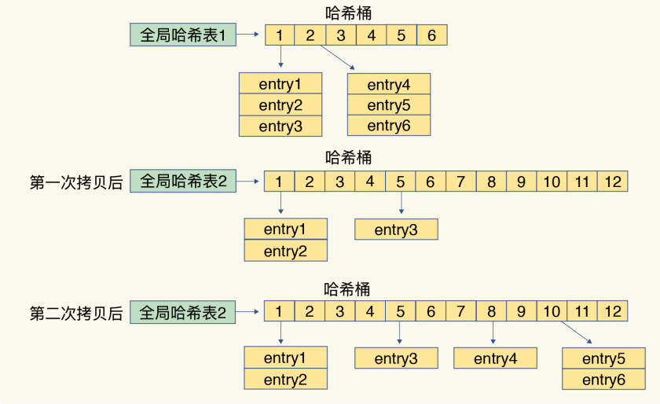
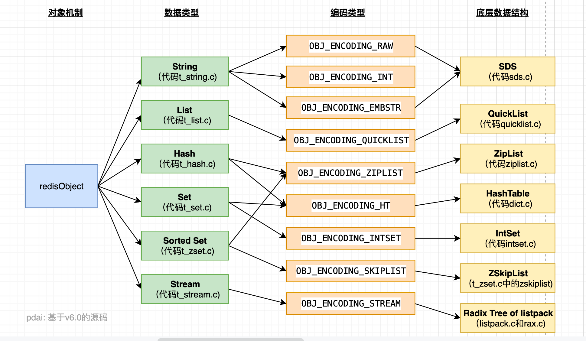
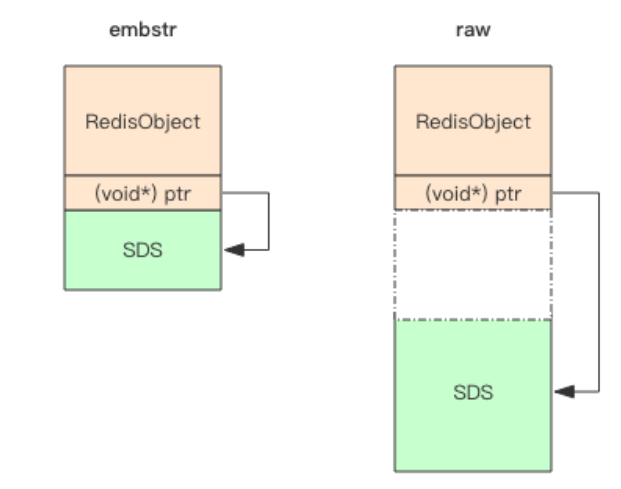
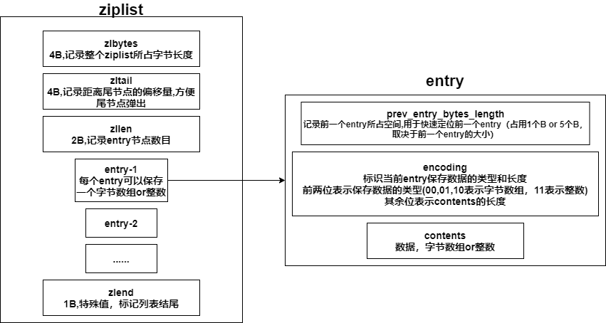
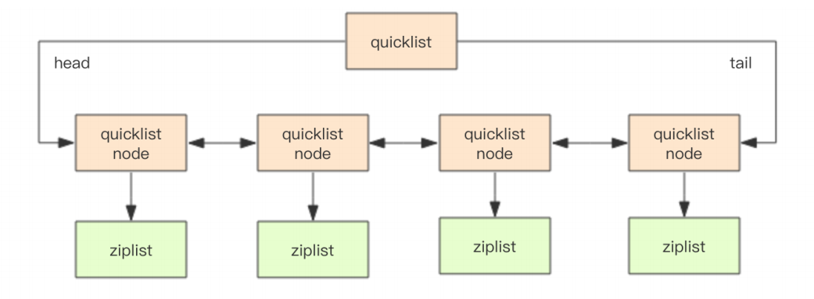
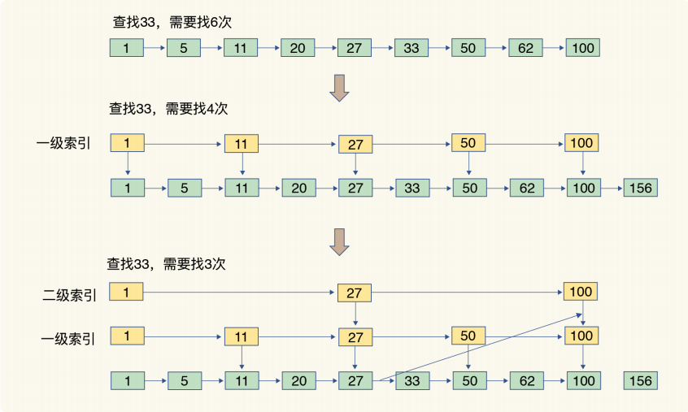
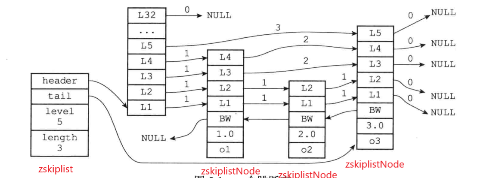
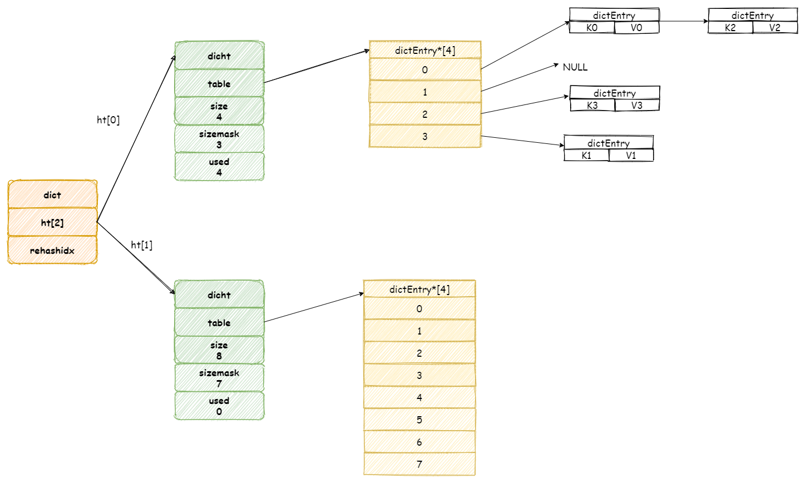

# 1. Redis API数据类型及其内部编码

Redis根据**value的不同**，分为以下类型（每种类型都有多种内部编码）

* **常见**
  * **string**
    * raw（底层数据结构是SDS）
    * int（底层数据结构是SDS）
    * embstr（底层数据结构是SDS）
  * **hash**
    * hashtable
    * ziplist
  * **list**
    * linkedlist
    * ziplist
    * quicklist
  * **set**
    * hashtable
    * intset
  * **zset**
    * skiplist
    * ziplist

* **少用**
  * Geospatial
  * HyperLogLog
  * Bitmap


## Redis使用内部编码的好处

>1. 可以改进内部编码，而对外的数据结构和命令没有影响，一旦开发出了更优秀的内部编码，无须改动外部数据结构和命令
>2. 多种内部编码可以在不同的场景下发挥各自的优势


# 2. Redis的全局哈希表和RedisObject


## 2.1 Redis Object

Redis存储的数据 **都** 用**redisObject**来封装

```c
typedef struct redisObject{
    unsigned int type;      //4B，对象类型-string,list,hash,set,zset
    unsigned int encoding;  //4B，内部编码类型-int,SDS,ziplist,linkedlist,quicklist,hashtable,intset,skiplist
    REDIS_LRU_BITS lru;     //记录对象最后一次被访问的时间
    int refcount;           //引用计数器，记录当前对象被引用的次数
    void * ptr              //与对象的数据内容相关——如果是整数，直接存储数据，否则为指向数据的指针
}
```


## 2.2 全局哈希表

Redis使用哈希表来存储键值对

* Redis哈希表中的哈希桶保存的是指向Entry的指针（每个桶都是一个Entry链表）
* Redis有两个全局哈希表
* Redis通过**链式哈希**解决冲突
* Redis的rehash是渐进式的


### rehash

Redis有2个全局哈希表，Redis采用**渐进式rehash**

0. Redis一次只会使用一个哈希表，另一个哈希表不会被分配空间

1. Redis给哈希表2分配更大的空间（例如是哈希表1的2倍）

2. Redis每次对全局哈希表进行增删改查时，除了增删改查操作之外，还会将哈希表1中第一个索引位置上的所有Entry**拷贝**到哈希表2中

   再进行一次增删改查，就将哈希表1中第二个索引位置上的所有Entry**拷贝**到哈希表2中

   依次类推，直到哈希表1中的所有元素都拷贝到哈希表2中（如果服务器比较空闲，那么会有定时任务来帮助进行rehash）

3. 释放哈希表1的空间



#### rehash的优点

> rehash采用分而治之的方式，将rehash所需的计算工作均摊到每个操作上，避免了集中式rahash带来的庞大计算量

#### rehash的问题

> 在数据量大的时候，rahash可能会出现以下问题
>
> * rehash时，同时存在两个哈希表，占用额外空间
> * rehash时，增删改查有概率同时操作两个哈希表，耗时增加
> * redis在内存接近maxmemory时且设置有驱逐策略的情况下，出现rehash会让内存占用超过maxmemory，触发驱逐淘汰，导致导量的key被驱逐淘汰


# 3. Redis底层数据结构

Redis一共有**6种底层数据结构**——**简单动态字符串**，**双向链表**，**压缩列表**，**哈希表**，**跳表**，**整数数组**

Redis后续还加入了一种新的——**quciklist** 




## 3.1 SDS

Redis的简单动态字符串(simple dynamic string，SDS)

string的内部编码 **raw**，**int**，**embstr**都是基于SDS实现的

```c
typedef struct SBS{
    int len;   //已用长度
    int free;  //未用长度
    char buf[];//字符数据
}
```

Redis对于字符串的使用——采用 **空间预分配机制**和 **惰性空间释放机制**

### 3.1.1 空间预分配机制

* 第一次创建时，len属性=实际大小，free为0，不做预分配

* 修改后，如果已有free空间不够且数据<1MB，每次预分配一倍容量

  >原有len=60b，free=0，再追加60b，预分配120b——len=120b，free=120b

* 修改后，如果已有free空间不够且数据>1MB，每次预分配1MB容量


### 3.1.2 惰性空间释放机制

惰性空间释放机制用于优化SDS字符串缩短的操作

当SDS字符串缩短时，不会立刻回收内存，而是用free属性来记录这些空闲内存，等待将来使用


### 内部编码int，embstr和raw使用SBS

* **embstr**：RedisObject与SDS连续存放在一起，使用malloc分配一次内存
* **raw**：RedisObject与SDS分开存储，使用malloc分配两次
* **int**：RedisObject的ptr直接存储数据



### 为什么使用SDS而不是C自带的字符串？

1. SDS可以以O(1)获取字符串的长度，C自带的字符串需要O(N)
2. 杜绝缓冲区溢出
   * C自带的字符串在进行操作时（例如拷贝，拼接），不会检查目标地内存是否足够，可能发生缓区溢出
   * SDS在操作字符串时会检查内存空间是否足够，如果不够会拓展
3. 减少修改字符串带来的内存重分配次数
   * SDS提供了预分配机制和惰性空间释放机制
4. C字符串只能保存文本数据，SDS可以保存文本或者二进制数据


## 3.2 ziplist

压缩列表结构如下



**压缩列表**

* 内部表现为数据紧凑排列的一块连续内存数组——节约内存
* 可以快速定位到第一个元素和最后一个元素——以O(1)实现入队和出队
* 对中间元素的操作涉及复杂的指针移动，时间复杂度就是O(N)了

### 连锁更新问题

对ziplist的插入or删除，可能会造成连锁更新问题

以插入为例，假设ziplist中原本每个entry都是254个B，那么每个entry的prev_entry_bytes_length都只占用1个B

在ziplist的头部插入要给大entry，导致第二个entry的prev_entry_bytes_length需要5个B，第二个entry的大小变为258B，那么第三个entry的prev_entry_bytes_length也需要5个B，导致第三个entry的大小变为258B ......


## 3.3 linkedlist

```c
struct list{
    listNode* head;
    listNode* tail;
    long length;//包含的节点s
}

struct listNode<T>{
    listNode* prev;
    listNode* next;
    T value
}
```


## 3.4 quicklist

* quciklist是ziplist和linkedlist的混合体
* quicklist内部默认每个ziplist长度为8KB，超过该长度，会另起一个ziplist
* quicklist默认压缩深度为0（不压缩）——压缩深度由 **参数list-compress-depth**决定

```c
struct quciklist{
    quicklistNode* head;
    quicklistNode* tail;
    long count; //元素个数
    int nodes;  //ziplist节点的个数
    int compressDepth; //LZF算法压缩深度
}

struct quicklistNode{
    quicklistNode* prev;
    quciklistNode* next;
    ziplist* zl; //指向压缩列表的指针
    int32 size; //ziplist的字节总数
    int16 count;//ziplist中的元素数目
    int2 encoding;//存储形式，使用原生字节数组还是LZF压缩存储
}
```




## 3.5 intset


intset保存的整数类型根据长度划分——int16，int32，int64

各个元素在contents中按照值的大小从小到大有序地排列，并且不会包含重复的元素

### 升级操作

如果intset保存的都是int16，然后插入了一个int32的元素，那么需要进行升级操作

1. 创建一个新的intset，底层数组存储的都是int32

2. 将原来intset中的所有元素都转换为int32，放入新的intset中
3. 将新元素放入新的intset中

（intset不支持降级操作）


## 3.6 skiplist

skiplist是一种有 **有序**数据结构——**支持平均O(logN)，最坏O(N)**





Redis的跳跃表由——zskiplist和zskiplistNode组成

* **zskiplistNode**

  ```c
  struct zskiplistLevel{
      struct zskiplistNode * forward;//前进指针
      int span;//跨度
  }
  
  struct zskiplistNode{
      zskiplistLevel level[]; //层数组
      zskiplistNode * backward; //后退指针
      double score; //分值
      robj *obj; //真正用来存储数据的成员对象
  }
  ```

  * **层数组**——每个节点都有一个**level数组**，包含**多个层**，每个层都有两个属性（层越多，访问其他节点的速度越快）
    * **前进指针**——指向该层的下一个node（用于遍历操作和查询操作）
    * **跨度**——该节点与该层下一个node的距离（用于计算查询的目标节点在跳跃表中的排位——查询某个节点时，将沿途经过的所有层的跨度加起来，就是目标节点的排位）
  * **后退指针**——指向跳跃表中的前一个node
  * **score分值**——跳跃表中的节点按照score大小来排序（score小的在跳跃表靠前的位置），如果多个节点的score相同，那么按照obj的大小来排序
  * **成员对象obj**：真正用来存储数据的成员对象

* **zskiplist**

  ```C
  struct zskiplist{
      zskiplist * header,tail;
      long length;//跳跃表中节点个数
      int level;//跳跃表中层数最大的节点的层数（不包括第一个节点）
  }
  ```

  

## 3.7 dict

Redis创建hashmap时候会创建一个哈希表数组ht——保存两个哈希表dicht

* ht[0]在第一次往hashmap中添加键值对时分配内存空间
* ht[1]在扩容/缩容才会进行空间分配



* 哈希表dicht结构
  * dichtEntry数组table——每个位置都可以存放一个链表，采用开放链表避免冲突（头插法）
    * key
    * value
    * next指针（用于构建链表）
  * size：哈希表大小
  * used：已有节点数量


### rehash

rehash——扩展和收缩哈希表

1. 为ht[1]分配内存空间——如果拓展，那么ht[1]的大小为第一个大于等于ht[0].used x 2的2^n；如果执行的是收缩操作，那么ht[1]的大小是第一个大于等于ht[0].used的2^n
2. 将ht[0]中的所有键值对rehash到ht[1]上
3. 释放ht[0]，将ht[1]设置为ht[0]，并在ht[1]创建一个新的空白哈希表


### 哈希表收缩与拓展的条件

1. 如果服务器正在执行BGSAVE 或者 BGREWRITEAOF，那么哈希表的负载因子>=5，才会触发扩容（负责银子=ht[0].used/ht[0].isze）
2. 如果服务器没有执行BGSAVE 或者 GBREWRITEAOF，那么哈希表的负载因子>=1，就会触发扩容

**原因——**因为在BGSAVE或者BGREWRITEAOF时，服务器会fork()子进程，子进程采用copy-on-write机制，所以在子进程存在期间，服务器要提高执行拓展操作所需的负载因子，尽可能地避免在子进程存在期间进行哈希表拓展操作——节约内存


### 渐进式rehash

1. 为ht[1]分配内存空间——如果拓展，那么ht[1]的大小为第一个大于等于ht[0].used x 2的2^n；如果执行的是收缩操作，那么ht[1]的大小是第一个大于等于ht[0].used的2^n
2. 维持一个索引计数变量rehashidx=0
3. 每次对字典进行增删改查，都会将ht[0] rehashidx位置上的元素移动到ht[1]，并且rehashidx+=1，直接全部移动完毕
4. 释放ht[0]，将ht[1]设置为ht[0]，并在ht[1]创建一个新的空白哈希表

5. 在渐进式rehash过程中，删改查都会在ht[0]和ht[1]两个哈希表上进行；插入只会在ht[1]中进行
