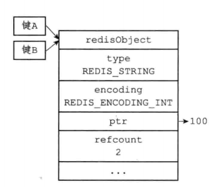

### 内存回收

RedisObject中有个refcount字段——引用计数

* 创建一个对象时，其refcount初始化为1
* 当对象被一个程序使用时，其refcount+1
* 当对象不被一个程序使用时，其refcount-1
* 当对象的refcount为0时，其占用的内存会被释放
* API
  * incrRefCount：将对象的refcount+1
  * decrRefCount：将对象的refcount-1,如果对象refcount为0，释放对象
  * resetRefCount：将对象的refcount设置为0，但不会释放对象，一般用于重置refcount

### 内存共享

RedisObject的refCount还有对象共享的作用

* Redis中只有int字符串才可以被共享（因为共享前需要判断想创建的对象与已有的对象是否完全相同，负责的对象判断需要消耗很多CPU时间）
* Redis初始化时，会创建1w个字符串对象（0—9999），使用这些整数时，共享对象，而不是创建