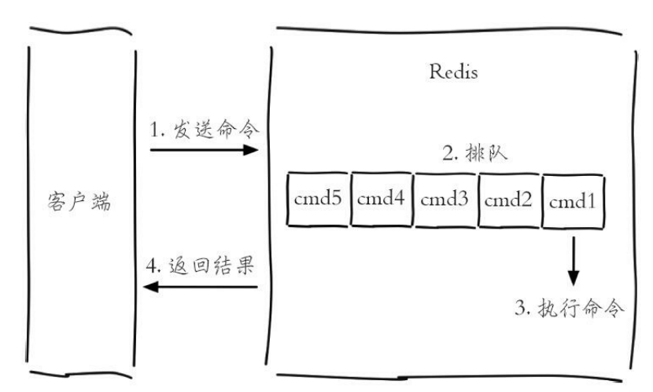
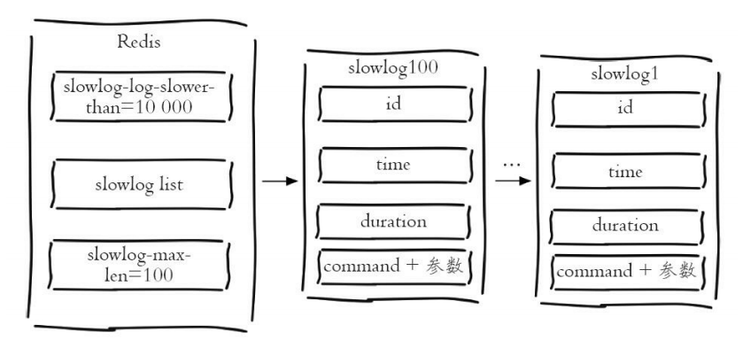

### 1. Redis中一条命令的生命周期

慢查询只会统计 3) 的时间

### 2. 慢查询的配置参数

* **slowlog-log-slower-than**

  执行时间超过多少微妙将记录到慢查询日志中(默认是10000)

* **slowlog-max-len**

  慢查询日志最多存储多少条

### 3. Redis如果存储慢查询日志

慢查询日志存储在内存中——Redis使用一个FIFO列表才存储慢查询日志，slowlog-max-len就是该列表的长度

当一个命令满足慢查询条件要放入这个列表时，如果列表已经达到最大长度，那么最早插入的一条命令会从列表中移出

### 4. 获取慢查询日志

> slowlog get [n]——获取n条慢查询日志
>
> slowlog len——获取慢查询日志列表的长度
>
> slowlog reset——重置慢查询日志

### 5. 慢查询日志数据结构

* **id**：慢查询日志的标识id
* **time**：发生时间戳
* **duration**：命令耗时
* **command+参数**：执行命令和参数