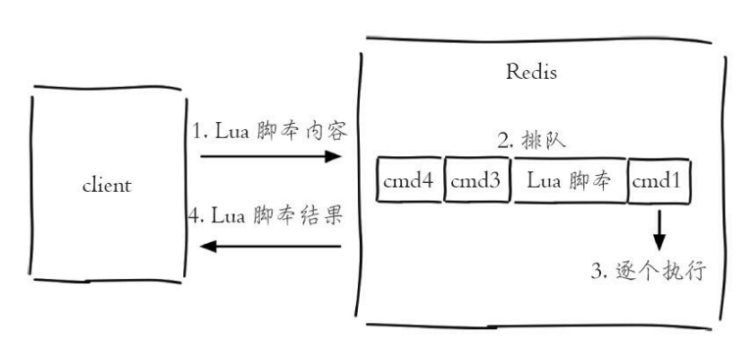
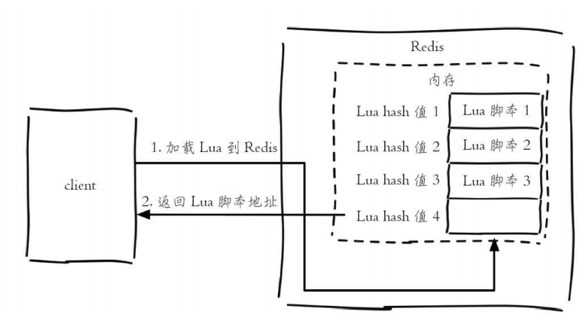

## 1. Redis事务

Redis单条命令都是保证原子性的，但是Redis的事务是不保证原子性的！

Redis的事务不支持回滚功能

### **1.1 Redis事务介绍**

```
开启事务——>命令入队列——>执行事务
```

* 所有的命令入队后并不会直接执行，只有发起执行命令后才会执行

* Redis的事务本质上就是一组命令的集合，一个事务中所有的命令都会被序列化，在事务执行过程中，会**按照顺序依次执行**
  
  * 一次性
  * 顺序性
  * 排他性（事务内的命令依次执行，不会插入其他命令）

* Redis事务没有隔离级别的概念

* **开启事务**
  
  ```
  multi
  ```

* **执行事务**
  
  ```
  exec
  ```

* 事务执行时出现异常
  
  * **编译型异常**——语法错误
    
    所有命令都不会执行
  
  * **运行时异常**
    
    错误的命令执行报错，其他命令正常执行

## 2. Redis实现乐观锁—watch

```
watch key [key....]
```

在事务开始前，用watch监听key

事务exec时，会检查key被watch监听后是否被修改了——如果被修改了，那么返回NULL并告诉客户端执行失败

```
1. watch key——会得到当前的值，记为A
2. exec——再次获取key的值，记为B，判断A和B是否相同
```

## 3. Lua

Redis可以执行Lua脚本——有两种方法： **eval**和**evalsha**

**特点**

* Lua脚本的执行是**原子性**的
* Lua可以一次性叫多条命令打包，减少网络开销

### 3.1 eval



> eval  脚本内容  key个数  key列表  参数列表——执行小Lua脚本可以用这个
> 
> redis-cli --eval Lua脚本——直接执行文件

* 通过eval执行Lua脚本，Lua脚本不会在Redis实例上进行存储，要多次执行Lua脚本的话，需要多次传输Lua脚本

### 3.2 evalsha



* Client将Lua脚本加载到Redis上(存放在内存中)，Redis返回给Client该脚本的SHA1校验和
  
  > script load命令可以将脚本加载到Redis内存中

* Client后续可以使用evalsha命令，名试用SHA1作为参数，直接执行对应的Lua脚本
  
  > evalsha  脚本SHA1值  key个数  key列表  参数列表

* 使用evalsha，Lua脚本常驻在服务端，脚本得到了复用

### 3.3 Lua脚本相关命令

1. **script load**
   
   将Lua脚本加载到Redis内存中

2. **script exists sha1 [sha1 ...]**
   
   判断SHA1对应的脚本是否加载到Redis内存中

3. **script flush**
   
   清除Redis内存中已经加载的所有Lua脚本

4. **script kill**
   
   杀死正在执行的Lua脚本（如果Lua脚本正在执行写操作，那么该命令不会生效）

Redis提供了一个 **lua-time-limit(默认5s)**——Lua脚本的超时时间，如果Lua脚本执行时间超过该值，那么会向其他命令发送BUSY信号，其他Client会收到 "Busy Redis is busy running a script"，并提示使用script kill或者shutdown nosave来杀死这个busy的脚本
