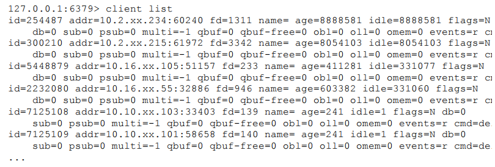
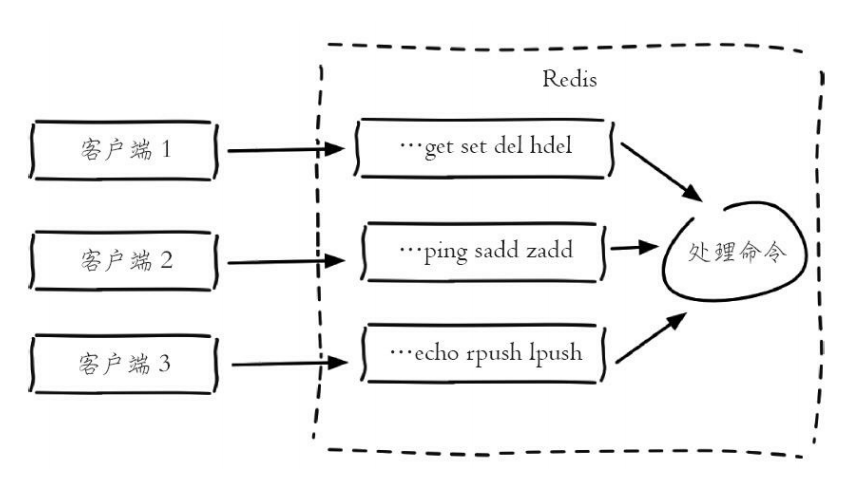
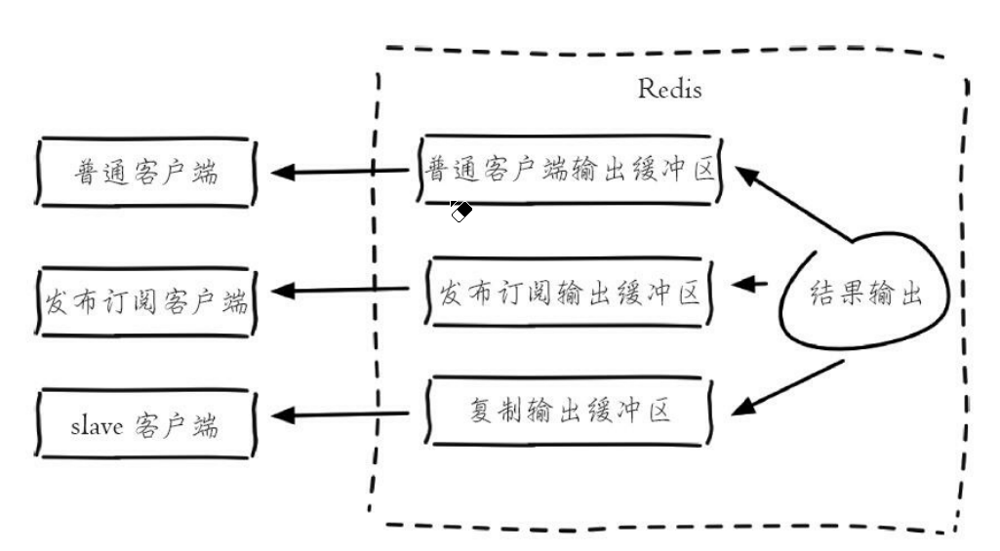

# 1. 客户端服务端交互协议RESP

Redis指定了RESP协议——实现Client与Redis Server的交互

## 1.1 发送命令格式

> *<参数数目> \r\n
>
> $<参数1的字节数目> \r\n
>
> <参数1> \r\n
>
> ....
>
> $<参数n的字节数目> \r\n
>
> <参数n> \r\n\

## 1.2 返回结果格式

* **状态回复**——第一个字节为 "+"
* **错误回复**——第一个字节为 "-"
* **整数回复**——第一个字节为 ":"
* **字符串回复**——第一个字节为 "$"
* **多条字符串回复**——第一个字节为 "*"
* **nil**——返回 **$-1**


# 2. 客户端信息查看

|     命令     |              优点              |                       缺点                       |
| :----------: | :----------------------------: | :----------------------------------------------: |
| client list  |    能够精确地分析每个客户端    |          执行速度慢，可能导致Redis阻塞           |
| info clients | 执行速度快，但是分析过程较简单 | 不能精确地定位到具体的一个Client；只会显示最大值 |

## 2.1 client list



|   参数    |                           含义                           |
| :-------: | :------------------------------------------------------: |
|    id     |                         客户端ID                         |
|   addr    |                      客户端IP和端口                      |
|    fd     |                    socket的文件描述符                    |
|   name    |                       客户端连接名                       |
|    age    |                    客户端连接存活时间                    |
|   idle    |                  客户端最近一次空闲时间                  |
|   flags   |                        客户端类型                        |
|    db     |            当前客户端正在使用的数据库索引下标            |
|    sub    |                 当前客户端订阅的频道数目                 |
|   psub    |                  当前客户端订阅的模式数                  |
|   multi   |                当前事务中已执行的命令个数                |
|   qbuf    |                     输入缓冲区总容量                     |
| qbuf-free |                    输入缓冲区剩余容量                    |
|    obl    |                      固定缓冲区大小                      |
|    oll    |                    动态缓冲区列表长度                    |
|   omem    |                      输出缓冲区大小                      |
|  events   | 文件描述符时间作(r/w):r和w分别代表客户端套接字可读和可写 |
|    cmd    |                 客户端最后一次执行的命令                 |


### 2.1.1 标识

* **id**：客户端连接的唯一标识
* **addr**：客户端的IP和端口
* **fd**：socket的文件描述符
* **name**：客户端的名词

### 2.1.2 客户端输入缓冲区

客户端连接上Redis Server后，Redis Server会在内存中位Client分配一个客户端输入缓冲区——**将Client发送来的命令临时保存，同时Redis会从输入缓冲区拉取命令并执行**



* **qbuf**：Redis为这个Client分配的输入缓冲区的总容量
* **qbuf-free**：该Client分配到的输入缓冲区的剩余容量

#### 输入缓冲区产生的问题

* 每个客户端的输入缓冲区不能超过1G，超过1G就会强行关闭Client
* 输入缓冲区不受maxmemory限制，输入缓冲区的过度使用可能导致Redis使用的内存超过了maxmemory，可能会产生数据丢失，键值淘汰，OOM等情况


### 2.1.3 客户端输出缓冲区

* **obl**：每个Client的输出缓冲区中固定缓冲区的长度
* **oll**：每个Client的输出缓冲区中动态缓冲区的列表长度
* **omem**：每个Client的输出缓冲区使用的字节数目


Redis同样为每个Client分配一个输出缓冲区——保存命令执行的结果返回给客户端



#### 2.1.3.1 输出缓冲区分类

输出缓冲区分为三种

* **普通客户端输出缓冲区**
* **发布订阅输出缓冲区**
* **复制输出缓冲区**

#### 2.1.3.2 配置输出缓冲区

> client-output-buffer-limie <class> <hard limit> <soft limit> <soft seconds>
>
> * <class>：客户端类型
>   * normal：普通客户端
>   * slave：slave客户端
>   * pubsub：发布订阅客户端
> * <hard limit>：如果客户端使用的输出缓冲区大小 > <hard limit>，客户端会被立刻关闭
> * <soft limit>和<soft seconds>：如果客户端使用的输出缓冲区大小超过了<soft limit>并且持续了<soft seconds>秒，那么客户端将被关闭
>
> 
>
> Redis默认配置
>
> client-output-buffer-limit normal 0 0 0
>
> client-output-buffer-limit slave 256mb 646mb 60
>
> client-output-buffer-limit pubsub 32mb 88mb 60

#### 2.1.3.3 输出缓冲区特点

* **输出缓冲区**不受maxmemory限制——使用不当会造成maxmemory用满产生数据丢失，键值淘汰，OOM

* 输出缓冲区由两部分组成

  * **固定缓冲区(16KB)**——使用字节数组，存储较小的结果
  * **动态缓冲区**——使用列表，存储较大的结果，队列中的每个对象就是每个返回结果

  ```c
  typedef struct redisClient{
      list * reply;//动态缓冲区列表
      unsigned long reply_bytes;//动态缓冲区列表长度
      int bufpos;//固定缓冲区已经使用的字节数目
      char buf[REDIS_REPLY_CHUNK_BYTES];//固定缓冲区
  }
  ```


### 2.1.4 客户端存活状态

* **age**：客户端已经连接的时间
* **idle**：客户端最近一次的空闲时间


### 2.1.5 客户端限制maxclients和timeout

* **maxclients**：限制最大的客户端连接数(默认值10000)
* **timeout**：限制连接的最大空闲时间，一旦Client的idel超过了timeout，连接就会关闭(默认0)

### 2.1.6 客户端类型

* **flag**：表示客户端的类型


## 2.2 Client其他API

### 2.2.1 client kill

> client kill ip:port——杀死指定IP和port的Client

### 2.2.2 client pause

> client pause timeout(毫秒)——阻塞符合条件的Clienttimeout毫秒
>
> 只对普通客户端和发布订阅客户端有效，对主从复制客户端无效

### 2.2.3 monitor

>monitor——监听Redis正在执行的命令

**缺点**

* 每个Client都有输出缓冲区，monitor可以监听Redis执行的所有命令，一旦Redis并发量过大，monitor客户端的输出缓冲区就会暴涨，可能会瞬间占用大量内存


## 2.3 Client相关配置

* **timeout**：检测客户端空闲连接的超时时间，一旦idle超过timeout，那么会关闭客户端
* **maxclients**：允许的最大客户端连接数
* **tcp-keepalive**：检测TCP连接活性的周期(默认为0，不进行检测)——Redis每隔一段时间对TCP连接进行活性检测，防止大量死连接占用系统资源
* **tcp-backlog**：TCP三次握手后，会将接受的连接放入队列中，tcp-backlog就是队里的大小(默认值511)