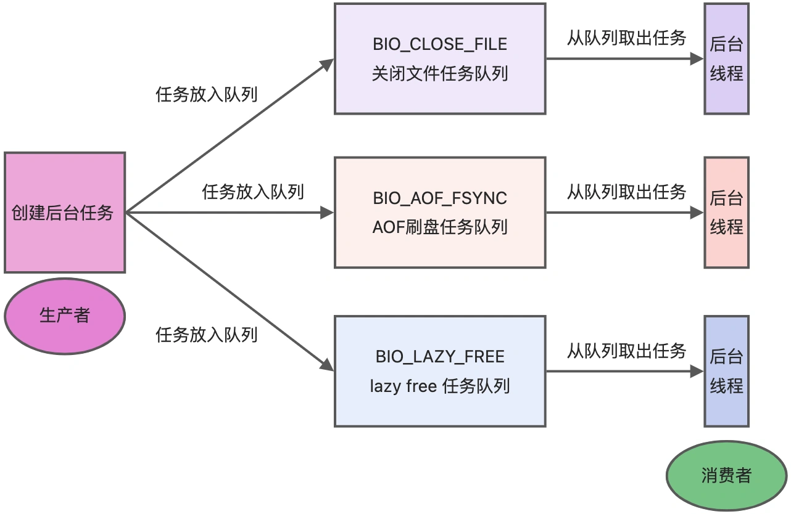
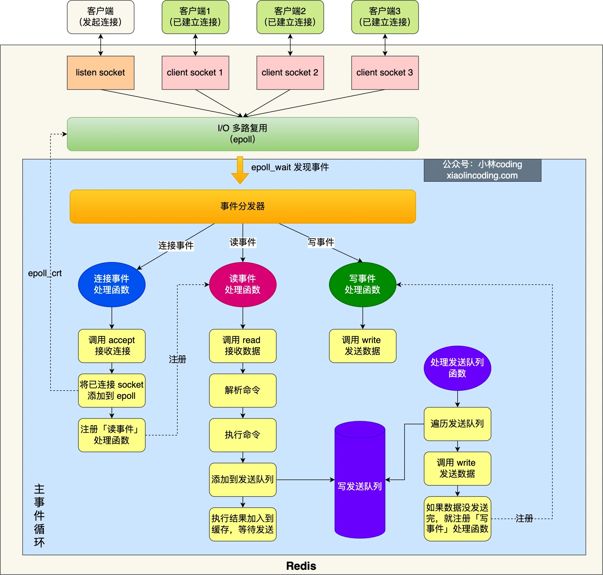

# 1. Redis单线程与后台线程

Redis单线程指的是**接收Client请求=>解析请求=>处理命令=>发送数据给客户端**这个过程由一个线程完成

* Redis2.6版本，有两个后台线程
  
  * **关闭文件**：通过`close(fd)`关闭文件
  
  * **AOF刷盘**：通过`fsync(fd)`将AOF刷盘

* Redis4.0引入了一个新的后台线程lazyfree线程，通过`free(obj`**异步释放内存**

每个后台线程会不断轮询任务队列，主线程将任务放入任务队列中，由后台线程去执行

# 2. Redis单线程模型

## 2.1 Redis6.0前

* 初始化
  
  1. 创建一个epoll对象和一个ServerSocket
  
  2. 让ServerSocket绑定端口号并开始监听
  
  3. 通过`epoll_ctl()`将ServerSocket加入到epoll中，同时为其注册**连接事件处理函数**

* 事件循环，每轮循环干下面的事情
  
  1. 调用处理发送队列函数，查看发送队列中是否有任务，如果有，通过write()将数据发送出去，如果发送队列中的任务没有处理完，就注册写事件处理函数，等待`epoll_wait()`发现可写后处理
  
  2. 调用`epoll_wait()`等待事件到来
     
     * 如果是连接事件——调用连接事件处理函数
       
       1. 通过`accept()`获得已连接的Socket
       
       2. 调用`epoll_ctl()`将已连接的Socket加入到epoll中
       
       3. 为该Socket注册读事件处理函数
     
     * 如果是读事件——调用读事件处理函数
       
       1. 通过`read()`获取用户命令，解析命令，处理命令，将执行结果添加到发送队列
     
     * 如果是写事件——调用写事件处理函数
       
       1. 通过`write()`将用数据发送出去，如果这一轮数据每发完，继续处理写事件处理函数，等到`epoll_wait()`发现可写后处理

## 2.2 Redis6.0

* Redis6.0引入了多线程——采用多个IO线程来处理网络请求

* 默认情况下，多线程只针对发送响应数据，不会以多线程方式处理读请求
  
  * 可以在配置文件中配置`io-threads-do-reads yes`让Redis以多线程方式处理读请求
  
  * `io-threads N`启用N-1个IO多线程

# 3. Redis为什么那么快

1. Redis大部分操作在内存中完成，Redis的瓶颈可能是机器内存or网络贷款，并非CPU

2. Redis采用了高效的数据结构

3. Reids采用单线程模型避免多线程之间的竞争，省去了多线程切换，多线程加锁带来的性能损耗

4. Redis采用IO多路复用机制处理大量的Socket请求
