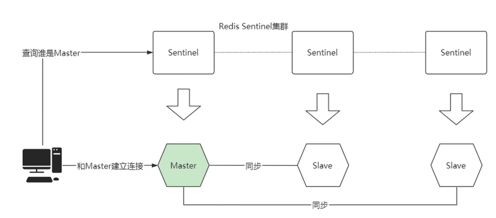
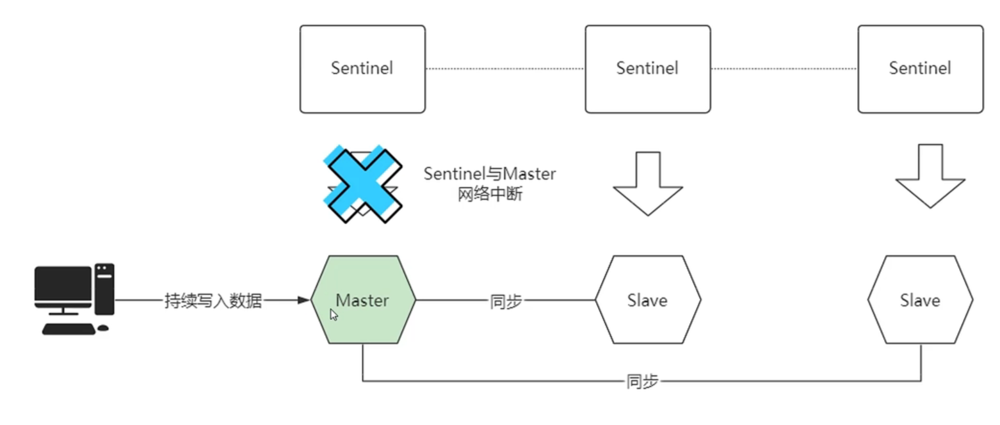
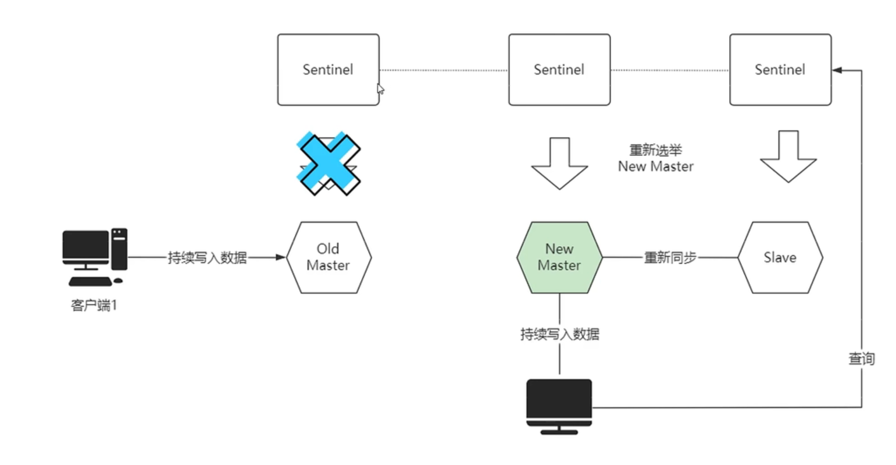
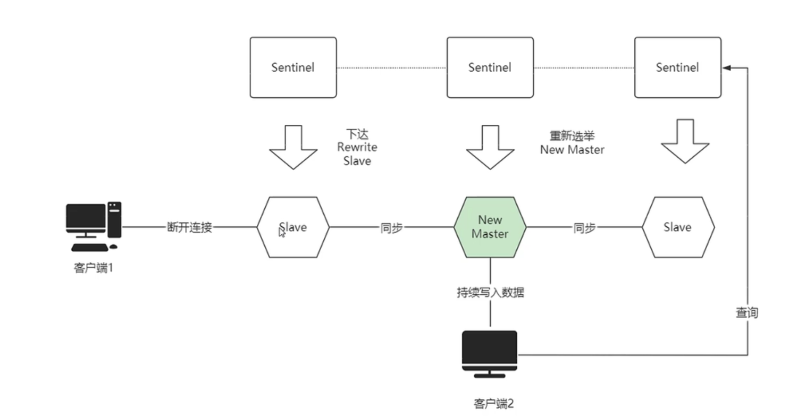

## 1. 脑裂现象发生过程

Redis Sentinel集群没有过半机制——如果发生网络分区，会出现多个主节点对外提供服务，一旦网络分区恢复，只会保留一个主节点，这就导致其他主节点上的写操作的数据丢失

Redis集群正常工作，客户端与master建立连接

突然master与sentinel之间断开连接，Sentinel认为master死亡了

Sentinel重新选举初一个新的master，新的客户端会连接上新master，但是旧客户端仍会连接旧master，并向旧master写数据

当旧master的网络恢复后，Sentinel会将其降级为slave

旧master成为slave后，会进行全量同步，同步new master的数据

全量同步中，new master会生成RDB文件发送给旧master，旧master先 flush清空本地数据，然后加载new master发送来的RDB文件——这就会导致旧客户端的写操作发生数据丢失

## 2. 脑裂现象缓解方法

配置 **min-slave-to-write参数** 和 **min-slaves-max-lag参数**

* min-slave-to-write：主节点必须要有至少 x 个从节点连接，如果小于这个数，主节点会禁止写数据
* min-slave-max-lag：主从数据复制和同步的延迟不能超过 x 秒，如果超过，主节点会禁止写数据

配置这两个参数后，如果旧主与集群其他部分发生网络分区，那么由于配置了这两个参数，旧主就无法处理写请求了
