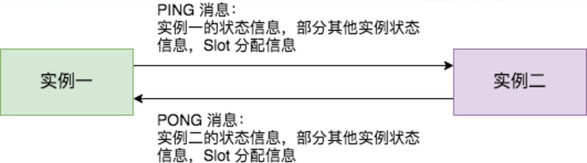
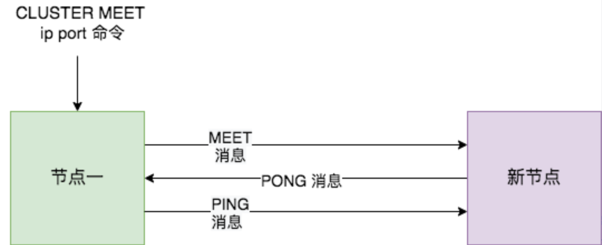
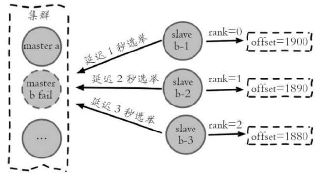
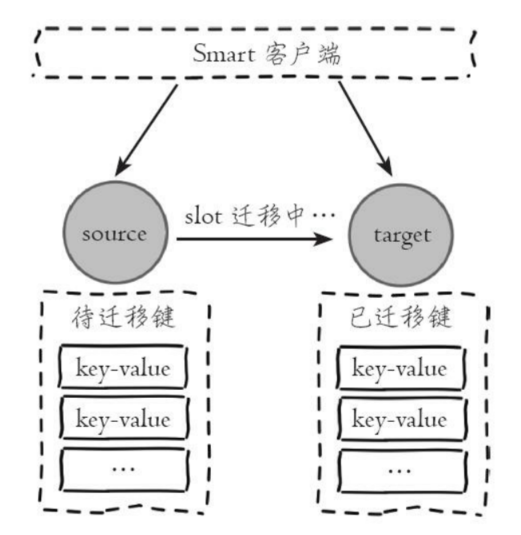
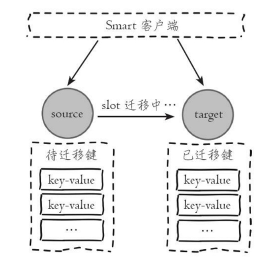

# 1. Redis Cluster介绍

* Redis Cluster着重于拓展性，如果Redis集群的内存不够使用，可以通过分片进行拓展

* Redis Cluster采用Slot分区，Slot是Redis Cluster数据管理和迁移的基本单位

* Redis Cluster一共有16384（2^16）个Slot，所有的key根据哈希算法，分散在0—16383中
  
  

* **功能限制**
  
  * 对批量操作支持有限——只有映射到同一个node上的key才可以批量操作
  * 对事务支持有限——同上
  * 只能使用0号数据库
  * 不支持嵌套树状复制结构

# 2. Redis Cluster搭建和拓展(非重点)

## 2.1 配置

```SHELL
port 6379
cluster-enabled yes //开启集群模式
cluster-node-timeout  15000 //节点超时时间
cluster-config-file "node-6379.conf" //集群配置文件
```

* 如果启动Redis时存在集群配置文件，Redis会使用集群配置文件内容初始化集群信息，否则会创建一份集群配置文件
* Redis启动后会分配一个节点ID，并记录到集群配置文件中（重启会重新读取集群配置文件，所以节点ID不会改变）

## 2.2 节点握手

各个节点启动之后，节点各自独立，无法构建集群——需要通过节点握手让节点之间相互感知，构成一个集群


只要在集群内任务一个节点执行cluster meet，握手状态会通过Gossip消息在集群内传播，集群内的其他节点会自动发现细新节点

## 2.3 分配槽

**主节点**

我们给主节点分配槽

> cluster addslots {begin ..end}

**从节点**

从节点不分配槽，作为主节点的从节点

> cluster replicate master_node_id


## 2.4 集群伸缩

集群伸缩主要是让slot和slot中的数据，从一个node移动到另一个node

### 2.4.1 拓展集群

数据迁移是逐个slot进行的

```SHELL
1. 向target node发送 cluster setslot {slot} importing {sourceNodeId}
2. 向source node发送 cluster setslot {slot} migrating {targetNodeId}
3. source node循环执行 cluster getkeysinslot {slot} {count}命令，获取count个属于 槽{slot}的键
4. 在source node上执行 migrate {targetIp} {targetPort} "" 0 {timeout} keys {keys ...}命令，将获取的key通过pipeline机制批量迁移到target node
5. 重复步骤3和步骤4直到所有的键值数据迁移到target node
6. 向集群内所有主节点发送 cluster setslot {slot} node {targetNodeId}命令——告知其余主节点，这些槽分配给了targetNode 
```

### 2.4.2 收缩集群

1. 确定下线的节点是否有负责的slot，如果有，需要把slot迁移到其他节点，保证该节点下线后整个集群slot映射的完整性
2. 当下线节点不再负责槽或者本身是从节点时——通知集群内其他节点**忘记下线节点**，当所有节点忘记该节点后就可以正常关闭

**忘记节点**

* 集群内的节点不停地通过Gossip信息彼此交换节点状态——要让其他节点不要再与下线节点进行Gossip信息交换——Redis提供 **cluster forget {downNodeId}**来实现忘记节点

* 当节点收到cluster forget命令后，会把nodeID指定的节点加入禁用列表，在禁用列表中的节点不再发送Gossip信息
  
  （禁用列表有效期60s，超过60s会再次参与信息交换）

# 3. Redis Cluster数据结构

## 3.1 clusterState,clusterNode,clusterNodeFailReport

每个Redis node都维护一个 **clusterState**结构，存储集群的状态数据

```C
typedef struct clusterState{
    clusterNode * myself;  //节点自身的clusterNode数据
    dirt * nodes;          //记录node_name与clusterNode的映射
    clusterNode * slots[CLUSTER_SLOTS]; //记录slot 对应的节点 
}
```

**clusterNode**保存了一个node的状态信息

```C
typedef struct clusterNode{
    char[] name;      //节点名
    int flags;        //节点标识，标记node状态(master,slave,上线,下线)
    int configEpoch;  //纪元，当前node已知的集群的epoch
    char[] slots;     //该节点拥有的slot
    int numslots;     //节点拥有的slot数目
    int numslaves;    //节点拥有的从节点数目
    clusterNode ** slaves; //指向从节点列表的指针
    clusterNode * slaveof; //指向主节点的指针

    mstime_t ping_sent; //我最后一次向该node发送PING的时间
    mstime_t pong_received;//我最后一次接收到该node PONG的时间
    mstime_t fail_time;   //flags被设置为下线状态时的时间

    list* fail_reports;  //下线记录列表,用来记录疑似下线报告
}
```

**clusterNodeFailReport**记录节点下线报告

```c
typedef struct clusterNodeFailReport{
    clusterNode * node;  //认为该节点已经下线的节点
    mstime_t time;       //报告时间
}
```

## 3.2 消息体结构

```c
typedef struct clusterMsg{
    int totlen;       //消息总长度
    int ver;          //消息版本
    int type;         //消息类型
    int currentEpoch; //发送该消息的节点记录的整个集群的唯一的epoch
    int configEpoch;  //每个master都有一个唯一的configEpoch做标识，如果和其他master的configEpoch冲突，会强制自增使本节点在集群中唯一 
    int offset;       //主从复制偏移量
    char[] sender;    //发送该信息的节点的名称
    char[] myslots;   //发送信息的节点负责的slots信息
    int flags;        //发送消息的节点的状态
    union clusterMsgData data; //这是一个union结构体，可以为PING，PONG，MEET，FAIL等消息体，如果是PING，PONG，MEET类型，ping字段被赋值,如果是FAIL类型,fail字段被赋值
}

typedef struct clusterMsgData{
    struct  ping{
        clusterMsgDataGossip gossip[1];//存储有发送节点最后一次给接受节点发送PING消息的时间，接收节点最后一次给发送节点发送PONG消息的时间
    }

    struct fail{
        clusterMsgDataFail about;//存储有下线节点的name
    }
}
```

# 4. 集群内通信——Gossip

* Gossip协议——**节点之间彼此不断通信交换信息**，一段时间后所有节点都会直到集群的完整信息（只要节点之间可以正常通信，最终一定会达到一致的状态），Redis Cluster内采用Gossip协议进行通信

* Gossip消息有4种
  
  * **ping**——用于检测节点是否在线，交换彼此信息
  * **pong**——响应信息
  * **meet**——用于通知新节点加入集群
  * **fail**——当节点判定集群中另一个节点下线时，会向集群内广播一个fail

## 4.1 定时ping/pong



Redis Cluster中的节点会定时向其他节点发送PING消息，来交换各个节点的状态数据，检查各个检点的状态

* **每秒1次的定时任务**
  
  每秒会随机选取5个node，然后找出最久没有通信的node发送ping消息，用于保证Gossip信息交换的随机性

* **每秒10次的定时任务**
  
  每100毫秒扫描本地节点列表，如果发现某个节点最近一次接受pong消息的时间 > cluster_node_timeout/2，那么立即发送ping消息，防止该节点信息太长时间未更新

## 4.2 meet—节点加入集群



* 当新节点要加入Redis Cluster时，需要Client给Redis Cluster中的集群节点发送一个cluster meet命令

* 集群节点会为新节点创建一个clusterNode结构，并将其添加到自己维护的字典中

* 集群节点会向新节点发送meet消息，新节点接收到meet消息后，为集群节点创建一个clusterNode结构，添加到自己维护的字典中

* 新节点向集群节点返回PONG消息，集群节点接收到PONG消息后，就知道新节点接收到了自己的meet消息

* 集群节点向新节点发送PING消息，新节点接收到PING消息后，直到集群节点收到了自己返回的PONG消息，完成握手操作

* meet操作成功之后，集群节点会通过PING机制将新节点的消息发送给集群中的其他节点，让集群中的其他节点与新节点握手

## 4.3 fail—故障转移

* **主观下线**——某个节点认为另一个节点不可用
* **客观下线**——集群中大部分节点都认为某个节点不可用，将其标记为下线，真正的下线
1. 节点会定期检查已经发送 PING 消息的接收方节点是否在规定时间 ( cluster-node-timeout ) 内返回了 PONG 消息，如果没有则会将其标记为疑似下线状态，也就是 PFAIL 状态（**主观下线**）
2. 节点一认为节点二主观下线，节点1会通过PING消息将这个主观下线情况发送给其他节点（例如节点三），节点三接收到消息后，从自己维护的**字典nodes**中取出**节点二对应的clusterNode**，将节点一对其的主观下线判断存储节点二的**clusterNode的下线记录列表**（只有主节点发出的主观下线判定才会被处理，从节点不会）
3. 节点三尝试对节点二进行客观下线
   * 节点三遍历节点二的clusterNode中的下线记录列表
   * 如果下线记录数>主节点的一半，就会向**集群广播fail消息**——fail消息会让集群中的所有节点将故障节点标记为客观下线状态，并通知故障节点的从节点触发 **故障转移**

# 5. 故障转移

流程如下

1. 资格检查
2. 准备选举时间
3. 发起选举
4. 选举投票
5. 替换主节点

有一个非常重要的数据—— **配置纪元**

* 在clusterNode中有一个configEpoch字段，这个就是配置纪元，每个主节点自身都会维护一个配置纪元，用于表示当前主节点的版本
* Redis Cluster中所有的主节点都拥有不同的配置纪元，从节点复制主节点的配置纪元
* Redis Cluster有一个全局配置纪元——所有主节点中配置纪元的最大值
* 主节点的配置纪元会随着ping/pong消息在集群内传播，如果发送方和接收方的配置纪元相同，那么nodeID更大的一方会递增全局配置纪元，并赋予自己

**配置纪元的作用**

1. 标识集群内各个主节点的版本和集群中的最大版本
2. 每个集群中出现了新的主节点（新加入or从节点转换），都会递增全局配置纪元，然后将其赋予新加入的主节点
3. 如果节点之间通过ping/pong交换数据时，出现了冲突，那么以配置纪元较大的一方为准

## 5.1 资格检查

下线主节点的每个从节点都会检查最后与主节点的断线时间，如果从节点与主节点的断线时间超过 **cluster-node-time* cluster-slave-validity-factor**，那么该从节点不具备故障转移资格

## 5.2 准备选举时间

确定节点**选举的延迟触发时间**——只有达到该时间才会进行后续流程

1. 获取主节点的所有从节点
2. 获取所有从节点的offset，并从大到小排列，分别赋予rank值0,1,2,3.....（偏移量越大，排名越小，排名从0开始）
3. **选举的延迟触发时间**=500+random()%500+ rank*1000

这里采用延迟触发机制——对多个从节点使用不同的延迟选举时间来支持优先级问题，复制偏移量越大的从节点，优先级越高，延迟越低



## 5.3 发起选举

当从节点超过了选举的延时触发时间后，发起选举

1. 自增集群的全局配置纪元，保存在clusterState.failover_auth_epoch中——用于表示该从节点发起的选举的版本
2. 在集群内**广播选举消息(FAILOVER_AUTH_REQUEST)**，并记录已经发送过的消息的状态，保证从节点在一个配置纪元内只能发起一次选举

## 5.4 选举投票

* 只有master可以投票

* 每个master在一个配置纪元内只有一张选票

* master会接受对于某个配置纪元内的第一个广播选举消息，其余的会忽略

* 如果slave接收到了超过N/2+1的master的投票，那么该从节点就可以替换死亡的master（N为持有槽的主节点总数，包括客观下线的主节点）

* **投票作废**——从节点开始投票后，如果在 cluster-node-timeout*2 的时间内，还没有获得足够的票数，本次选举作废，slave会从将自己的clusterState.failover_auth_epoch自增1，作为下一轮投票的配置纪元，发起下一论投票

## 5.5 替换主节点

* 从节点取消复制变为主节点
* 执行 clusterDelSlot操作撤销故障主节点负责的槽，并执行clusterAddSlot将这些槽委派给自己
* 向集群广播自己的消息，通知群内所有的节点——当前节点变为主节点并接管了故障主节点的槽

# 6. 请求路由

## 6.1 MOVED重定向

* 在Redis Cluster中，Redis接受请求时，首先会计算key对应的slot_index，并找到对应的node
  
  如果该node就是自己，就处理请求，否则向Client发送MOVED重定向消息（包含了slot和node的信息）

* MOVED重定向下，node只会回复重定向响应，不会进行转发

## 6.2 ASK重定向

如果slot对应的数据正在进行迁移，此时客户端请求访问该slot的数据，该slot的数据可能一部分在source node，一部分在target node



1. Client访问source node，如果存在键对象就直接执行命令并返回结果

2. 如果键对象不在source node上，那么source node回复 ASK重定向异常
   
   > (error) ASK {slot} {targetIP}:{targetPort}

3. 客户端从ASK重定向异常中提取出targetNode信息，发送asking命令给targetNode建立连接，然后再执行命令



## 6.3 二者区别

* ASK重定向说明集群正在进行slot迁移，客户端无法知道什么时候迁移完成，因此只是临时重定向
* MOVED重定向说明slot已经明确在确定的节点上，是永久重定向
