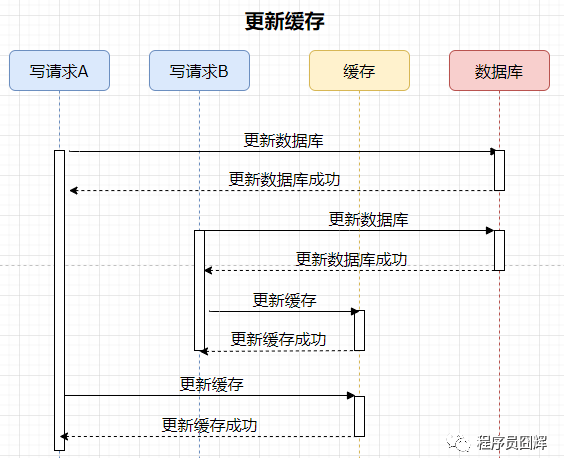
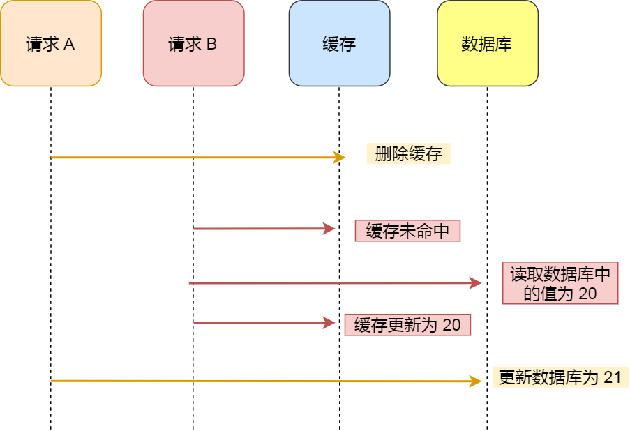
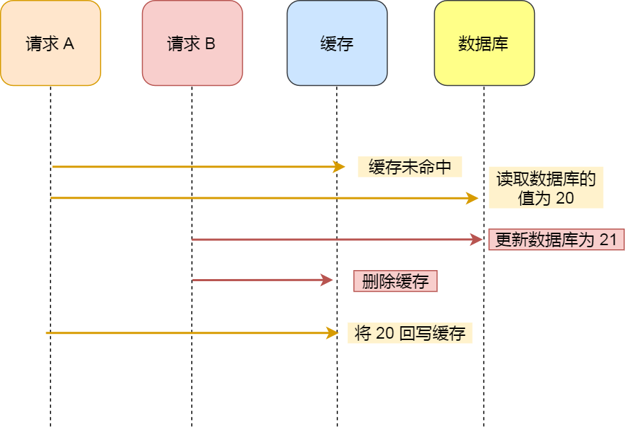

在Cache Aside中，我们处理写操作时

1. 先修改数据库

2. 让缓存中的数据失效

## 1. 为什么不是更新缓存？

如果我们处理写操作时，更新数据库+更新缓存，在多个请求并发更新同一条数据时，会因为写入顺序不同，导致数据不一致

## 2. 先库后缓存or先缓存后库

### 2.1 先删除缓存，在修改数据库

* 如果删除缓存成功，修改数据库失败——没有破坏数据一致性，重试即可

* 先缓存后库，在**读写并发**下会出现数据一致性问题，会导致操作结束后，Redis中存储的是旧数据，数据库中存储的是新数据（不推荐使用先缓存后库）

* 解决措施——**延时双删**——用户在更新完数据库后，等待一段时间，然后再次删除缓存（等待时间不好确定，并且也有一段时间数据不一致）

### 2.2 先更新数据库，再删除缓存

* 如果更新数据库成功，删除缓存失败——数据不一致，需要数据库回滚or重试

#### 目标数据已在缓存中

* 如果目标数据原本在缓存中，那么在更新完数据库到删除缓存的这段时间内，其他请求可以从缓存中读取到旧数据

* 该问题无法避免（除非使用分布式事务or分布式锁），但是数据不一致的时间极短，影响不大

#### 目标数据不在缓存中

* 如果目标数据不在缓存中，那么在读写并发下，可能会出现数据不一致，如下图

* 但是在实际应用中，这个问题出现的概率极低，因为缓存的写入速度远远快于数据库的写入，很难出现请求B已经更新完数据库并且删除了缓存后，请求A才将读取到的旧数据写入缓存的情况

* 所以先更新数据库，再删除缓存，在大多数情况下可以保证数据一致性，推荐使用这种方式，并且要给缓存数据加上**过期时间来兜底**

## 3. 如何保证更新数据库与删除缓存都成功

### 3.1 重试机制

引入MQ，将第二个操作生成一个消息放入到MQ中，让消费者消费消息来删除缓存，如果删除缓存失败，利用MQ的重试机制来再次消费消息，再次尝试删除缓存

### 3.2 订阅binlog

1. 更新数据库，产生binlog，被binlog抓取组件抓取发送到MQ中  
2. 缓存管理服务订阅和消费binlog，收到binlog后执行失效缓存  
3. 如果失效缓存失败，引入重试机制
