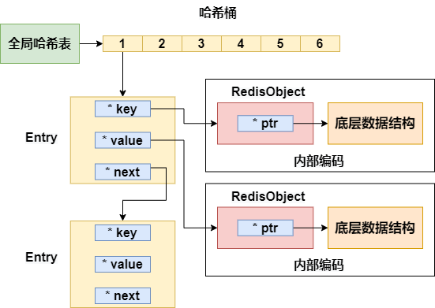
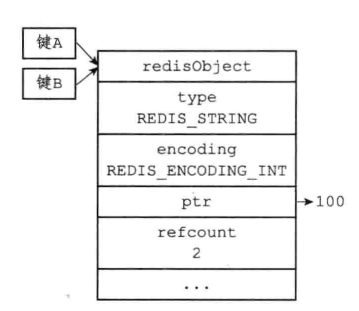
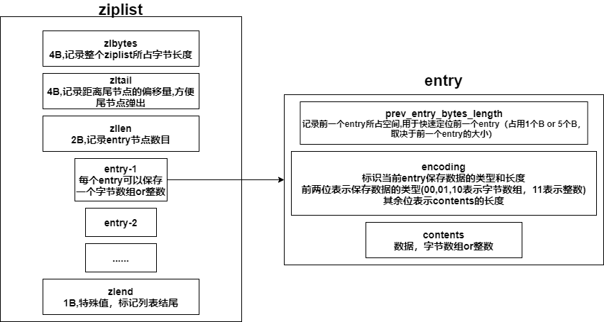
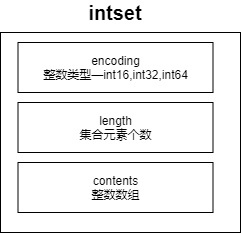
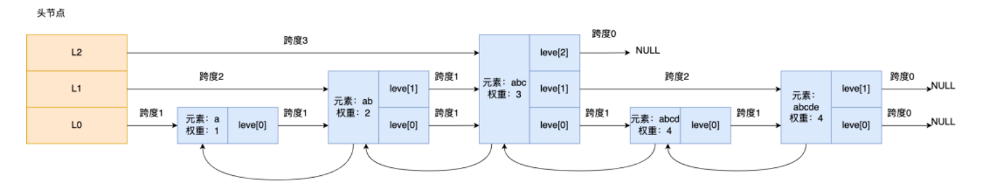
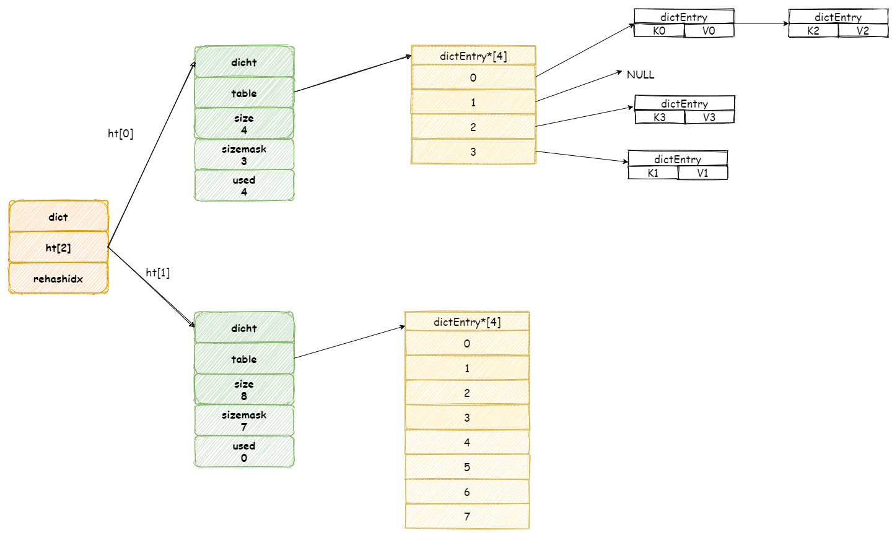

# 1. Redis的全局哈希表和RedisObject



## 1.1 Redis Object

Redis存储的数据 **都** 用**redisObject**来封装

```c
typedef struct redisObject{
    unsigned int type;      //4B，对象类型-string,list,hash,set,zset
    unsigned int encoding;  //4B，内部编码类型-int,SDS,ziplist,linkedlist,quicklist,hashtable,intset,skiplist
    REDIS_LRU_BITS lru;     //记录对象最后一次被访问的时间
    int refcount;           //引用计数器，记录当前对象被引用的次数
    void * ptr              //与对象的数据内容相关——如果是整数，直接存储数据，否则为指向数据的指针
}
```

### refcount的作用

1. **内存回收**
   
   * 创建一个对象时，其refcount初始化为1
   * 当对象被一个程序使用时，其refcount+1
   * 当对象不被一个程序使用时，其refcount-1
   * 当对象的refcount为0时，其占用的内存会被释放
   * API
     * incrRefCount：将对象的refcount+1
     * decrRefCount：将对象的refcount-1,如果对象refcount为0，释放对象
     * resetRefCount：将对象的refcount设置为0，但不会释放对象，一般用于重置refcount

2. **内存共享**
   
   
   
   * Redis中只有int字符串才可以被共享（因为共享前需要判断想创建的对象与已有的对象是否完全相同，负责的对象判断需要消耗很多性能）
   * Redis初始化时，会创建1w个int字符串对象（0—9999），使用这些整数时，共享对象，而不是创建
   * 通过refount可以知道有几个key共享该对象

## 1.2 全局哈希表

Redis使用哈希表来存储键值对

* Redis哈希表中的哈希桶保存的是一个Entry链表
* Redis有两个全局哈希表
* Redis通过**链式哈希**解决冲突
* Redis的rehash是渐进式的


### rehash

Redis有2个全局哈希表，Redis采用**渐进式rehash**

0. Redis一次只会使用一个哈希表，另一个哈希表不会被分配空间

1. Redis给哈希表2分配更大的空间（例如是哈希表1的2倍）

2. Redis每次对全局哈希表进行增删改查时，除了增删改查操作之外，还会将哈希表1中第一个索引位置上的所有Entry**拷贝**到哈希表2中
   
   再进行一次增删改查，就将哈希表1中第二个索引位置上的所有Entry**拷贝**到哈希表2中
   
   依次类推，直到哈希表1中的所有元素都拷贝到哈希表2中（如果服务器比较空闲，那么会有定时任务来帮助进行rehash）

3. 释放哈希表1的空间


#### rehash的优点

> rehash采用分而治之的方式，将rehash所需的计算工作均摊到每个操作上，避免了集中式rahash带来的庞大计算量

#### rehash的问题

> 在数据量大的时候，rahash可能会出现以下问题
> 
> * rehash时，同时存在两个哈希表，占用额外空间
> * rehash时，增删改查有概率同时操作两个哈希表，耗时增加
> * redis在内存接近maxmemory时且设置有驱逐策略的情况下，进行rehash会让内存占用超过maxmemory，触发驱逐淘汰，导致部门key被驱逐淘汰

# 2. Redis底层数据结构

* list在旧版本，底层用的是ziplist或linkedlist，后来Redis3.2推出了quicklist就都使用quicklist，移除了linkedlist


## 2.1 SDS

Redis的简单动态字符串(simple dynamic string，SDS)

string的内部编码 **raw**，**embstr**都是基于SDS实现的

```c
typedef struct SBS{
    int len;   //已用长度
    int free;  //未用长度
    char buf[];//字符数据
}
```

Redis对于字符串的使用——采用 **空间预分配机制**和 **惰性空间释放机制**

### 2.1.1 空间预分配机制

* 第一次创建时，len属性=实际大小，free为0，不做预分配

* 修改后，如果已有free空间不够且数据<1MB，每次预分配一倍容量
  
  > 原有len=60b，free=0，再追加60b，预分配120b——len=120b，free=120b

* 修改后，如果已有free空间不够且数据>1MB，每次预分配1MB容量

### 2.1.2 惰性空间释放机制

当SDS字符串缩短时，不会立刻回收内存，而是用free属性来记录这些空闲内存，等待将来使用

### 2.1.3 内部编码int，embstr和raw使用SBS

* **embstr**：RedisObject与SDS连续存放在一起，使用malloc分配一次内存
* **raw**：RedisObject与SDS分开存储，使用malloc分配两次
* **int**：RedisObject的ptr直接存储数据


### 2.1.4 为什么使用SDS而不是C自带的字符串

1. SDS可以以O(1)获取字符串的长度，C自带的字符串需要O(N)
2. 杜绝缓冲区溢出
   * C自带的字符串在进行操作时（例如拷贝，拼接），不会检查目标地内存是否足够，可能发生缓冲区溢出
   * SDS在操作字符串时会检查内存空间是否足够，如果空间不够会自动扩容
3. 减少修改字符串带来的内存分配次数
   * SDS提供了预分配机制和惰性空间释放机制
4. C字符串只能保存文本数据，SDS可以保存文本或者二进制数据，可以用来实现bitmap

## 2.2 ziplist

压缩列表结构如下



**压缩列表**

* 数据紧凑排列的一块连续内存数组——节约内存
* 可以快速定位到第一个元素和最后一个元素——以O(1)实现入队和出队
* 对中间元素的操作涉及复杂的指针移动，时间复杂度就是O(N)了

### 连锁更新问题

对ziplist的插入or删除，可能会造成连锁更新问题

以插入为例，假设ziplist中原本每个entry都是254个B，那么每个entry的prev_entry_bytes_length都只占用1个B

在ziplist的头部插入要给大entry，导致第二个entry的prev_entry_bytes_length需要5个B，第二个entry的大小变为258B，那么第三个entry的prev_entry_bytes_length也需要5个B，导致第三个entry的大小变为258B ......

## 2.3 linkedlist

* Redis3.2后推出quicklist，就不再使用该结构

```c
struct list{
    listNode* head;
    listNode* tail;
    long length;//包含的节点s
}

struct listNode<T>{
    listNode* prev;
    listNode* next;
    T value
}
```

## 2.4 quicklist

* quicklist内部默认每个ziplist长度为8KB，超过该长度，会另起一个ziplist
* quicklist默认压缩深度为0（不压缩）——压缩深度由 **参数list-compress-depth**决定

```c
struct quciklist{
    quicklistNode* head;
    quicklistNode* tail;
    long count; //元素个数
    int nodes;  //ziplist节点的个数
    int compressDepth; //LZF算法压缩深度
}

struct quicklistNode{
    quicklistNode* prev;
    quciklistNode* next;
    ziplist* zl; //指向压缩列表的指针
    int32 size; //ziplist的字节总数
    int16 count;//ziplist中的元素数目
    int2 encoding;//存储形式，存储的是字节数组还是压缩数据
}
```


## 2.5 intset



intset保存的整数类型根据长度划分——int16，int32，int64

各个元素在contents中按照值的大小从小到大有序地排列，并且不会包含重复的元素

### 升级操作

如果intset保存的都是int16，然后插入了一个int32的元素，那么需要进行升级操作

1. 创建一个新的intset，底层数组存储的都是int32

2. 将原来intset中的所有元素都转换为int32，放入新的intset中

3. 将新元素放入新的intset中

（intset不支持降级操作）

## 2.6 skiplist

* skiplist是一种有 **有序**数据结构——**支持平均O(logN)，最坏O(N)**

* skiplist可以支持范围查询

* skiplist是一个有层级关系的链表，每一个层级都可以包含多个节点，节点之间通过指针连接成一个链表——依赖node中的level数组

* level数组中的每一个元素代表skiplist中的一层



```c
struct zskiplist{
    zskiplistNode * header,tail;
    long length; //总结点数目
    int level;//跳表的最大层数
}
struct zskiplistLevel{
    struct zskiplistNode * forward;//该层中的下一个节点
    int span;//跨度,记录当前节点和该层下一个节点之间的距离,用于计算这个节点在跳表中的排位
}

struct zskiplistNode{
    zskiplistLevel level[]; //层数组
    zskiplistNode * backward; //后退指针,指向前一个节点
    double score; //元素的权重值,skiplistNode按照score升序排序
    robj *obj; //存储的元素
}
```

### 跳表查询过程

跳表从头结点的最高层开始，逐一遍历每一层，在遍历某一层的跳表节点时，会使用跳表节点中的元素权重值和元素进行判断

* 如果当前节点的权重<要查找的权重，访问该层的下一个节点

* 如果当前节点的权重=要查找的权重，当前节点的元素值<要查找的数据，访问该层的下一个节点

* 如果上述两个条件都不满足，或者该层的下一个节点为空——使用当前节点的level数组中的下一个level中的指针，在下一层中进行查找

### 跳表节点层数设置

* 跳表中相邻两层的节点数量的比例会影响跳表的查询性能，如果上层节点数目太少，性能会急剧下降

* 跳表的相邻两层的节点数量最理想的比例是 2:1，查找复杂度可以降低到 O(logN)

* Redis——创建节点的时候，随机生成每个节点的层数
  
  * 跳表在创建节点时，随机生成一个[0,1]的随机数，如果随机数>0.25就结束，确定该节点的层数，如果随机数<0.25，那么该节点的层数+1，继续生成下一个随机数，重复上述流程

### 为什么用跳表不用平衡树

* 内存占用来看，跳表比平衡树更灵活一些，平衡树每个节点包含2个指针，跳表中的每个节点包含的指针数目平均为1/(1-p)，在Redis中，p=1/4，平均每个节点包含1.33个指针

* 范围查询，跳表比平衡树操作更简单

* 算法实现难度上，跳表比平衡树更简单

## 2.7 dict

* HashTable的结构文件是`dict.c`

Redis创建hashmap时候会创建一个哈希表数组ht——保存两个哈希表dicht

* ht[0]在第一次往hashmap中添加键值对时分配内存空间
* ht[1]在扩容/缩容才会进行空间分配



* 哈希表dicht结构
  * dichtEntry数组table——每个位置都可以存放一个链表，采用开放链表避免冲突（头插法）
    * key
    * value
    * next指针（用于构建链表）
  * size：哈希表大小
  * used：已有节点数量

### 2.7.1 哈希表收缩与拓展的条件

1. 如果服务器正在执行BGSAVE 或者 BGREWRITEAOF，那么哈希表的负载因子>=5，才会触发扩容（负责因子=ht[0].used/ht[0].isze）
2. 如果服务器没有执行BGSAVE 或者 GBREWRITEAOF，那么哈希表的负载因子>=1，就会触发扩容

**原因**——因为在BGSAVE或者BGREWRITEAOF时，服务器会fork()子进程，子进程采用copy-on-write机制，所以在子进程存在期间，服务器要提高执行拓展操作所需的负载因子，尽可能地避免在子进程存在期间进行哈希表拓展操作——节约内存

### 2.7.2 渐进式rehash

1. 为ht[1]分配内存空间——如果拓展，那么ht[1]的大小为第一个大于等于ht[0].used x 2的2^n；如果执行的是收缩操作，那么ht[1]的大小是第一个大于等于ht[0].used的2^n

2. rehashidx重置为0

3. 每次对字典进行增删改查，都会将ht[0] rehashidx位置上的元素移动到ht[1]，并且rehashidx+=1，直接全部移动完毕

4. 释放ht[0]，将ht[1]设置为ht[0]，并在ht[1]创建一个新的空白哈希表

5. 在渐进式rehash过程中，删改查都会在ht[0]和ht[1]两个哈希表上进行；插入只会在ht[1]中进行
