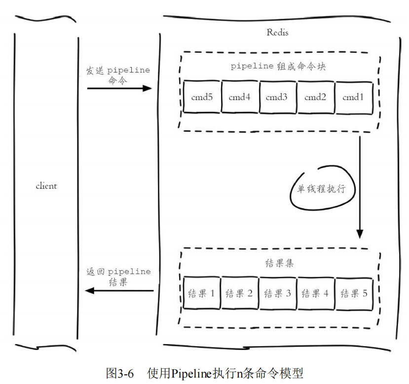

### 1. 一条命令的生命周期

其中，1) + 4)称为 Round Trip Time(RTT，往返时间)

### 2. Pipeline

Pipeline是**Client**提供的一种批处理技术，用于一次性处理多个Redis命令

使用Pipeline可以解决多个命令执行时的网络等待

### 3. Pipeline和原生批量操作的区别

* 原生批量操作是原子的
  
  Pipeline是非原子的

* 原生批量操作时一个命令对应多个key
  
  Pipeline支持多个命令

* 原生批量操作时Redis服务端支持实现的
  
  Pipeline需要服务端与客户端共同实现