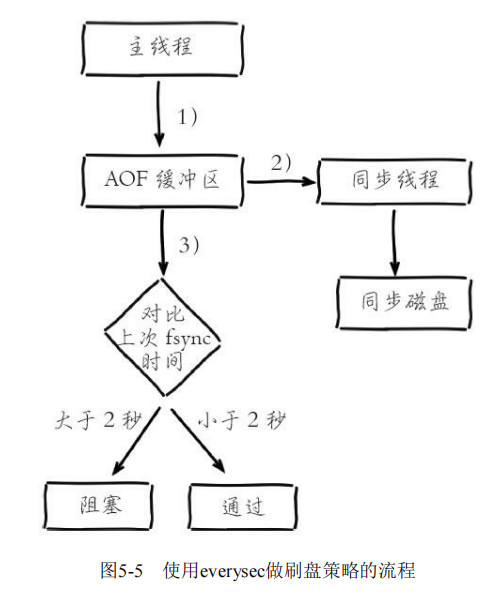

Redis有三种持久化机制

* RDB
* AOF
* 混合持久化(RDB+AOF,Redis4.0引入)

# 1. RDB

RDB持久化——将当前进程数据生成快照保存到磁盘

Redis默认使用LZF算法对RDB文件进行压缩处理——压缩后的文件远远小于内存大小

## 1.1 RDB触发机制

* **手动触发**
  * **save命令**：阻塞主线程，直到RDB完成为止(已废除)
  * **bgsave命令**：Redis进程执行fork操作创建子进程，RDB持久化由子进程负责，完成后自动结束
* **自动触发**
  * **save配置**——配置文件中配置 save m n，达到条件后自动触发
  * **debug reload命令**——执行该命令，会自动触发
  * **shutdown**——默认情况下执行shutdown命令，如果没有开启AOF，那么自动执行bgsave

## 1.2 bgsave执行流程

1. 执行bgsave命令，Redis父进程判断当前是否存在正在执行的子进程(如RDB子进程,AOF子进程)，如果存在，bgsave直接返回
2. 父进程执行fork操作创建子进程，fork操作执行过程中会阻塞父进程
3. 父进程fork完成后，可以继续响应其他命令；由子进程负责RDB持久化
4. 子进程根据父进程的内存快照生成RDB文件，原子替换旧文件（copy-on-write机制）
5. 子进程发送信号通知父进程

## 1.3 RDB优缺点

### 1.3.1 优点

* RDB是一个紧凑压缩的二进制文件，代表Redis在某个时间点上的快照数据，非常适用于冷备份，全量复制等场景
* Redis加载RDB恢复数据远远快于AOF

### 1.3.2 缺点

* RDB方式下，数据没办法做到实时持久化/秒级持久化——因为bgsave每次都要fork一个子进程，属于重量级操作

* 如果数据量很大，那么RDB持久化的时候，可能会导致客户端延迟

# 2. AOF

* AOF默认不开启，可以配置 **appendonly yes**来开启AOF

* AOF是写后日志，**先执行命令，后写AOF**
  
  > 写后日志有2个好处
  > 
  > 1. 避免额外的检查开销，如果先日志后执行写操作的话，需要先校验命令的语法
  > 
  > 2. 不会阻塞当前写操作的执行

## 2.1 AOF工作流程

1. **所有的写命令都会写入aof_buf中**
2. **AOF缓冲区根据对应的策略向磁盘做同步操作**
3. 随着AOF文件越来越大，**需要定期对AOF文件进行重写**
4. **Redis重启时，可以加载AOF进行数据恢复**

### 2.1.1 命令写入

每执行一条写命令，都会将该写命令写入aof_buf中，采用的是RESP协议

### 2.1.2 文件同步

Redis提供了多种文件同步策略——由 **参数appendfsync**控制

* **always**：命令写入aof_buf后立刻调用fsync同步到AOF文件中，fsync完成后线程返回
* **everysec**：命令写入aof_buf后调用write写入操作系统缓存，write完成后线程返回；有**后台线程**每秒调用一次fsync同步文件
* **no**：命令写入aof_buf后调用write写入操作系统缓存，write完成后线程返回；由操作系统决定何时调用fsync同步文件

### 2.1.3 重写机制

#### 2.1.3.1 触发时机

* **手动触发**：直接调用 **bgrewriteaof命令**

* **自动触发**：根据 **auto-aof-rewrite-min-size**和 **auto-aof-rewrite-percentage**参数确定自动触发时机
  
  * **auto-aof-rewrite-size**：AOF重写时的最小文件体积(默认64MB)
  * **auto-aof-rewrite-percentage**：当前AOF文件空间和上一次重写后AOF文件空间的比值
  
  > 自动触发时机=aof_current_size>auto>aof-rewrite-min-size && (aof_current_size-aof_base_size)/aof_base_size>=auto-aof-rewrite-percentage

#### 2.1.3.2 重写流程

1) 执行AOF重写请求

2) 父进程执行fork创建子进程

3) 父进程fork操作完成后，继续响应其他命令
* 3.1) 写命令依然写入aof_buf并根据appendfsync策略同步到磁盘上的旧AOF文件

* 3.2) 父进程将写命令写入aof_rewrite_buf，防止新AOF文件生成期间丢失这部分数据
4) 子进程根据**当前的内存快照**，按照合并规则生成新的AOP文件
5. 子进程发送信号给父进程

6. 父进程将aof_rewrite_buf中的数据写入新AOF文件

7. 使用新AOF文件替换旧AOF文件

## 2.2 everysec策略下的AOF追加阻塞

AOF持久化采用**everysec**作为同步磁盘策略——**命令写入aof_buf后调用write写入操作系统缓存，write完成后线程返回；有专门的线程每秒调用一次fsync同步文件**

但是该策略，在系统磁盘资源繁忙时，会造成**Redis主线程阻塞**

1. 主线程将命令写入aof_buf后调用write写入操作系统缓存

2. 有一个同步线程线程负责每秒执行一次fsync同步磁盘操作

3. 如果磁盘负载过高，导致AOF fsync阻塞，那么主线程在调用write时，也会被阻塞，直到AOF线程执行完fsync

## 2.3 AOF优缺点

### 2.3.1 优点

* AOF可以通过刷盘策略保证数据不丢失（或者最多丢失1s数据）
* AOF以追加方式写入，写入性能好（适合做热备份）

### 2.3.2 缺点

1. 同等数据量下，AOF文件比RDB文件大
2. 使用AOF恢复数据比较慢

# 3. Redis4.0混合持久化

重启Redis时——很少使用RDB来恢复数据（因为会丢失大量数据），通常使用AOF日志重放，但是AOF速度慢

所以Redis4.0引入了**混合持久化**

* **RDB以一定的频率执行，在两次RDB之间，使用AOF来记录这段时间的所有命令操作**
* 重启Redis时，先加载最近一次RDB，再重放该RDB以后的AOF

# 4. 面试题

## 4.1 fork实现

- 子进程通过fork操作产生，理论上子进程占用的内存大小=父进程
- 但是Linux有**Copy-On-Write机制**，在创建子进程时，会复制父进程的页表作为子进程的页表，让父子进程共享物理内存，并且共享的物理内存只读，当父子进程任意一方想要修改某个内存页时候，会发生写时复制，分配一个新的内存页，将原页内容拷贝到新页上，进程在新页上进行写
- 通过**Copy-On-Write机制**可以让子进程拥有自己诞生那一刻的内存视图，后续不会改变

## 4.2 为什么持久化是子进程而不是子线程

* 如果使用线程，多线程之间共享内存，在修改共享内存数据时，需要加锁来保证数据安全，会降低性能

* 使用子进程，通过Linux的**Copy-On-Write机制**，可以让父子进程享有相同的内存，并且这个内存只读，当父子进程任意一方想要修改某个内存页时候，会发生写时复制，分配一个新的内存页，将原页内容拷贝到新页上，进程在新页上进行写
