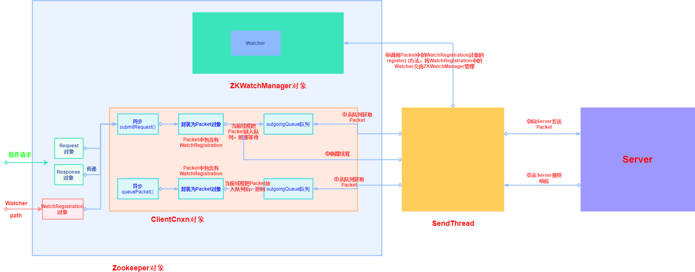

### 1. Zookeeper Client介绍

* **每创建一个Zookeeper对象，就是成功创建了一个与服务器连接的客户端**
* **Zookeeper提供的API有同步和异步两种模式**

  * 调用同步API，Client的线程会阻塞，直到收到Server的响应结果(不管是否成功)
  * 调用异步API，Client会从API返回，继续干自己的事情，Server返回响应结果时(不管是否成功)会通知Client（通过一个Callback对象）


### 2. Zookeeper Client方法调用流程图



### 3. Zookeeper Client类图结构


* ClientCnxn：网络连接器

  * pendingQueue：两个核心队列之一，存储已经发送，正在等待回复的Packet（服务端响应的等待队列）

  * outgoingQueue：两个核心队列之一，存储即将要发送的Packet（Client请求的发送队列）

    

  * chrootPath：命名空间，客户端在connectString中添加后缀来设置

    ```
    IP1,IP2,IP3/apps/a
    ```

    

  * SendThread：

    * 负责向服务器发送Packet，接受服务器响应

    * 维护Client与Server之间的Session生命周期——以一定的频率向Server发送PING包来实现心跳检测
    * 在Session周期内，如果Client与Server出现TCP断开，自动重连
    * 接收到服务的响应后，如果响应中包含了事件，将的事件写入EventThread的watingEvents

  * EventThread：负责Client的事件处理，并触发注册的Watcher，EventThread不断地从watingEvents中取出Object，识别其类型(Watcher或AsyncCallback)，并分别调用其process()或processResult()来触发回调

    * watingEvents：事件队列，存放所有等待被Client等待的事件


