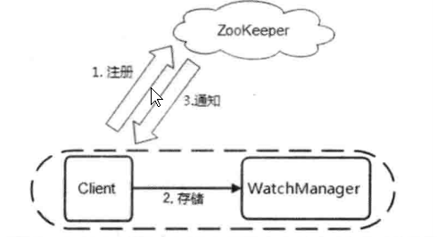

1. Client向Zookeeper服务端发送Watch，进行注册
2. 同时Client还会把Watch存储到WatchManager中
3. Zookeeper服务端触发Watch时，会向Client发送通知，Client依据通知从WatchManager中取出对应的Watcher对象来执行**回调逻辑**


### 1. Client注册和存储Watcher


1. 根据调用的方法不同，将Watcher和path封装为不同的WatchRegistration对象

1. **Wathcer**和**path**会封装为WatchRegistration对象，然后WatchRegistration对象会封装进Packet对象中
2. Packet对象发送outgoing队列后，会有SendThread发送给服务器
2. SendThread收到Server的响应后执行**finalPacket()方法**
3. 从Packet对象中取出WatchRegistration对象，然后调用其**register()**，将WatchRegistration中的Watcher交由ZKWatchManager保管


### 2. Watcher在Server端的存储


最终，ServerCnxn（Watcher）存放到了DataTree的WatcherManager中的watchTables和watch2Paths

**Zookeeper服务器端，其实是把ServerCnxn当做Watcher进行存储**


### 3. Server端触发Watcher

以setData()触发Watcher举例

setData()方法最终会调用 **DataTree的setData()方法**，而Watcher的触发就在这setData()中


### 4. Client回调Watcher


watingEvent是一个阻塞等待队列，EventThread的run()会不断对处理该队列中的对象

EventThread的run()会从watingEvent中取出WatcherSetEventPair，从中取得Set `<Wather>`和WatchedEvent ,然后逐个执行执行每个Watcher的process( )

```java
public void run() {
    try {
        isRunning = true;
        while (true) {
            Object event = waitingEvents.take();//从watingEvents中取出WatcherSetEventPair
            if (event == eventOfDeath) {
                wasKilled = true;
            } else {
                processEvent(event);//处理WatcherSetEventPair
            }
            if (wasKilled) {
                synchronized (waitingEvents) {
                    if (waitingEvents.isEmpty()) {
                        isRunning = false;
                        break;
                    }
                }
            }
        }
    } catch (InterruptedException e) {
        LOG.error("Event thread exiting due to interruption", e);
    }
}

private void processEvent(Object event) {
    try{
        if (event instanceof WatcherSetEventPair) {
            // 处理WatcherSetEventPair
            WatcherSetEventPair pair = (WatcherSetEventPair) event;
            for (Watcher watcher : pair.watchers) {//从WatcherSetEventPair中取出Set<Watcher>
                try {
                    watcher.process(pair.event);//逐个回调
                } catch (Throwable t) {
                    LOG.error("Error while calling watcher.", t);
                }
            }
        }
    }//以下代码略
}
```

