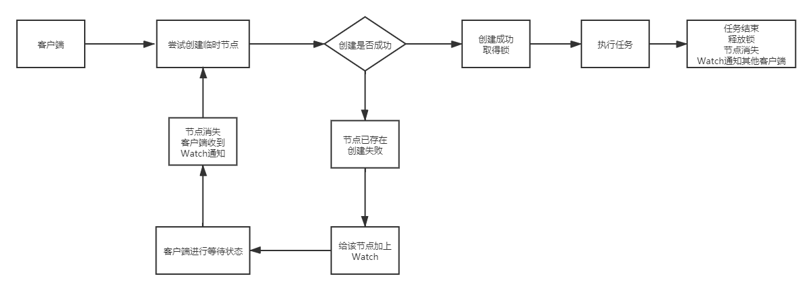

## 1. 数据发布/订阅(配置中心)

* 发布者将数据发布到Zookeeper的一个或一系列节点上，供订阅者进行数据订阅——达到动态获取数据的目的，实现配置信息的集中管理和数据的动态更新

* Zookeeper采用推拉结合的方式
  * 客户端向ZK注册自己关注的节点，一旦节点的数据发送改变，ZK会向相应的客户端发送Watcher事件通知
  * 客户端收到通知后，主动到服务端获取最新的数据
* 客户端启动时，去ZK上从指定节点获取配置数据，并添加一个Watcher监听

## 2. 负载均衡

基于ZK实现动态DNS

* **域名配置**

  在ZK中创建一个域名节点进行域名配置，例如/DDNS/app1/server.app1.hxq.com

  假设这个域名需要映射三个IP——10.100.0.1，10.100.0.2，10.100.0.3

  那么将IP信息写入这个节点即可

* **域名解析**

  * 访问对应的域名节点获得数据即可
  * 同时给域名节点加上Watcher，监听域名下IP的变动

  

## 3. 分布式协调/通知

通过Zookeeper的Watcher注册与异步通知机制——可以很好的实现不同系统之间的协调与通知，实现对数据变更的实时处理

* 集群管理
* 分布式日志收集系统
* 在线云主机管理
* 机器上/下线

### 3.1 ZK实现主备切换

数据同步服务，有多个实例，每个实例启动时候都会在ZK尝试创建/data/synchronized/lock临时节点

* 成功创建的实例，状态标记为running，负责执行数据同步工作
* 创建失败的实例，状态标记为standby，充当备机，并在/data/synchronized/lock上添加Watcher进行监控

如果running的实例因为某些原因死亡了，那么所有的备机都会收到ZK的异步通知，会尝试去创建/data/synchronized/lock节点，重复上述流程

主备切换时，原本的主机需要将一些关键的上下文数据留给下一任主机——可以将ZK上的某个指定节点指定为上下文数据存储节点

### 3.2 ZK实现分布式系统机器间通信

系统机器之间的通信无外乎——心跳检测，工作进度汇报，系统调度

#### 3.2.1 心跳检测

* 普通心跳检测——机器之间定期ping来判断
* ZK实现心跳检测——让不同的机器在ZK的一个指定节点下创建临时子节点，不同机器可以根据临时节点是否存在来判定对应的机器是否存货

#### 3.2.2 工作进度汇报

在ZK上选择一个节点，每个机器都在这个节点下创建临时子节点，这样可以实现2个功能

* 通过判断临时节点是否存在可以确定对应的机器是否存货
* 各个机器将自己的任务执行进入写入自己创建的临时子节点中，可以让其他机器看到任务的执行进度

## 4. Master选举

## 5. 分布式锁

### 5.1 Zookeeper实现分布式锁方式1

多个客户端创建同一个path的临时节点，创建成功的取得锁，创建失败的客户端监听这个临时节点，获得所锁的客户端释放锁(删除临时节点)，或者宕机(也会删除临时节点)，其他客户端就收收到Watch通知，可以去抢占锁

缺点：会出现惊群效应——释放锁的时候，会唤醒许多线程来争夺锁

### 5.2 Zookeeper实现分布式锁的机制2

### 5.3 Zookeeper分布式锁存在的问题

1. 客户端1成功获得锁，准备开始执行业务代码
2. 客户端1在执行业务代码时，与Zookeeper连接断开，其创建的临时节点被删除
3. 客户端2此时就可以取得分布式锁
4. 客户端1与客户端2同时访问资源

## 6. 分布式队列

分为两种——**常规的先入先出队列**和**等到队列元素集聚之后才统一安排的Barrier模型**

* **FIFO**

  同分布式锁的第二种方案

* **Barrier**

  Barrier分布式屏障——规定一个队列的元素必须都集聚后财通统一进行安排，否则一直等待

  实现如下

  

  