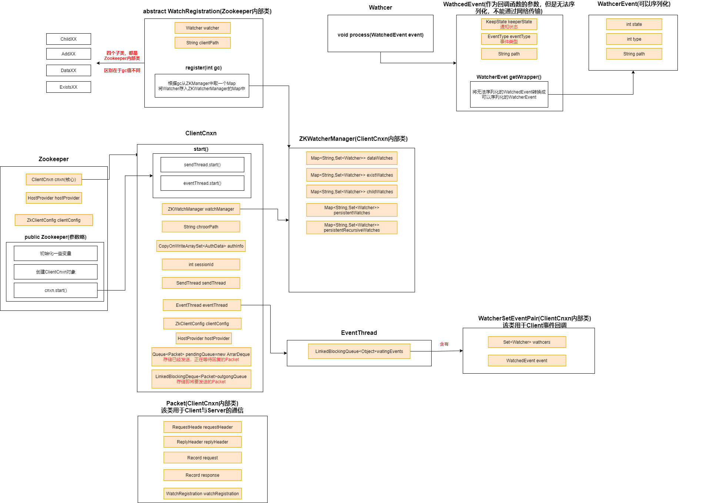
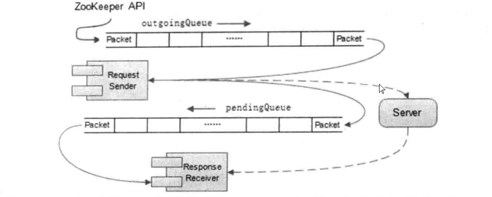

# 1. Zookeeper Client介绍

* **Zookeeper提供的API有同步和异步两种模式**
  * 调用同步API，Client的线程会阻塞，直到收到Server的响应结果(不管是否成功)
  * 调用异步API，Client会从API返回，继续干自己的事情，Server返回响应结果时(不管是否成功)会通知Client（通过一个Callback对象）

# 2. Zookeeper Client方法调用流程图

# 3. Zookeeper Client类图结构

## 3.1 ClientCnxn

网络连接器——核心结构，包含了核心的数据结构

### 3.1.1 WatchManager

有5个map，存储path与Watcher的映射

### 3.1.2 两个Packet队列

* **outgoingqueue**——存储即将要发送的Packet（请求发送队列）
* **pendingQueue**——存储已经发送，等待回复的Packet（响应等待队列）

### 3.1.3 两个核心线程

* SendThread：
  
  * 负责向服务器发送Packet，接受服务器响应
  * 发送Packet时，如果Packet中携带Watcher，将Watcher存储到WatcherManager中
  * 维护Client与Server之间的Session生命周期——以一定的频率向Server发送PING包来实现心跳检测
  * 在Session周期内，如果Client与Server出现TCP断开，自动重连
  * 接收到Server的响应后，如果响应中包含了事件，会从WatcherManager中取出对应的Watcher，将event和Watcher封装为WatcherSetEventPair，放入EventThread的阻塞队列waitingEvents中

* EventThread
  
  * watingEvents：阻塞队列，用来存放即将被回调的WatcherSetEventPair

* EventThread不断地从watingEvents中取出WatcherSetEventPair，从中获得Watcher和WatchedEvent，，调用Watcher的process()来触发回调
