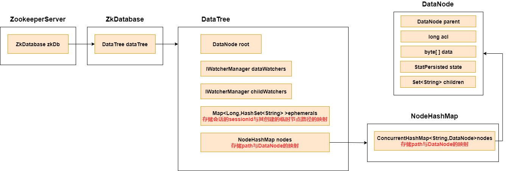

### **逻辑模型**

Zookeeper拥有一个内存数据库，内存数据库的结构如下

#### **1. Zookeeper层次数据模型data tree**

树形结构，由一个个znode组成，存储在内存中

#### **2. Znode的结构**

* **stat**：状态信息，包括了版本号，时间戳
  
  * **czxid(Created ZXID)**：创建节点的事务的ZXID
  
  * **mzxid(Modified ZXID)**：最后一次更新该节点的事务的ZXID
  
  * **pzxid**：该节点的子节点列表最后一次被修改时的事务ID(子节点列表修改——也就是创建/删除子节点才会修改pzxid，子节点内容变更不会修改pzxid)
  
  * **version**：：数据节点的版本号(该节点的修改次数)
  
    用于乐观锁机制，每次写入校验版本，如果跟预想的一样，说明没人修改过，可以进行修改，否则不能进行修改
  
  * **cversion**：子节点的版本号(子节点的修改次数)
  
    用于乐观锁机制，每次写入校验版本，如果跟预想的一样，说明没人修改过，可以进行修改，否则不能进行修改
  
  * **aversion**：节点的ACL版本(ACL的修改次数)
  
    用于乐观锁机制，每次写入校验版本，如果跟预想的一样，说明没人修改过，可以进行修改，否则不能进行修改
  
  * **ctime(Created Time)**：该节点创建时的时间
  
  * **mtime(Modified Time)**：该节点最后一次更新的时间
  
  * **ephemeralOwner**：如果节点是临时节点，那么该字段为创建节点的Session的SessionID，否则为0
  
  * **dataLength**：该节点data的长度
  
  * **numChildren**：该节点的子节点数目
* data：该Znode存储的数据，最多1MB（可以设置），每个节点都有一个ACL列表，规定了可以对该znode的data做哪些操作
* children：该Znode下的节点

#### **3. 支持的操作**

* 通过路径来定位Znode
* Znode的数据只支持全量写入和读取，不支持部分写入和读取
* 所有的API都是wait-free，正在执行的API调用不会影响其他API的完成

#### **4. Znode的类型**

* 持久节点：客户端断开连接后，不会消失
* 临时节点：客户端断开连接后，客户端创建的临时节点都会消失，临时节点不能有子节点
* 顺序节点：Zookeeper会将10位序列号加到原始名称后来设置Znode路径（名字具有顺序性）
  * 持久顺序节点
  * 临时顺序节点

### **代码实现**

#### 1. ZkDatabase

内存数据库，负责以下工作

* DataTree的存储和事务日志
* 定期向磁盘dump快照数据
* Zookeeper Server启动时，通过磁盘上的事务日志和数据快照，恢复一个完整的内存数据库
