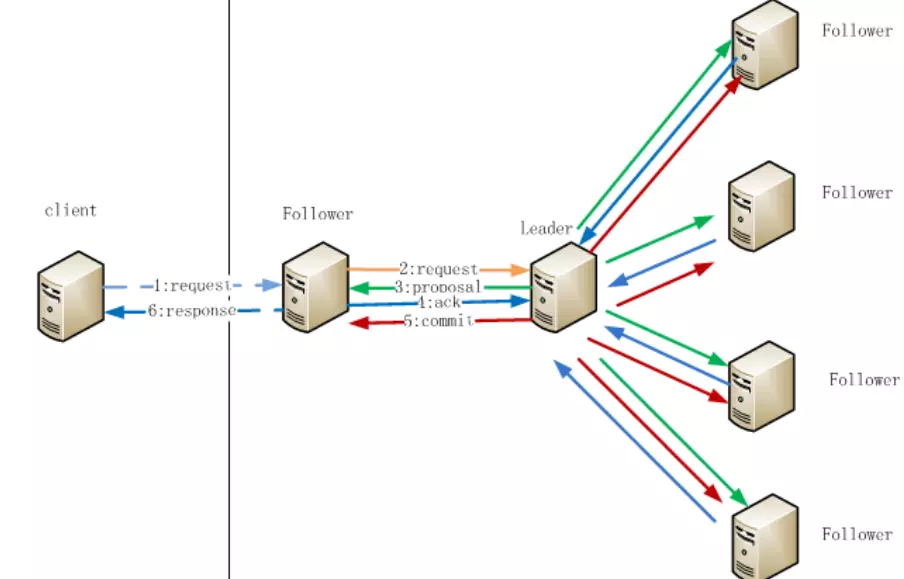

* **三种服务器角色的读写**
  * leader：可读可写
  * follower：只读不写
  * observer：只读不写

* **全局数据一致**：Zookeeper集群中所有的节点的Replicated Database保存有相同的数据

* **读操作**：不需要与集群交互，Client直接从连接的Replicated Database(内存数据库)上读取

* **写操作**——ZAB协议的消息广播模式

  **消息广播模式工作过程**

  * **前提**：Zookeeper只允许唯一的Leader服务器进行事务请求的处理，余下的服务器成为Follower服务器

  * **服务器加入集群**：一台遵守ZAB的新服务器加入集群后发现集群存在Leader负责消息广播，就会自觉地开始同步Leader的数据

  * **以下为写操作过程**

    **事务**——能够改变Zookeeper服务器状态的操作，一般包括数据节点创建与删除，数据节点内容更新，客户端会话创建与失效等操作

    * ①所有的客户端**事务请求**都会转发给Leader，由Leader为**事务请求**生成为一个Proposal

    * ②Leader为每个Proposal分配一个事务ID

      (ZXID，ZXID64位，前32位是epoch，表识Leader是否改变，选举新的Leader，epoch+=1；后32位用来计数，每产生一个proposal，后32位+1)，、

      每个Proposal按照其ZXID的先后顺序依次处理

    * ③Leader在Leader内部为每个Follower分配一个单独的队列，然后将Proposal依次放入这些队列中，然后根据FIFO的策略进行消息发送
  
    * ④每个Follower收到Proposal后，首先写入磁盘上的**事务日志**，然后执行操作，操作成功后，返回给Leader一个Ack响应
    
    * ⑤Leader接收到过半Follower的Ack响应后，就会向所有的Follower分发Commit消息，要求对前一个Proposal进行提交，同时Leader自身完成对事务的提交，每个Follower接收到Commit消息后，完成对事务的提交
