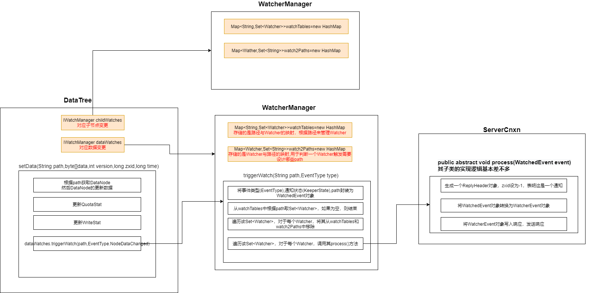

# 1. watch机制概述


1. Client向Zookeeper服务端发送Watch，进行注册
2. 同时Client还会把Watch存储到WatchManager中
3. Zookeeper服务端触发Watch时，会向Client发送通知，Client依据通知从WatchManager中取出对应的Watcher对象来执行**回调逻辑**


# 2. Client注册和存储Watcher


1. 根据调用的方法不同，将Watcher和path封装为不同的WatchRegistration对象，WatchRegistration对象会封装进Packet对象中
2. Packet对象发送outgoing队列后，会有SendThread发送给服务器
3. SendThread收到Server的确认响应后执行**finalPacket()方法**——从Packet对象中取出WatchRegistration对象，然后调用其**register()**，将WatchRegistration中的Watcher交由ZKWatchManager保管


# 3. Watcher在Server端的存储


* Server端有两个IWatchManager——childWatcherManager（管理子节点变更），dataWatchManager（管理数据变更）

* Client发送来的Watcher，如果是要监听指定路径节点的数据变化，就放入DataWatcherManager中，如果是要监听指定路径节点的子节点的变化，那么就放入ChildWatcherManager，我以DataWatcherManager为例来说明

* DataWatcherManager中有两个Map，Client发送来的Watcher会加入这两个Map
  * 一个存储path与Watcher的映射，用于根据path管理Watcher
  * 一个存储Watcher与path的映射，用于判断一个Watcher的触发需要涉及哪些path


# 4. Server端触发Watcher

* 以setData()触发Watcher举例，修改指定path的Node的数据
* 将EventType和KeeperState封装为WatchedEvent（WatchedEvent包含了事件类型和通知状态）
* 从WatcherManager的map中根据path取出对应的Watcher，调用其process(WatchedEvent e)方法，将WatchedEvent发送给Client




# 5. Client回调Watcher


* Client消息的收发由SendThread负责，Watcher回调由EventThread负责
* SendThread收到消息后，如果发现消息中包含WatchedEvent，那么知道消息是Watcher通知，SendThread会根据该WatchedEvent中的信息从WatcherManager中取出对应的Watcher，然后将该Watcher和WatchedEvent封装为WatcherSetEventPair，放入EventThread的阻塞队列
* EventThread会不断从该阻塞队列中取出WatcherSetEventPair进行处理——从中获取Watcher和WatchedEvent，然后调用Watcher的process()进行回调处理


```java
public void run() {
    try {
        isRunning = true;
        while (true) {
            Object event = waitingEvents.take();//从watingEvents中取出WatcherSetEventPair
            if (event == eventOfDeath) {
                wasKilled = true;
            } else {
                processEvent(event);//处理WatcherSetEventPair
            }
            if (wasKilled) {
                synchronized (waitingEvents) {
                    if (waitingEvents.isEmpty()) {
                        isRunning = false;
                        break;
                    }
                }
            }
        }
    } catch (InterruptedException e) {
        LOG.error("Event thread exiting due to interruption", e);
    }
}

private void processEvent(Object event) {
    try{
        if (event instanceof WatcherSetEventPair) {
            // 处理WatcherSetEventPair
            WatcherSetEventPair pair = (WatcherSetEventPair) event;
            for (Watcher watcher : pair.watchers) {//从WatcherSetEventPair中取出Set<Watcher>
                try {
                    watcher.process(pair.event);//逐个回调
                } catch (Throwable t) {
                    LOG.error("Error while calling watcher.", t);
                }
            }
        }
    }//以下代码略
}
```

