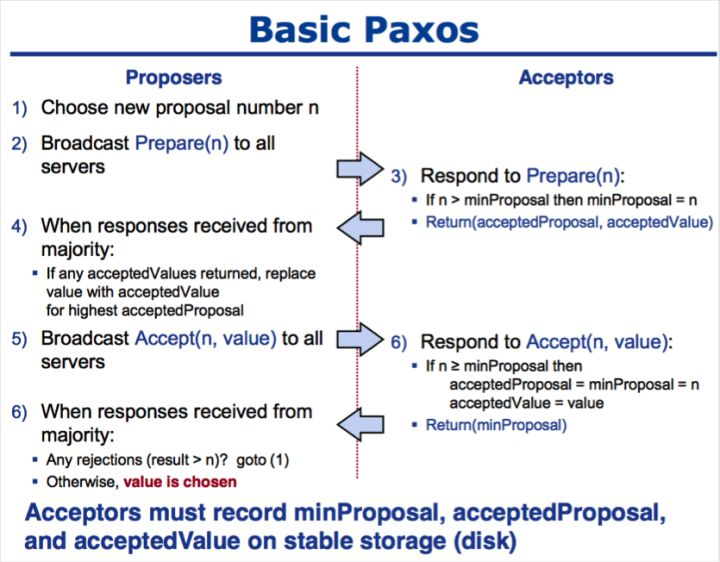
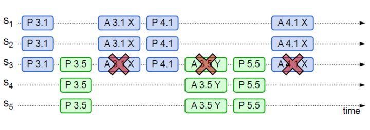

* Paxos算法是分布式共识的代名词，当前最常用的一批共识算法都是基于Paxos改进的（例如Fast Paxos，Cheap Paxos，Raft，ZAB）
* 兰伯特提出的Paxos算法包含2个部分
  * Basic Paxos：多节点之间如何就某个值达成共识
  * Multi Paxos：多节点之间如何就一系列值达成共识
* **Basic Paxos**通过**两阶段提交**的方式来达成共识
* **Basic Paxos**实现了容错，在少于一半的节点出现故障时，集群仍能工作

## 1. 基础概念

* Proposal Value：提案的值
* Proposal ID：提案编号
* Proposal：提案=提案编号+提案的值
* 角色
  * Proposer：提案发起者——接入和协调功能，收到Client请求后，生成Proposal，发起两阶段提交，进行共识协商
  * Acceptor：提案接收者——协商和存储数据，对Proposal进行投票，并接受达成共识的Proposal，存储保存
  * Learner：提案学习者——存储数据，备份

* Paxos是一个两阶段算法——分为Prepare阶段和Accept阶段

## 2. 过程分析

### 2.0 数据结构支持

Acceptor需要维护三个变量

* **minProposal**——记录Acceptor 已经Promise/Accpet的Proposal中Proposal ID的最大值

  该变量用于实现2个承诺

  1. Acceptor不会接受Proposal ID<= minProposal的Prepare请求
  2. Acceptor不会接受Proposal ID< minProposal的Accept请求

* **acceptedProposalID**：Acceptor最近一次Accept的Proposal的ID

* **acceptedProposalValue**：Acceptor最近一次Accept的Proposal的Value

### 2.1 Prepare阶段

#### 2.1.1 Prepare

Proposer生成一个**提案编号n**，向所有的Acceptor广播`Prepare(n)`请求（该请求只会包含提案编号，不包含提案值）

#### 2.1.2 Promise

Acceptor接收到`Prepare(n)`请求后，会将n与**变量minProposal**进行对比，判断该Promise请求是否违背自己的承诺

* 如果n> minProposal，那么Acceptor做出两个承诺，一个应答

  * 承诺1：不再接受Proposal ID<= n的**Prepare请求**（将minProposal更新为n实现）

  * 承诺2：不再接受Proposal ID<n的**Accept请求**（将minProposal更新为n实现）

  * 应答：返回**Promise(acceptedProposalID,acceptedProposalValue)响应**

    （如果Acceptor没有Accept过Proposal，那么Promise响应中携带NULL值，否则会携带最近一次Accept的Proposal的ID和Value）

* 如果n<=minProposal，Acceptor会拒绝该Prepare请求

### 2.2 Accept阶段

* Proposer收到超过半数Acceptor的`Promise()`响应后，从这些响应中选出Proposal ID最大的提案的Value作为这次提案的Value，如果所有Promise()响应都返回了NULL，那么Proposer随意决定提案的Value

  Proposer向Acceptor发送`Accept(n,value)`请求（携带Proposal ID和Value）

* Acceptor在收到`Accept(n,value)`请求后，会将n与**变量minProposal**进行对比，判断该Accept请求是否违背自己的承诺

  * 如果n>=minProposal，那么Acceptor会接受该提案，持久化存储该提案的Proposal ID和Value，同时会**更新minProposal，acceptedProposalID，acceptedProposalValue三个变量**，**返回minProposal**
  * 如果n<minProposal，那么会拒绝该提案

* Proposer收到过半Acceptor的返回值后，如果发现有返回值>n，那么表明有更新的提案，否则表明该value达成一致
  

## 3. 算法实现

## 4. Basic Paxos缺点

1. **提案冲突问题**——如果有多个Proposer同时提交提案，可能因为**提案冲突**，提案提交失败，需要重新协商

   提案冲突非常极端的情况会出现——**Paxos活锁问题**——提案冲突，导致不同的Proposal交替Prepare成功，Accept失败

2. Basic Paxos至少需要2轮网络通信，往返消息多，耗性能，延迟大

## 5. Multi-Paxos算法

* Multi-Paxos算法是一个统称——基于Multi-Paxos思想，通过多个Basic Paxos实例实现一系列值的共识的算法（Chubby的Multi-Paxos实现，Raft都是Multi-Paxos算法）
* Multi-Paxos做了两点改进
  1. Multi-Paxos引入了Leader，Leader是唯一的Proposer，**只有Leader可以提交提案**（Multi-Paxos首先要选举Leader，Leader是通过一次决议形成，在Leader不可用时，需要选举新的leader继续服务）——**解决提案冲突问题**
  2. 优化Basic Paxos执行流程——在Leader稳定运行时，省略Basic Paxos的Prepare阶段，直接执行Accept阶段——**解决网络通信的性能损耗**
