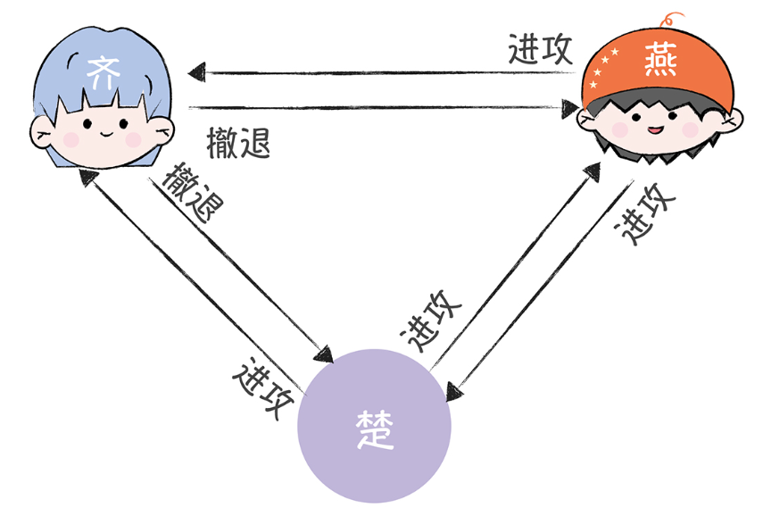
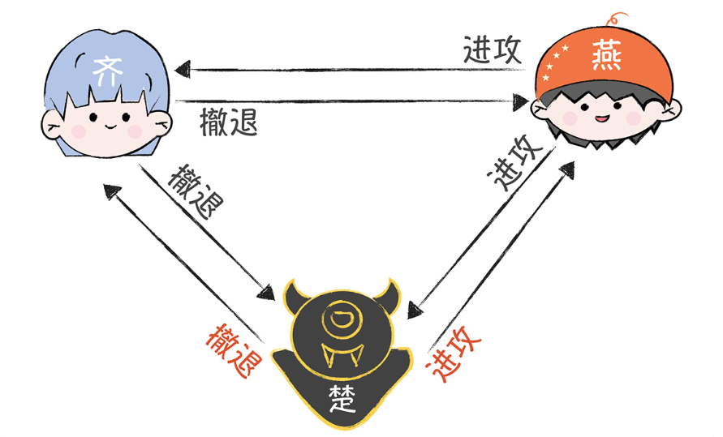
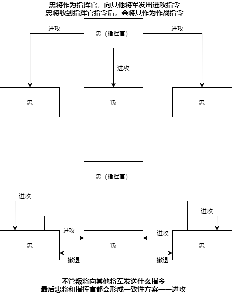
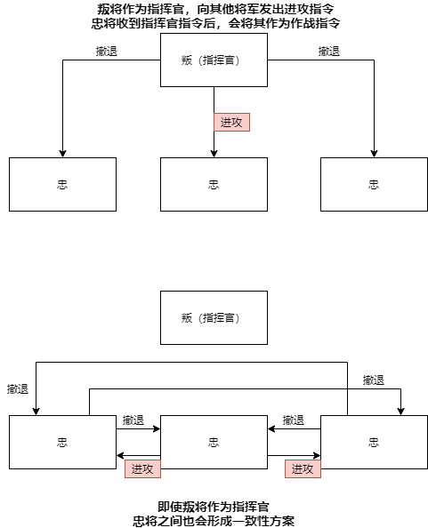
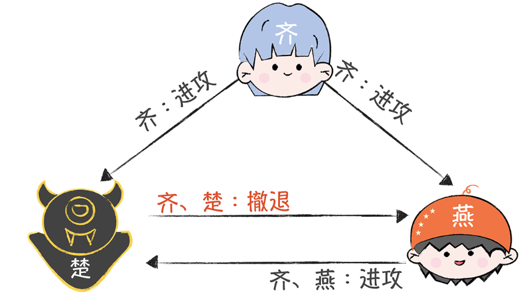
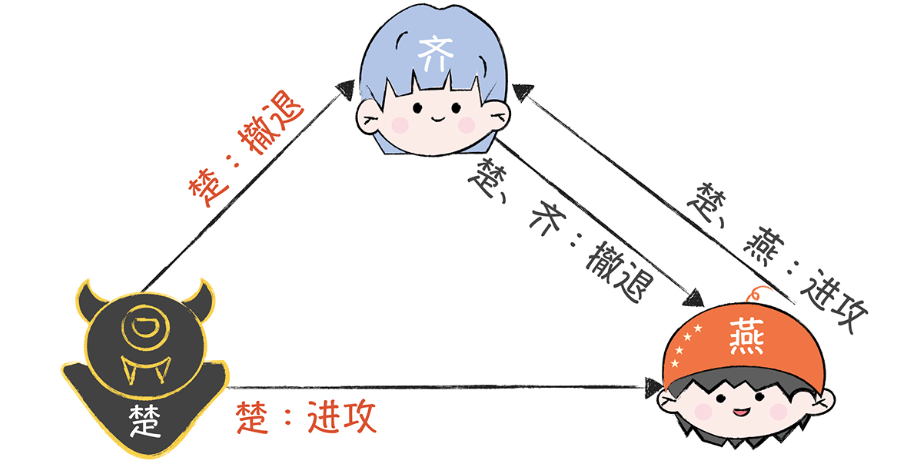

# 1. 问题描述

* 假设有A,B,C三个将军，围攻了D
* 将军之间互相交换消息，按照少数服从多数原则投票表决下一步采取什么行动
* **目标是形成一个一致性的方案**，让所有的将军一起进攻or一起撤退
* **存在的问题**
  * 将军中可能存在叛徒，信使中也可能存在叛徒，叛徒可以篡改或者伪造消息（恶意行为）
    * 叛变的将军——被非法控制的计算机节点，会进行恶意行为
    * 信使被间谍替换——通讯被中间人攻击，攻击者伪造信息和劫持通讯（恶意行为）
  * 信使被杀——通讯故障，消息丢失

## 1.1 正常情况

* 正常情况下，每个将军将自己的决策告诉其他将军，所有的将军获得的投票结果都是 进攻:撤退=2:1，产生一致性方案——进攻

## 1.2 二忠一叛情况

如果有人叛变（被黑客控制），向其他将军发送误导信息（恶意行为）——导致无法形成一致性的方案

* 此时齐看到是 进攻:撤退=1:2，齐国决定撤退
* 燕国看到的是 进攻:撤退=2:1，燕国决定进攻

# 2. 二忠一叛解决方案

## 2.1 口信消息型解决方案

### 2.1.1 口信消息定义

1. 任何已经发送的消息都可以被正确传达
2. 消息的接收者知道是谁发送了消息
3. 消息的缺省可以被检测

### 2.1.2 口信消息使用前提

* 如果叛将数目为m，那么将军数目必须>=3m+1，就可以通过下面流程解决

### 2.1.3 口信消息过程

如果有1名叛将，这里就需要4名将军，整个流程分为两轮

* 约定，如果没有收到命令，那么将默认指令作为作战指令

* **第一轮**
  * 先发送消息的将军为指挥官，其他为副将，指挥官将消息发送给所有副将
  * 每个副将，从指挥官获得作战信息，将其作为作战指令，如果没有获得作战信息，那么将默认指令作为作战指令
* **第二轮**
  * 所有副将之间交换**各自的作战指令**，按照少数服从多数原则，执行指令

### 2.1.4 忠将为指挥官

* 不管叛将发送什么指令，最终忠将一定会形成一致性方案

### 2.1.5 叛将为指挥官

* 叛将作为首领，向不同的将军发送误导信息，即使这样，三位忠将中最终也可以形成**一致性方案**

## 2.2 签名消息型解决方案

### 2.2.1 签名消息定义

1. 将军对消息签名，并且签名无法被伪造，对签名消息进行任何更改都会被发现
2. 任何人都能验证签名的真伪

### 2.2.2 签名消息过程

* 如果是忠将先发出作战信息协商，一旦叛将修改或者伪造收到的作战信息，那么其他将军可以发现

* 如果叛将先发出误导的作战信息，那么剩余的将军会发现叛将发送的作战信息是不一致的，也会发现叛将

# 3. 拜占庭将军问题总结

* 抽象了**分布式**系统面临的**共识问题**——在可能有误导信息的情况下，采用合适的通讯机制，让多个将军达成共识，形成**一致性方案**
* 现有的分布式算法分为两类
  * **拜占庭容错算法**——解决分布式系统中既存在故障，又存在恶意攻击场景下的共识问题（存在消息篡改或伪造）
    * PBFT
    * PoW
  * **故障容错算法（非拜占庭容错算法）**——解决分布式系统中存在故障，但不存在恶意攻击场景下的共识问题（不存在消息篡改或伪造）
    * Paxos
    * Raft
    * ZAB

