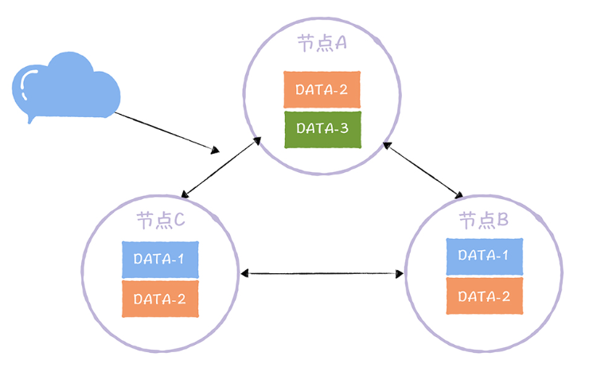

* 如果想让分布式系统可以在AP和CP之间切换，可以通过Quorum NWR实现
* 通过Quorum NWR，可以自定义数据一致性级别
* 在AP分布式系统中，Quorum NWR通常都会实现——可以让后续用户根据业务特性，灵活指定数据一致性级别

## 1. Quorum NWR三要素

* 三要素——N，W，R，通过组合这三个要素，实现自定义数据一致性级别

### 1.1 N副本数

* N：副本数（副本因子）——副本数可以不等于节点数，不同的数据可以拥有不同的副本数（实现Quorum NWR时，需要让用户可以自定义指定数据的副本数目，推荐副本数<=节点数）
  
  

### 1.2 W写一致性

* W：写一致性级别，对于一个写操作，只有完成W个副本的更新，才算完成了写操作
  
  

### 1.3 R读一致性

* R：读一致性级别，表示读取一个数据时，需要读R个副本，给Client返回R个副本中最新的那份数据
  
  

### 1.4 不同的一致性效果

* W+R>N时，在Client看来，整个系统是强一致性的，一定能够返回更新后的数据
* W+R<=N时，在Client看来，整个系统是最终一致性的，可能会返回旧数据
* W=N时，R=1读性能比较好
* R=N时，W=1写性能比较好
* W=(N+1)/2，R=(N+1)/2时，容错能力比较好，能够容忍少数节点故障（容忍(N-1)/2个节点）
* 一般让W+R=N+1
