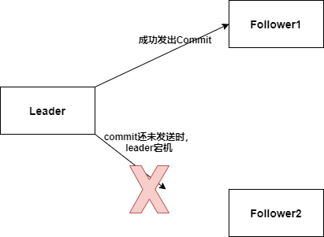
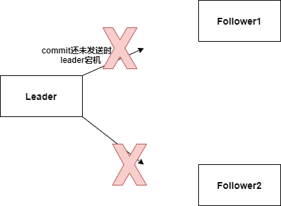

* ZAB协议是Paxos算法的一个实现

* Zookeeper依赖ZAB协议实现 **分布式数据一致性**

* ZAB协议下有2个模式——消息广播模式，崩溃恢复模式

# 1. 消息广播模式

* Zookeeper只允许唯一的Leader服务器进行事务请求的处理，余下的服务器成为Follower服务器
* Leader会将客户端的每一个写请求都转换为一个Proposal（提案）
  1. 所有的客户端**写请求**都会转发给Leader，由Leader为**事务请求**生成为一个提案
  2. Leader为每个提案分配一个ZXID**(每一个Proposal按照其ZXID的先后顺序来进行排序和处理)**
  3. Leader将这个提案分发给所有的Follower（Leader为每个Follower分配一个FIFO队列，将Proposal依次放入队列中，根据FIFO策略进行消息发送）
  4. 每个Follower收到Proposal后，首先写入磁盘上的**事务日志**，然后执行提案，操作成功后，返回给Leader一个Ack响应
  5. Leader接收到过半Follower的Ack响应后，向所有的Follower分发Commit消息，要求对前一个Proposal进行提交，每个Follower接收到Commit消息后，完成对事务的提交（同时Leader自己也会完成提交）

# 2. 崩溃恢复模式

* 崩溃恢复模式的主要作用——**提供数据一致性保证**

## 2.1 崩溃恢复模式的进入与退出

* **进入崩溃恢复模式**
  
  1. ZK集群第一次启动时候
  2. Leader崩溃退出，重启
  3. 集群中不存在过半的服务器与Leader保持正常通信

* **退出崩溃恢复模式**
  
  * 选举初新Leader，并且集群中过半的Follower与新Leader完成了数据同步

* **服务器加入集群**——一台新服务器加入集群后发现集群中存在Leader，就会自觉地开始同步Leader的数据

## 2.2 崩溃恢复模式运行过程

1. 通过**选举算法**选举出新的leader
2. 数据同步
3. 半数以上的Follower完成数据同步后，退出崩溃恢复模式

# 3. ZAB协议提供的数据一致性保证

## 3.1 已经被leader提交的提案最终可以被所有的服务器提交



* Leader收到过半Follower的Ack后，将Commit消息发送给全部的Follower之前宕机了（只有部分Follower收到了Commit），进入崩溃恢复模式
* **ZAB协议要保证**——在退出崩溃恢复模式时，这个提案被所有的服务器提交

```
看完3.3再来看这段
Follower1提交了提案，Follower2没有提交提案，所以Follower1的zxid变量一定大于Follower2，所以新主一定是Follower1
Follower2在同步新主的数据中，就会同步这个提案的数据，提交了这个提案
```

## 3.2 丢弃只在Leader上被提出的提案

Leader生成了一个提案，并发送给所有Follower，成功收到半数以上Follower的Ack后就宕机了，提案未提交，Commit消息还未发送给任何一个Follower



* **ZAB协议要保证**——在退出崩溃恢复模式，这个提案要被丢弃（这个提案没有被提交，但是已经写入了事务日志）

```
看完3.3再来看这段
假设该提案的ZXID为 0x0001|0004(16进制)
Follower1和Follower2都没有提交这个提案，所以选出来的新主可能是Follower1或Follower2，假设选出Follower1作为新主，新主最后提交的提案的ZXID为0x0001|0003,如果新主产生一个新的提案，那么这个新提案的ZXID为0x0002|0000(epoch+1)

当旧主恢复后，会成为新主的Follower，重新连接上新主，当Leader发现Follower包含一条自己没有的事务记录，会让F进行事务回滚，然后进行差异化同步
```

## 3.3 如何实现

1. 每个提案都有一个ZXID（64位，前32位是epoch选举纪元，每选出一个leader，epoch+1，后32位是提案序号，在一个epoch中，每提出一个提案，后32位+1）
2. 每个服务器都维护了一个变量——其值为该服务器最后一次commit的提案的ZXID
3. Leader选举算法会从存活的服务器中选举出变量最大的服务器作为新Leader（保证新Leader一定有所有已经提交过的提案）
4. 所有的Follower都会与新Leader进行数据同步，在数据同步的过程中就可以保证 **已经被leader提交的提案最终可以被所有的服务器提交** 和 **丢弃只在Leader上被提出的提案**

## 3.4 数据同步

数据同步为分4类

* 差异化同步
* 全量同步
* 回滚同步
* 先回滚再差异化同步

### 3.4.1 Learner向Leader注册

选举出Leader后，Learner向Leader服务器进行注册

### 3.4.2 Leader获取Learner状态

Learner在向Leader注册时，会给Leader发送一个数据包，Leader可以从这个数据包中解析出Learner的**currentEpoch**和**lastZxid**

### 3.4.3 数据同步初始化

在开始数据同步之前，Leader会进行数据同步初始化，首先从ZK的内存数据库中提取出Proposal缓存队列，然后完成三个变量的初始化

* **peerLastZxid**：该Learner服务器最后处理的提案的ZXID（Learner传过来的lastZxid，是**处理**不是**提交**）
* **minCommittedLog**：Leader服务器的Proposal缓存队列中ZXID的最大值
* **maxCommittedLog**：Leader服务器的Proposal缓存队列中ZXID的最小值

### 3.4.4 数据同步

* **minCommittedLog<peerLastZxid<maxCommittedLog**——**差异化同步**——将peerLastZxid开始的提案同步发送给Learner

* **peerLastZxid>maxCommittedLog**——**回滚同步**——让Learner回滚到ZXID值为maxCommittedLog对应的事务操作

* **peerLastZxid<minCommittedLog 或者 Leader上没有Proposal缓存队列并且peerLastZxid<leader最后处理的提案的Zxid**——**全量同步**——Leader将内存数据库中的全量数据发给Learner

* **先回滚再差异化同步**
  
  如果 **peerLastZxid<maxCommittedLog**并且 **peerLastZxid不存在于Leader得到Proposal缓存队列**
  
  > A，B，C三台机器，一开始B是Leader，此时leader_epoch为5，集群中所有机器都提交了0x500000001和0x500000002，此时Leader正要处理ZXID为0x500000003的事务，并且Leader已经将该事务写入事务日志，此时Leader正要将该Proposal发送给Follower，Leader挂了
  > 
  > 集群进行新一轮选举，选举出A作为新Leader，同时leader_epoch更新为6，然后A和C继续对外提供服务，又提交了0x600000001和0x600000002，此时B重新启动了，并开始同步A的数据
  > 
  > 在这种场景下，使用先回滚再差异化同步——当Leader发现Learner包含一条自己没有的事务记录，会让Learner进行事务回滚，然后进行差异化同步
