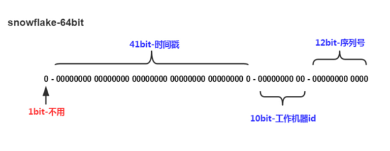

* 雪花算法——分布式ID生成算法，将64bit分割为多个部分，每个部分有不同的含义
  
  * 第1位：0
  * 第2位开始的41位：时间戳（可以用69年）
  * 接下去10位：机器ID（可以用1024台机器）
  * 最后12位：自增序列（每台机器上每毫秒最多可以产生4096个ID）
  
  

* 优点——**雪花算法提供了一个很好的设计思想，雪花算法生成的ID是趋势递增，不依赖数据库等第三方系统，以服务的方式部署，稳定性更高，生成ID的性能也是非常高的，而且可以根据自身业务特性分配bit位，非常灵活**

* 缺点——雪花算法强依赖机器时钟，如果机器上时钟回拨，会导致ID重复或者服务会处于不可用状态