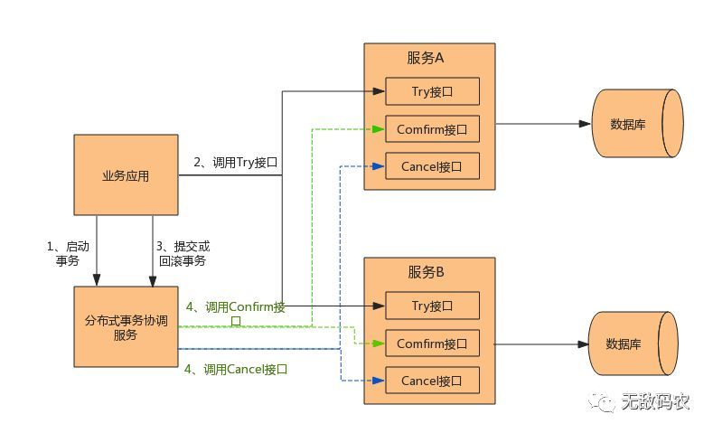

## 1. TCC架构

TCC分为三个操作——Try，Confirm，Cancel

* 一个完整的业务活动分为一个主业务服务和若干个从业务服务
* 主业务服务负责发起并完成整个业务活动
* 从业务服务提供三个接口
  * Try接口
  * Confirm接口
  * Cancel接口
* 业务活动管理器控制活动的一致性
* 如果Confirm和Cancel失败了，会进行重试，所以必须保证Confirm和Cancel是幂等的，如果重试失败了，就需要人工介入了

## 2. TCC过程

### 2.1 Try阶段

进行业务检查，让各个服务预留业务资源

### 2.2 Confirm阶段

真正执行业务，Confirm操作必须保证幂等性

### 2.3 Cancel阶段

回滚，释放Try阶段预留的业务资源，Cancel操作必须保证幂等性

## 3. TCC和2PC的区别

* TCC的本质是补偿事务
* TCC核心思想——对于每个操作都要注册一个对应的确认操作和补偿操作（撤销操作）
* TCC是业务层面的协议，TCC的3个操作都要在业务代码中编写，为了实现一致性，确认操作和补偿操作必须是幂等的
* TCC不依赖数据库的事务，在业务中实现的分布式事务，避免对资源的长时间占用——减轻了数据库的压力，但是对业务代码侵入性较强，效率比较高
* 2PC 是数据库或者存储资源层面的事务，实现的是强一致性，在两阶段提交的整个过程中，一直会持有数据库的锁
* **TCC通过补偿机制来完成整个业务操作，保证最终一致性**，**2PC是强一致性的**
