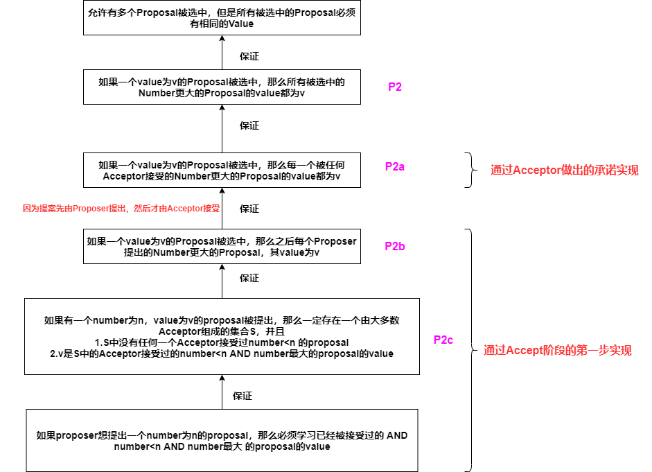
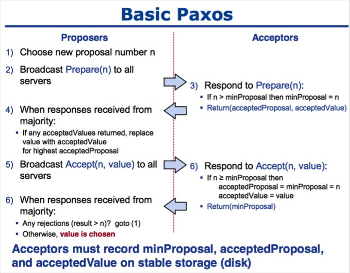
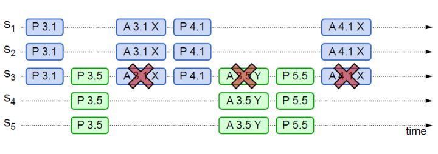

* Paxos算法是分布式共识的代名词，当前最常用的一批共识算法都是基于Paxos改进的（例如Fast Paxos，Cheap Paxos，Raft，ZAB）
* 兰伯特提出的Paxos算法包含2个部分
  * Basic Paxos：多节点之间如何就**某个值**达成共识
  * Multi Paxos：多节点之间如何就**一系列值**达成共识

# 1. 基础概念

* **Proposal Value**：提案的值
* **Proposal ID（Number）**：提案编号
* **Proposal**：提案=提案编号+提案的值
* **Chosen**：一个提案被大多数的Acceptor accept，那么该提案的Proposal被chosen，其Proposal Value也被Chosen
* 角色
  * **Proposer**：提案发起者——接入和协调功能，收到Client请求后，生成Proposal，发起两阶段提交，进行共识协商
  * **Acceptor**：提案接收者——协商和存储数据，对Proposal进行投票，并接受达成共识的Proposal，存储保存
  * **Learner**：提案学习者——存储数据，备份

# 2. Basic Paxos

* Basic Paxos——多节点之间如果就**某个值**达成共识——**有且只有一个Value被选中**
* **Basic Paxos**通过**两阶段提交**的方式来达成共识——分配**Prepare阶段**和**Accept阶段**
* **Basic Paxos**实现了容错，在少于一半的节点出现故障时，集群仍能工作

## 2.1 Basic Paxos的要求

1. **一个Acceptor一定会Accept它第一个收到的Proposal**

   >一个Acceptor一定会Accept它第一个收到的Proposal + 一个Proposal只有被大多数Acceptor accept后才被chosen
   >
   >会出现这种情况——同时有多个Proposer提出多个Proposal，导致不同的Acceptor accept了不同的Proposal，但是没有一个Proposal被大多数Acceptor accept
   >
   >所以我们必须让每个Acceptor可以accept多个Proposal——所以我们将Proposal拆分为Proposal Number和Proposal Value，每个Proposal都分配一个唯一的Proposal Number

2. **允许有多个Proposal被选中，但是所有被选中的Proposal必须具有相同的Value**

## 2.2 Basic Paxos过程——论文描述

### 2.2.1 Prepare阶段

1. Proposer选择一个proposal number——n，向Acceptor发送number为n的`prepare request`

2. 如果一个acceptor接收到一个number为n的`prepare request`，并且n> 任何它已经回复过的prepare request的number，那么acceptor将**承诺**不再接受任何number<n的`prepare request`，并且向Proposer回复自己accept过的number最大的proposal（如果没有回复NULL）

### 2.2.2 Accept阶段

1. 如果proposer收到了大多数Acceptor对自己`prepare request`的回复，那么proposer会向Acceptor发送**一个number为n，value为v的Proposal**作为`accept request`——其中v是Acceptor对自己`prepare request`的回复中number>n 并且number最大的Proposal的value（如果回复中没有Proposal的信息，那么v由Proposer随机选定）
2. 如果Acceptor收到了一个number为n的`accept request`，并且它没有对number>n的prepare request回复过，就会接收该`accept request`

## 2.3 Basic Paxos过程——代码描述

### 2.3.0 数据结构支持

Acceptor需要维护三个变量

* **minProposal**——记录Acceptor 已经Promise/Accpet的Proposal中Proposal ID的最大值

  **该变量用于实现2个承诺**

  1. Acceptor不会接受Proposal ID<= minProposal的Prepare请求
  2. Acceptor不会接受Proposal ID< minProposal的Accept请求

* **acceptedProposalID**：Acceptor最近一次Accept的Proposal的ID

* **acceptedProposalValue**：Acceptor最近一次Accept的Proposal的Value

### 2.3.1 Prepare阶段

1. Proposer生成一个**proposal number——n **，向所有的Acceptor广播`Prepare(n) request`（该请求只会包含提案编号，不包含提案值）

2. Acceptor接收到`Prepare(n)`请求后，会将n与**变量minProposal**进行对比，判断该Promise请求是否违背自己的承诺

   * 如果n> minProposal，那么Acceptor做出两个承诺，一个应答

     * 承诺1：不再接受Proposal ID<= n的**Prepare请求**（将minProposal更新为n实现）

     * 承诺2：不再接受Proposal ID<n的**Accept请求**（将minProposal更新为n实现）

     * 应答：返回**Promise(acceptedProposalID,acceptedProposalValue)响应**

       （如果Acceptor没有Accept过Proposal，那么Promise响应中携带NULL值，否则会携带最近一次Accept的Proposal的ID和Value）

   * 如果n<=minProposal，Acceptor会拒绝该Prepare请求

### 2.3.2 Accept阶段

1. Proposer收到超过半数Acceptor的`Promise()`响应后，向Acceptor发送一个**number为n，value为v的Proposal**——**Accept(n,v) request**

   >v：Proposer收到的来自Acceptor的Promise响应中，携带了Acceptor最新accept的Proposal的number和value，v是这些Acceptor最新accept的Proposal中 number<n 并且number最大的Proposal的value（如果每个Acceptor的Promise响应中都没有其最新accept的Proposal的信息，那么v将由Proposer随机选择）

2. Acceptor在收到`Accept(n,value)`请求后，会将n与**变量minProposal**进行对比，判断该Accept请求是否违背自己的承诺

   * 如果n>=minProposal，那么**Acceptor会接受该提案（Accept Proposal）**

     持久化存储该提案的Proposal ID和Value，同时会**更新minProposal，acceptedProposalID，acceptedProposalValue三个变量**，**返回minProposal**

   * 如果n<minProposal，那么会拒绝该提案

3. Proposer收到过半Acceptor的返回值后，如果发现有返回值>n，那么表明有更新的提案，否则表明**该value达成一致**

## 2.4 Learner同步

* 当一个Acceptor Accept一个Proposal，立刻广播给所有的Learner
* 让Acceptor将它们的接收情况发送给一个特定的learner，当一个value被选定时，让这个特定的learner通知其他所有learner
* Acceptor将它们的接受情况发送给一个distinguished learner集合，这个集合中的任意一个learner都能在一个value被选定时通知所有的learner
* 由于message loss，可能没有learner知道有value被选中，那么learner可以让一个proposer发送一个proposal，使用上面描述的算法，来知道一个value是否被选中

## 2.5 Basic Paxos缺点

1. **提案冲突问题**——两个Proposer持续发送比对方Proposal Number大的Proposal，最终导致它们两者没有一个被选中

2. Basic Paxos至少需要2轮网络通信，往返消息多，耗性能，延迟大

# 3. Multi-Paxos算法

* Multi-Paxos算法是一个统称——基于Multi-Paxos思想，通过多个Basic Paxos实例实现一系列值的共识的算法（Chubby的Multi-Paxos实现，Raft都是Multi-Paxos算法）
* Multi-Paxos做了两点改进
  1. Multi-Paxos引入了Leader，Leader是唯一的Proposer，**只有Leader可以提交提案**（Multi-Paxos首先要选举Leader，Leader是通过一次决议形成，在Leader不可用时，需要选举新的leader继续服务）——**解决提案冲突问题**
  2. 优化Basic Paxos执行流程——在Leader稳定运行时，省略Basic Paxos的Prepare阶段，直接执行Accept阶段——**解决网络通信的性能损耗**
