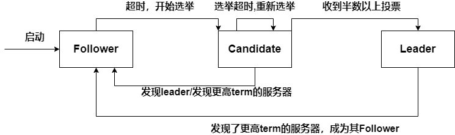
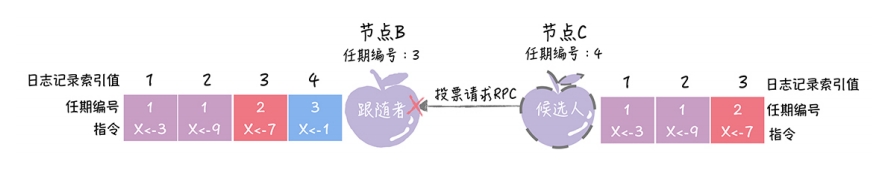
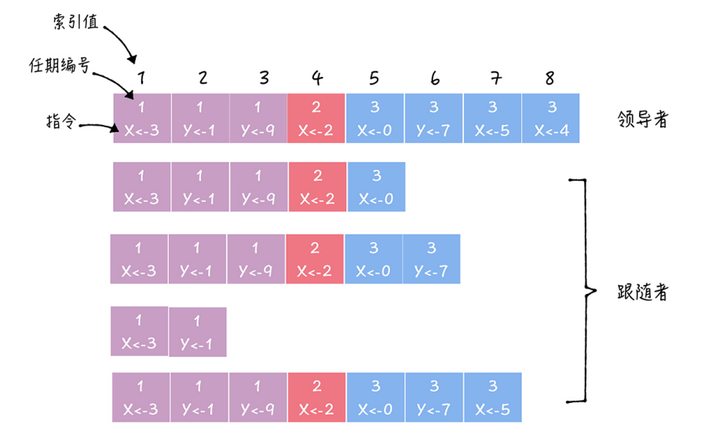
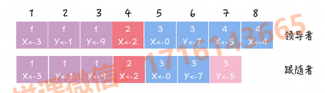

* Raft属于Multi-Paxos算法
* Raft是分布式系统开发首选的共识算法——CP系统首选
* Raft本质——通过**一切以leader为准**的方式，实现一系列指的共识和各节点日志的一致

## 1. Raft角色

Raft分成三种角色

* follower：接受和处理来自leader的信息，与leader通过心跳机制保持连接；接受和处理来自Candidate的Request Vote RPC
* leader：集群中一切以leader为准，负责**处理写请求**，**管理日志复制**，**不断发送心跳信息**
* Candidate：候选人，等待其他节点的投票，如果获得了大多数节点的选票，就晋升为leader

## 2. 节点之间如何通信

Raft算法中，节点之间使通过RPC进行通信，有2类RPC

* 请求投票RPC（Request Vote RPC）——由Candidate发起，通知各节点进行投票，必须携带Candidate最后一条日志项的term和log index
* 日志复制RPC（AppendEntries RPC）——只能由Leader发起，用来复制日志和提供心跳信息，携带Leader最新提交的日志项的Log Index和Term

## 3. Leader选举

### 3.1 任期

* Raft将时间划分为任意个任期term，任期用连续的数字表示

* 每一个任期都是一轮选举，在一个term中，一个或多个Candidate会尝试成为Leader，如果一个Candidate赢得了选举，那么就成为该任期内的Leader，如果没有选出Leader，会开启下一个任期（term自增），并开始下一轮选举

* **超时自增**：如果follower超过一定的时间没有收到leader的心跳，就会成为Candidate，并递增自己的term

* **更新为较大值**：如果节点收到了其他节点包含term的消息，会将信息中的term与自己的term进行比较，更新为较大的term

* **恢复为follwer**：如果一个角色为leader or Candidate的节点，发现自己的term比某个节点小，就会立刻恢复为follwer（用于网络分区后的错误恢复）

* **拒绝消息**——**保证日志最完整的节点才能成为leader**

  Candidate在发送RequestVote RPC时，要带上自己的最后一条日志的term和log index

  其他节点收到消息时，如果发现自己的日志比请求中携带的更新，则拒绝投票。日志比较的原则是，如果本地的最后一条log entry的term更大，则term大的更新，如果term一样大，则log index更大的更新

  

### 3.2 选举规则

* Leader会周期性地向所有Follower发送心跳消息（不包含日志信息地AppendEntreis RPC），防止Follower超时成为Candidate发起新一轮投票

* **随机超时时间**

  * 每个Follower都会**随机生成一个超时时间**，如果在超时时间内，Follower都没有收到Leader的心跳消息，那么Follower会让自己成为Candidate，发起新一轮投票
  * 在一次选举中，Candidate在**选举超时时间（选举超时时间是随机的）**内获得了大多数选票（过半），才能晋升为Leader——为了保证一个给定的任期内最多只有一个leader

* 在一次选举中，每一个节点最多只能在一个term内投出一票，并且按照**先来先服务的原则**投票

* Candidate在发送RequestVote RPC时，要带上自己的最后一条日志的term和log index

  其他节点收到消息时，如果发现自己的日志比请求中携带的更新，则拒绝投票。日志比较的原则是，如果本地的最后一条log entry的term更大，则term大的更新，如果term一样大，则log index更大的更新

### 3.3 初始选举

1. 初始状态——现在有a，b，c三个节点，term(任期)都为0，角色都是Follower，没有Leader——Raft算法有 **随机超时时间特性**，每个节点都会等待leader的消息，但是超时时间是随机的（a为1s，b为1.5s，c为2s）

2. a到达超时时间后，a成为Candidate，并增加自己的term，然后投一票给自己，并向b，c发送 Request Vote RPC（请求消息里面会携带a的term）

3. b，c收到a的Request Vote RPC后，检查自己日志是否比请求携带的更新

   * 更新——检查自己是否在a的任期中投过票，如果还没有投过，就将票投给a，并且更新自己的任期值（一个任期只能投一票）
   * 没有更新——拒绝投票

4. 如果Candidate在**选举超时时间**内收到了大多数的选票，就会成为leader，其余成为Follower

5. Leader会定期向所有Follower发送心跳消息，防止Follower超时成为Candidate发起新一轮投票

   

### 3.4 Follower开启选举

* **Raft使用心跳机制来触发leader选举**
  * 每个服务器都有一个计时器，计时器的超时时间随机，如果一台服务器可以接受来自Leader的心跳，那么会一直保持Follower状态，并不断刷新自己的计时器
  * Leader会不断向所有Follower周期性发送心跳来保证自己的Leader地位

* 一个Follower在超时时间耗尽前都没有收到Leader的心跳，认为Leader不可用，自增自己的term值，并将状态切换为Candidate，然后向其余所有节点发送RequestVote RPC请求

### 3.5 随机超时时间—避免多个节点同时发起投票

* 在一个任期内，如果有多个Candidate发起投票，那么导致选票被瓜分，选举失败——Raft通过**随机超时时间**解决这个问题

* **随机超时时间有2种含义**
  1. 每个Follower都会**随机生成一个超时时间**，如果在超时时间内，Follower都没有收到Leader的心跳消息，那么Follower会让自己成为Candidate，发起新一轮投票
  2. 在一次选举中，Candidate在**选举超时时间（选举超时时间是随机的）**内获得了大多数选票（过半），才能晋升为Leader——为了保证一个给定的任期内最多只有一个leader

## 4. 日志同步

Raft日志同步保证如下两点:

- 如果不同Node上的两个日志项有着相同的Log Index和Term，则它们所存储的命令是相同的（一个term内的log index是递增的，一个term和一个log index最多只能对应一个log entry）
- 如果不同Node上的两个日志项有着相同的Log Index和Term，则它们之前的所有日志项都是完全一样的（由一致性检查保证）

### 4.1 日志项

* Raft算法中，副本数据以日志形式存在，leader收到Client的写请求后，处理写请求的过程就是要给复制和提交日志项的过程

* 日志由日志项组成，日志项包含**用户指定的数据（Command）**，**任期编号（Term）**，**索引值（Log index）**

  * 任期编号（Term）：创建这条日志项的leader的任期编号
  * 索引值（Log index）：一个任期内，连续递增的整数，用于标记日志项

  

### 4.2 日志复制（写请求处理）

* **Raft的日志复制可以理解为一个优化后的2PC（将两阶段优化为一阶段）**
* **以下流程假设Leader与Follower在接受写请求前数据一致**

1. 客户端发送写请求给Leader，Leader基于Client请求中的指令，创建一个新的日志项，写入本地日志中

2. Leader通过AppendEntries RPC消息，将日志项复制到其他Node上

3. Node收到AppendEntries RPC消息后，在本地提交日志记录，向Leader返回确认响应

4. 如果Leader收到大多数Follower的确认响应，将日志项commit，向Client返回成功

   如果Leader没有收到大多数Follower的确认响应，那么向Client返回错误

>Raft中进行了优化——Leader将日志项提交后，不会发送消息通知Follower Commit，因为Leader每次向Follower发送的AppendEntries RPC消息（日志复制or心跳）中都会包含Leader最新提交的日志项的Log Index和Term，Follower就可以借此直到Leader的日志提交信息

### 4.3 一致性检查—处理日志不一致

* 在日志复制时，可能出现进程崩溃，服务器宕机等问题，此时会导致日志不一致

* Raft通过**一致性检查**来处理日志不一致

* Raft中，一切以Leader为准——Leader通过AppendEntries RPC一致性检查，找到Follower上与自己日志项相同的最大Log Index

  Follower上，该Log Index前的日志项与Leader一致，该Log Index后的日志项与Leader不一致——Leader强制Follower更新覆盖不一致的日志项

1. Leader通过AppendEntries RPC消息，最新提交的日志项的Log Index和Term发送给Follower（4，4）
2. 

### 4.4 完整的写处理过程

* 日志复制和一致性检查是要合在一起看的

## 8. Raft核心机制

* **Raft保证日志最完整的节点才能成为leader**

  * Candidate在发送RequestVote RPC时，要带上自己的最后一条日志的term和log index

    其他节点收到消息时，如果发现自己的日志比请求中携带的更新，则拒绝投票。日志比较的原则是，如果本地的最后一条log entry的term更大，则term大的更新，如果term一样大，则log index更大的更新

* **Raft保证一个任期至多只有一个leader，极大减少选举失败的情况**

  * 任期机制
  * Leader心跳机制
  * 随机超时时间
  * 先来先服务投票原则
  * 大多数选票原则

* **Raft中，日志必须连续**

* **Raft日志同步保证**
  * 如果不同日志中的两个条目有着相同的索引和任期号，则它们所存储的命令是相同的
  * 如果不同日志中的两个条目有着相同的索引和任期号，则它们之前的所有条目都是完全一样的

## 9. 安全性

* 日志最完整的节点才能成为leader

>这个保证是在RequestVote RPC中做的，Candidate在发送RequestVote RPC时，要带上自己的最后一条日志的term和log index，其他节点收到消息时，如果发现自己的日志比请求中携带的更新，则拒绝投票。日志比较的原则是，如果本地的最后一条log entry的term更大，则term大的更新，如果term一样大，则log index更大的更新

