# 1. 简介

* Raft是一种管理日志复制的共识算法
* Raft属于Multi-Paxos算法
* Raft是CP系统首选算法
* Raft本质——通过一切以Leader为准的方式，实现一系列值的共识和各节点日志的一致

# 2. 问题拆分

Raft可以拆分为以下问题

* Leader Election
* Log Replication
* Safety
* Membemship Changes
* Log Compaction

# 3. Raft角色

* **Follower**
  * 接受和处理来自Leader和Candidate的RPC消息，与Leader通过心跳保持联系
* **Candidate**
  * 发起投票，如果获得了大多数节点的选票，晋升为leader
* **Leader**
  * 处理所有的写请求（如果Client发送写请求给Follower，Follower会重定向给Leader）
  * 管理日志复制
  * 不断向Follower发送心跳消息

# 4. 任期

* 任期是Raft中的逻辑时钟
* 通过任期，可以让服务器检测出过时的信息（例如过时的leader）
* Server之间的通信都会携带自己的term，有两方面用途

# 5. Raft算法关键特性

**Raft算法的关键特性都是通过[规则](#rule)实现的**

* **Election Safety(选举安全)**——一个任期内至多能有一个Leader
  * 由[先来先服务规则](#rule6.3.4.2) 和 [Candidate选举规则](#rule6.3.5)中Candidate必须会得过半选票才能成为Leader保证

* **Leader Append Only(领导只追加)**——Leader的日志只能追加

* **Log Matching(日志匹配)**——如果两个Server包含有index相同，term相同的log entry，那么该index前的所有log entries一定相同
  * 由[Log Replication](#LogReplication)中的[日志一致性检查和不一致处理](#rule8.4)保证

* **Leader Completeness(领导人完整)**——如果某个Leader提交了log entry，那么这些log entry一定可以在后续term更大的Leader中找到（Leader必须拥有所有已提交的log entries）
  * 由[Saftey](#safety)中的[选举限制](#rule9.1) 和 [NOPCommand和日志提交限制](#9.2)保证

* **State Machine Safety(状态机安全)**
  * 不同Server的状态机在相同index应用的log entry一定相同
  * 如果一个Server应用了一个log entry到它的状态机中，那么其他Server不能在相同的index位置应用不同的log entry
  * Log Matching和Leader Completeness保证State Machine Safety

# 6. Raft算法简明总结

## 6.1 节点数据结构

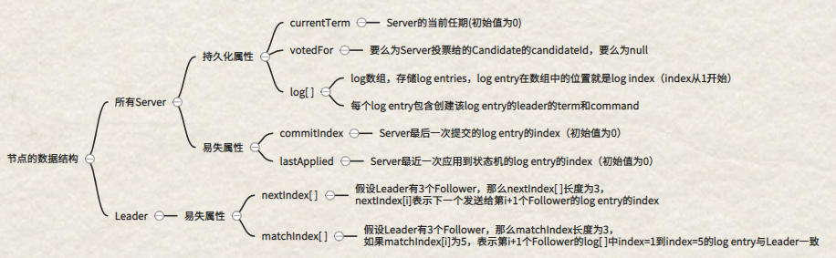

## 6.2 RPC消息

### 6.2.1 RequestVote RPC

* RequestVote RPC只能由Candidate发出

#### 6.2.1.1 携带的数据与响应结果

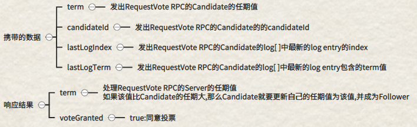

#### 6.2.1.2 Follower处理RequestVote RPC

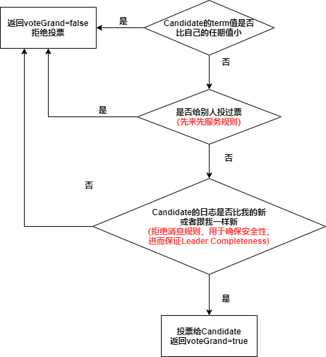

### 6.2.2 AppendEntries RPC

* 只能由Leader发出——用于同步日志和心跳

#### 6.2.2.1 携带的数据和响应结果

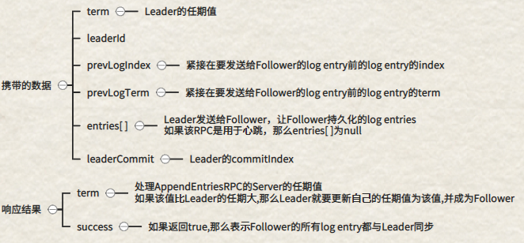

#### 6.2.2.2 Follower处理AppendEntries RPC的逻辑

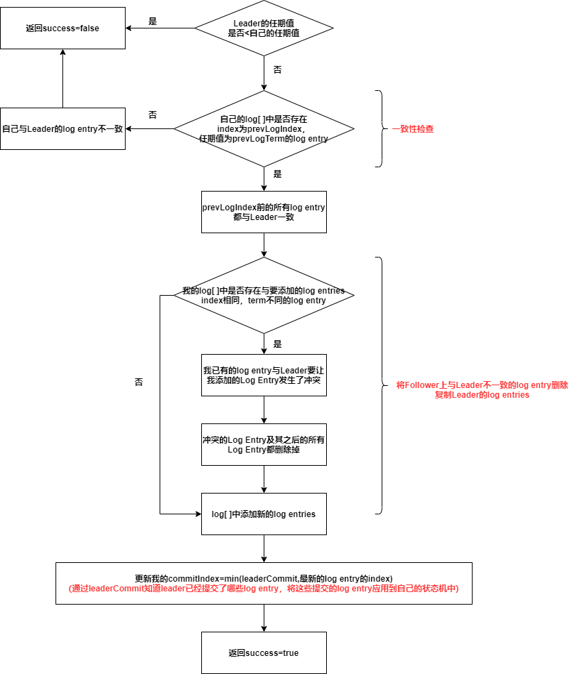

## 6.3 规则——Raft核心

### 6.3.1 应用状态机规则

如果commitIndex > lastApplied,就要自增lastApplied,然后将log[lastApplied]应用到状态机中 

### 6.3.2 更新为最大值并恢复为Follower规则

Raft集群中，节点之间的所有通信都会携带自己的任期值——如果节点收到的RPC请求orRPC响应中包含的任期值T>currentTerm，更新currentTerm=T，并且状态更改为Follower

### 6.3.3 拒绝消息规则

1. 如果RPC消息中的term<currentTerm——拒绝
2. 对于RequestVote RPC，除了检查term外，如果Candidate的日志比自己的旧，拒绝(RequestVote RPC中携带的lastLogIndex和lastLogTerm可以判断日志新旧)

### 6.3.4 Follwer规则

#### 6.3.4.1 超时自增规则

随机生成一个超时时间，如果超时时间内没有收到来自Leader的心跳，成为Candidate，发起选举

#### 6.3.4.2 先来先服务规则

Follower在一个任期内最多只能投出一票，在不违背拒绝消息规则的前提下，谁的RequestVote RPC先到就投给谁

### 6.3.5 Candidate选举规则

1. 自增currentTerm
2. 投票给自己
3. 重置选举超时时间（随机）
4. 向其他Server并行发送RequestVote RPC
5. 如果在选举超时时间内，获得了过半选票，成为Leader
6. 如果在选举途中收到了来自Leader的心跳，并且Leader的任期值>=currentTerm，那么Candidate变为Follower，如果Leader的任期值<currentTerm，就会拒绝Leader的心跳，继续选举（遵守[更新为最大值并恢复为Follower规则](#rule6.3.2)和[拒绝消息规则](#rule6.3.3)）
7. 如果选举超时了，自增currentTerm，发起下一论选举

### 6.3.6 Leader规则

#### 6.3.6.1 心跳消息规则

不断地向Follower发送心跳消息，防止Follower超时成为Candidate

#### 6.3.6.2 AppendEntries RPC发送规则

如果Leader最新的log的index> 某个Follower对应的nextIndex，通过AppendEntries RPC消息将nextIndex开始的所有log entries发送给Follower

* 如果该AppendEntries RPC成功返回(success=true)——Follower与Leader日志同步成功，日志一致，更新Follower对应的nextIndex和matchIndex
* 如果该AppendEntries RPC失败(success=false)——日志同步失败，日志不一致，Follower对应的nextIndex自减，重试

#### 6.3.6.3 commitIndex更新规则

如果N>commitIndex,并且matchIndex[ ]中大多数的matchIndex[i]>=N，并且log[N].term=currentTerm，那么设置commitIndex=N

#### 6.3.6.4 NOPCommand规则

Server成为Leader后，立刻发送一个包含空命令的log entry给所有Server

#### 6.3.6.5 日志提交规则

Leader只能显式提交当前任期内并且复制到过半Server上的日志，对于之前任期的日志，Server只能隐式提交（Leader显式提交index=10的日志，那么index=1到index=9的日志被隐式提交）

### 6.3.7 随机超时时间规则

* **随机超时时间规则——确保很少会发生多个Candidate在同一个任期内发起投票，导致选票被瓜分，选举失败的情况**

1. 每个Follower都会随机生成一个超时时间，如果在超时时间内，Follower都没有收到Leader的心跳消息，那么Follower会让自己成为Candidate，发起新一轮投票
2. 在一次选举中，Candidate在选举超时时间（选举超时时间是随机的）内获得了大多数选票（过半），才能晋升为Leader，如果超时了，那么就重新进行一轮新的选举

# 7. Leader Election

1. Follower按照[超时自增规则](#rule6.3.4.1)，成为Candidate，发起选举
2. Candidate按照[Candidate选举规则](#rule6.3.5)开始选举
3. Follower收到RequestVote RPC后，根据[先来先服务规则](#rule6.3.4.2)和[拒绝消息规则](#rule6.3.3)判断是否投票（Follower处理的完整逻辑如下图）

# 8. Log Replication

## 8.1 日志和日志项

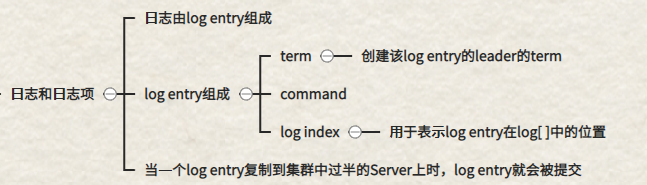

## 8.2 Raft对日志复制的担保

**Raft保证所有已提交的log entry已经被持久化，并且最终会应用到所有可用Server的状态机上**

## 8.3 AppendEntries RPC携带的重要信息

* entries[ ]：**Leader为每个Follower维护了一个nextIndex**，AppendEntries携带了Leader上从nextIndex开始的所有日志
* prevLogIndex：紧接在要发送给Follower的log entry前的log entry的index，用于让Follower进行一致性检查
* prevLogTerm：紧接在要发送给Follower的log entry前的log entry的term，用于让Follower进行一致性检查
* leaderCommit：Leader已经提交的日志中的最大的index，可以让Follower知道Leader提交了哪些log entry

## 8.4 写请求处理

* 写请求处理可以理解为一个优化后的2PC——**将两阶段优化为了一阶段**

1. Client发送请求，Leader基于请求中的command，创建一个log entry，写入自己的日志中
2. Leader并行地发送AppendEntries RPC给其他Server（发送给不同的Server的AppendEntries RPC可能不同，取决于nextIndex）
3. Follower处理AppendEntries RPC（详细见[Follower处理AppendEntries RPC的逻辑](#6.2.2.2)）

   * Follower通过prevLogIndex和prevLogTerm进行一致性检查，判断自己prevLogIndex处的日志是否与Leader一致

   * 如果一致，会将AppendEntries RPC中携带的日志与本地日志进行冲突检测
   * 如果发生了冲突，删除本地冲突的日志，然后将Leader发送过来的日志写入
   * 从AppendEntries RPC中的leaderCommitIndex知道Leader提交了哪些log entry，进而将Leader已经提交的log entry应用到自己的状态机中
   * 向Leader返回确认响应，表示Follower的日志与Leader同步成功，完全一致
4. 当Leader收到过半Server的AppendEntries RPC的确认响应——表明有过半的Server与Leader日志达成一致——Leader提交log entry，将log entry应用到Leader的状态机上（更新Leader维护的变量，主要是`commitIndex`），然后向Client返回结果（日志的提交必须遵守[日志提交规则](#6.3.6.5)）
5. 即使已经向Client返回结果，只要有Follower没有向Leader返回AppendEntries RPC的确认响应，Leader就会不断重试(减小nextIndex重试)，直到收到确认响应，Leader收到AppendEntries RPC的确认响应，表示Follower的日志与Leader一致（具体参考[日志的一致性检查和不一致处理](#rule8.5)）

## 8.5 日志的一致性检查和不一致处理

* **Follower处理AppendEntries RPC时完成一致性检查和不一致处理**（如下图）
* **Leader对于失败AppendEntries RPC的处理**
  * Leader为每个Follower维护了一个nextIndex，通过AppendEntries RPC将从nextIndex开始的所有日志发送给Follower
  * 如果AppendEntries RPC成功返回——Follower与Leader日志同步成功，日志一致，更新Follower对应的nextIndex和matchIndex
  * 如果AppendEntries RPC失败——日志同步失败，日志不一致，Follower对应的nextIndex自减，重新发送AppendEntries RPC（不断重复这个操作，直到AppendEntries RPC消息成功返回）

# 9. Safety

## 9.1 选举限制

* 选举限制——保证选举出来的Leader一定拥有前面任期所有的已提交的日志

1. Candidate发出的RequestVote RPC中通过lastLogIndex和lastLogTerm来标识自己日志的新旧
2. Follower收到RequestVote RPC后会按照[拒绝消息规则](#rule6.3.3)进行处理，只有Candidate的term比较大，并且Candidate的日志比Follower新或者跟Follower一样新，Follower才会投票给Candidate（Follower处理RequestVote RPC流程如下图）

## 9.2 NOPCommand和日志提交限制

### 9.2.1 存在的问题

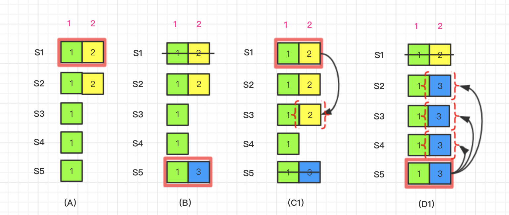

1. A——S1为Leader，任期为2，S1写入了term=2的日志，并复制给S2，然后宕机

2. B——S5获得S3,S4,S5的选票，成为Leader，任期为3，写入term=3的日志，宕机
3. C1——S3宕机，S1成为Leader，任期为4，将自己的日志复制给S2，S3，然后提交日志
4. D1——S1宕机，S5重新成为Leader，任期为5，将S1已提交的日志覆盖掉

上述过程违背了 **Leader Completeness**和 **State Machine Safety**

### 9.2.2 日志提交限制

* **Leader只能显式的提交当前任期内的成功复制到过半Server上的日志**
* **前面任期的日志只能隐式提交**（Leader显示提交了index=10的日志，那么index=1—index=9的日志就是被隐式提交了）

### 9.2.3 NOPCommand

* 为了解决[9.2.1](#9.2.1)的问题，引入了 **NOPCommand**——Server成为Leader后，立刻发送一个包含空命令的log entry给所有Server

### 9.2.4 改进后的过程

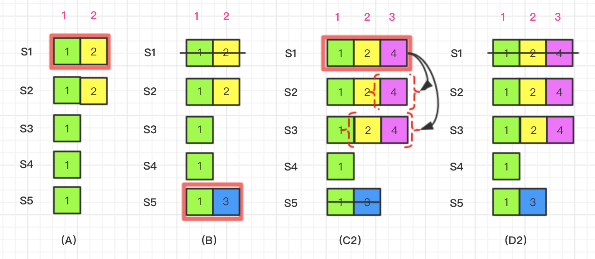

1. A——S1为Leader，任期为2，S1写入了term=2的日志，并复制给S2，然后宕机

2. B——S5获得S3,S4,S5的选票，成为Leader，任期为3，写入term=3的日志，宕机
3. C2——S3宕机，S1成为Leader，任期为4，发送一个term=4的空命令log entry给所有Server，S2，S3成功复制了日志，**S1显式提交了term=4的日志，term=2的日志被隐式提交了**
4. D2——S1宕机，S5无法成为Leader，Leader只能为S1，S2，S3

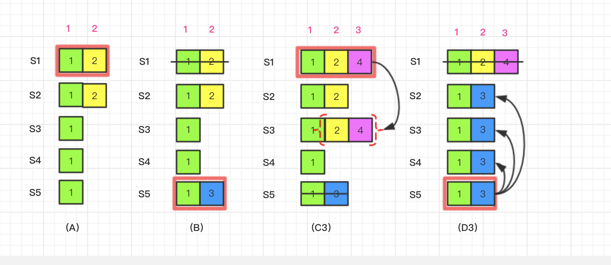

* 这种情况下，B结束时term=2的日志没有被提交，C3中S1成为Leader，发送term=4包含空命令的log entry给所有Server，只有S2完成了日志同步返回确认，所有S1不会显示提交term=4的日志，term=2的日志也就没有被隐式提交，所以D3中S5成为Leader后可以将其覆盖掉

## 9.3 时间和可用性

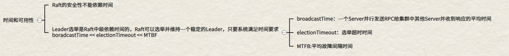

# 10. Membership Change

* 配置切换过程中不能在同一个任期中存在2个Leader——这是非常不安全的
* 如果直接将旧配置切换为新配置是不安全的，会导致一部分Server采用旧配置，一部分Server采用新配置——可能会出现2个Leader(如下图所示)，所以我们不能一次性的切换所有Server的配置

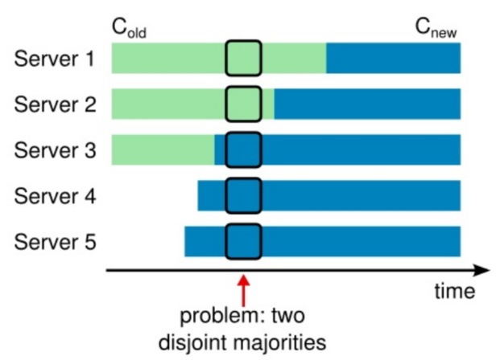

## 10.1 Raft安全切换配置

* 配置在Raft中以一种特殊的log entry存在
* 一个Server将新的配置log entry增加到自己的日志中，就会立刻采用这个新的配置(即使没被提交也是)
* Raft使用一个**两阶段的方法**
  * 先将旧配置转换为过渡配置（joint consensus）
  * 再转换为新配置

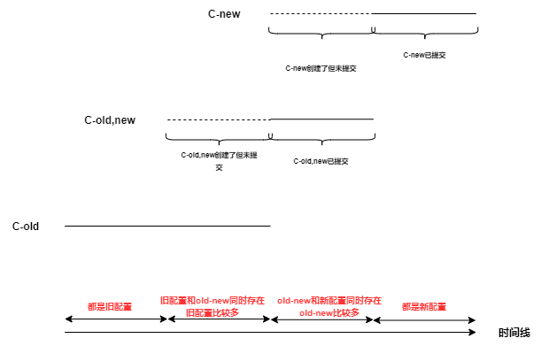

1. Leader收到将将配置由C-old变更为C-new的请求

2. Leader创建一个过度配置C-old,new(joint consensus)，并生成一个对应的log entry，将这个log entry按照Log Replication的规则让集群中的Server进行复制，一旦集群中过半Server复制了这个log entry，Leader就会将其提交，只有提交后Leader才会采用C-old,new的配置

   >如果log entry提交前，Leader宕机了，那么选举出来的新Leader的配置可能是C-old也可能是C-old,new，但一定不会是C-new
   >
   >如果在log entry提交后，Leader宕机了，那么选举出来的新Leader的配置一定是C-old,new

3. Leader创建一个C-new相关的log entry，并按照Log Replication的规则让集群中的Server进行复制

   当该log entry被过半Server复制后，Leader将其提交，新配置在集群中开始应用——旧配置就无用了，可以关闭不在新配置中的Server

## 10.2 存在的三个问题

1. 新的服务器可能刚开始没有存储任何日志，需要花费很长的时间才追赶，在这期间可以无法提交新的log entry——为了解决这个问题，Raft引入了一个新的状态——新加入集群的Server会作为Non-Voting（仅仅会复制日志），当新的Server追赶上了，即可按照上述流程进行配置切换
2. Leader可能不是新的配置中的一员——让Leader继续领导集群，当新配置被commit后，让Leader变为Follower，然后退出集群
3. 当某个Server退出集群中可能会扰乱集群——一个Server不在新配置中，就不会收到Leader的心跳，该Server会超时，然后自增自己的currentTerm，开启新一轮选举，发送RequestVote RPC，这可能会导致当前集群的Leader退回Follower，然后集群选举出新主，但是这个被移除的Server一段时间后会再度超时，重复上述流程——为了解决这个问题，当Server认为Leader存在时，会忽略RequestVote RPC

# 12. Raft与Client的交互

* Client所有的请求都是发送给Leader

* Client启动时，随机挑选Raft集群中的一个Server通信，如果Server不是Leader，Server会拒绝Client的连接请求并提供它最近收到的Leader的信息（AppendEntries RPC中包含了Leader的网络地址），如果Leader崩溃了，那么Client的请求会超时，Client会再次重试上述过程

* Raft的目标是实现线性化语义（每个操作只会执行一次），但是上述描述的Raft可能会执行同一条命令多次——Leader commit命令后，崩溃了，还没来得及向Client响应，此时Client超时重试，将命令发送给新Leader，这就导致这条命令执行了多次
  * **解决措施**——每条command分配一个唯一的ID，对于一条command，如果command对应的序列号已经执行过了，就不会再执行，直接返回结果
* 线性化的读操作不能返回脏数据，但是在不加任何限制的情况下，是可能会返回脏数据的——响应读请求的Leader可能并不知道自己已经被新Leader取代了
  * **解决措施**
    1. Leader必须知道哪些entries被提交了，但在任期开始时，Leader可能不知道，所以Leader在成为Leader后，立刻提交一次空白的log entry
    2. Leader在处理读请求前必须检查自己是否被取代了——他先和集群中大多数节点通过心跳消息交换一次数据

# 13. Raft与Paxos的不同

* Raft是强领导人特性，Raft使用领导人选举作为一致性协议里必不可少的部分

  Paxos中领导人选举仅仅是性能优化的手段，而不是必须要求的

* Paxos采用的是二阶段提交

  Raft对于日志复制，采用的是一种**近似一阶段提交**的方式

* Raft要求日志必须串行连续添加

  Multi Paxos可以并发添加日志，没有顺序要求，日志可能存在空洞现象

* Raft中只有拥有所有已提交的日志的Server才可能成为Leader

  Multi Paxos中可以选择任意节点作为Leader Proposer，成为Leader后再将日志补全3

