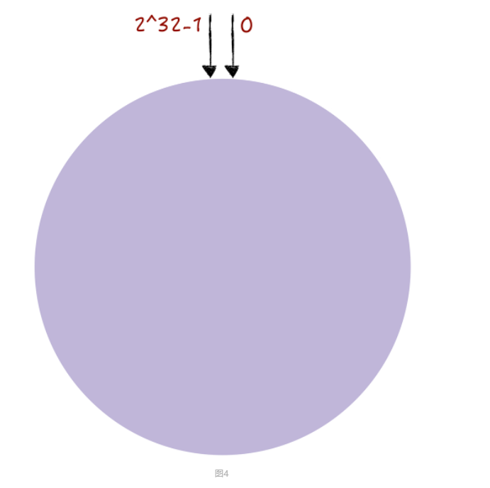
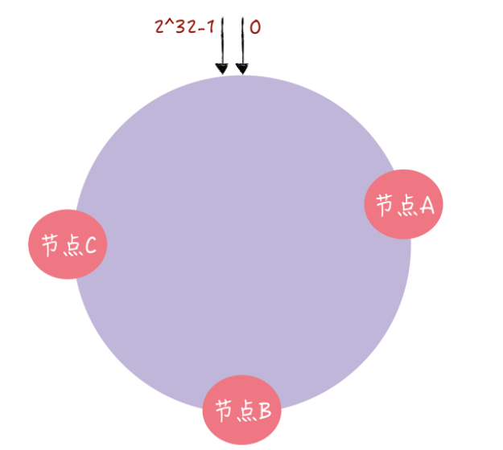
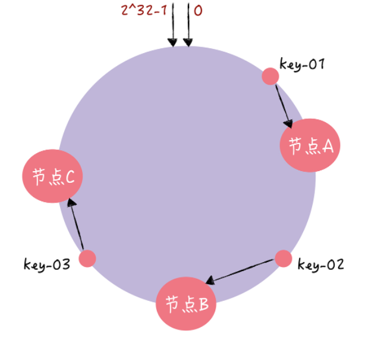
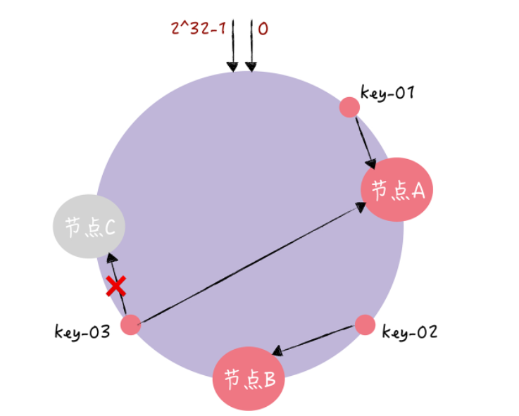
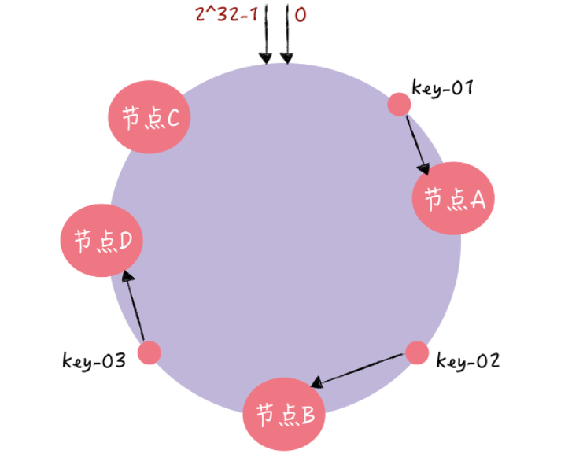
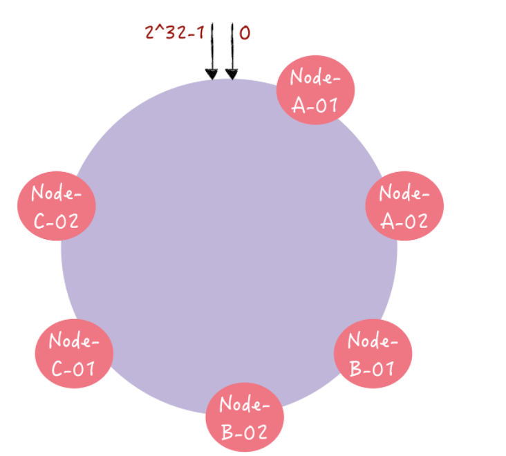

## 1. 一致性哈希算法的引入

* 在分布式集群中，对机器的添加/删除，或者机器故障后自动脱离集群，这都是分布式集群管理的最基本功能，如果采用常用的hash(object)%N算法，那么在添加机器或者删除机器后，需要对数据进行迁移，成本很大

* 使用一致性哈希算法，增强了集群的容错性和可拓展性（集群增加/删除节点时，数据迁移的成本更小）

## 2. 一致性哈希算法

### 2.1 哈希环

* 常见的哈希环是一个[0,2^32-1]的环形空间
* 一致性哈希算法是对2^32进行取模运算

### 2.2 哈希环的使用

* **每个节点，通过一致性哈希算法映射到哈希环上**

* **对key-value进行读写时，寻址过程如下**
  
  1. 利用一致性哈希算法计算key的哈希值，确定key在哈希环上的位置
  2. 然后从这个位置绕着哈希环顺时针走，遇到的第一个node就是key对应的node
  
  

* **移除节点的情况**
  
  
  
  如果节点C宕机后从集群中移除，那么只有位于移除节点和移除节点前一节点之间的数据受到影响，需要进行迁移

* **增加节点的情况**
  
  
  
  如果新增一个节点，那么只有位于新增节点和新增节点前一节点之间的数据受到影响，需要进行迁移

### 2.3 普通一致性哈希算法存在的问题

1. **数据访问的冷热不均**
   
   节点分布不均匀，导致Client访问频率高的数据集中在少数几个节点上，造成数据访问的冷热不均

2. **不平衡问题**
   
   当集群中一个节点宕机时，其上的数据会进行迁移，这可能会导致下个节点的压力骤增，可能导致雪崩，甚至整个服务挂掉

### 2.4 虚拟节点优化

* 对于每一个物理节点，为其分配**多个虚拟节点**，将虚拟节点映射到哈希环上，这样可以让节点在哈希环上的分布更加均匀，可以缓解普通一致性哈希算法存在的问题

