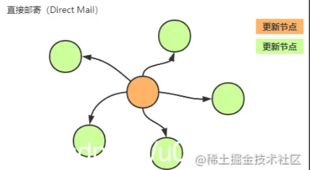
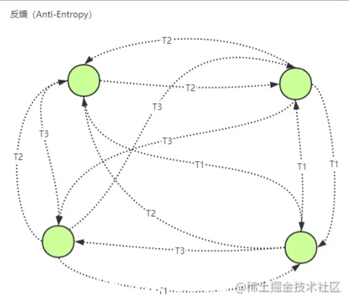
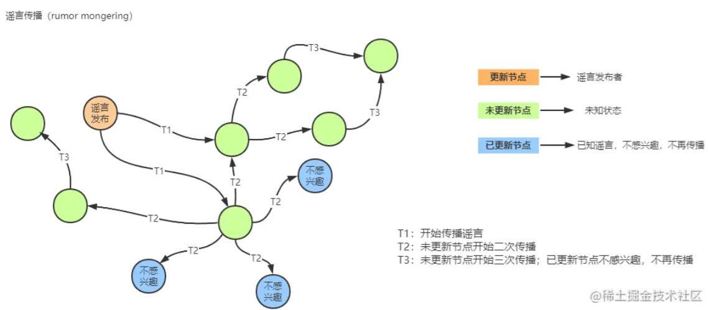

* 如果希望业务有非常强的可用性（即使只有一个节点存活也能提供服务），那么可以考虑下Gossip协议
* Gossip协议：像流言蜚语一样，使用一种随机，带有传染性的方式，将信息传播到整个网络中（集群中的节点不断通信交换信息），并在一定的时间内，让系统内所有的节点数据一致，**实现最终一致性**
* Gossip协议——去中心化，每个node都是平等的，每个节点每隔一段时间都会与其他节点通信交换信息，所有写操作可以由不同节点发起，并且同步给其他副本
* **Gossip通过Anti-entropy和Rumor mongering保证节点间数据的最终一致性**
* **优点**
  1. **可拓展性**——允许节点的任意增加和减少，新增节点的状态最终会与其他节点一致
  2. **分布式容错**——任意节点的宕机和重启不影响Gossip消息的传播
  3. **去中心化**——无需中心节点，所有节点都是对等的，任意节点无需知道整个网络状况，只要网络连通，任意节点可把消息散播到全网
  4. **最终一致性**
* **缺点**
  1. **消息延迟**——节点随机向少数几个节点发送消息，消息最终是通过多个轮次的散播而到达全网，不可避免的造成消息延迟
  2. **消息冗余**——节点定期随机选择周围节点发送消息，而收到消息的节点也会重复该步骤；不可避免的引起同一节点消息多次接收，增加消息处理压力

* **应用**

  * Gossip广泛用于数据库复制，信息扩散，集群成员身份确认，故障探测等
  * 反熵在存储组件中用的比较多，存储组件经常采用反熵才修复副本数据的不一致
  * 在实际场景中，Direct Email一定要实现

  * Redis Cluster内部通信使用的是Gossip协议
  * 如果发生了数据冲突，在Redis Cluster，每个信息都会携带版本号，以版本号高的为准

## 1. Gossip内容

* **Direct Mail（直接邮寄）**
* **Anti-entropy（反熵）**
* **Rumor mongering（谣言传播）**

### 1.1 Direct Mail

* 每个节点数据更新时会直接发送信息通知其他节点，当数据发送失败时，将数据缓存下来，然后重传
* **优点**——实现容易，数据同步及时
* **缺点**——可能会因为重试的缓存队列满了而丢失数据，无法实现最终一致性

### 1.2 Anti-entropy

* 集群中的每个node，每隔一段时间在集群中随机选择一些node，互相交换数据来消除数据差异，实现数据的最终一致性（有推，拉，推拉三种方式）
* 解决了Direct Mail消息丢失无法补偿容错导致的数据无法保持一致的问题

### 1.3 Rumor mongering

* Rumor mongering中节点有三种
  * 消息生产节点
  * 接受消息后会进行消息传播的节点
  * 接受消息后不会进行消息传播的节点

* 所有的节点在最开始没有产生数据变更时都假设是**未知状态**，它是不知道任何谣言信息的

* 当节点收到其他节点更新数据通知时，相当于听到了一条**谣言**，并将其视为**热门**开始传播给周边节点

* 当某个节点**谣言**盛行时，它会定期随机选择其他节点，并确保另一个节点知道

* 当某个节点发现周边节点都知道这个**谣言**时，该节点将停止将该谣言视为**热点**，并保留更新，而不会进一步传播

## 2. Gossip在Redis Cluster中的应用

* Gossip协议——**节点之间彼此不断通信交换信息**，一段时间后所有节点都会直到集群的完整信息（只要节点之间可以正常通信，最终一定会达到一致的状态），Redis Cluster内采用Gossip协议进行通信
* Gossip消息有4种
  * **ping**——用于检测节点是否在线，交换彼此信息
  * **pong**——响应信息
  * **meet**——用于通知新节点加入集群
  * **fail**——当节点判定集群中另一个节点下线时，会向集群内广播一个fail
* Redis Cluster中Gossip消息带有版本号，当发送数据冲突时，以版本号高的为准
