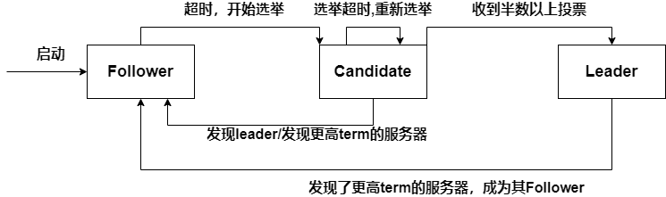

## 1. 应用

etcd，Consul，Nacos，RocketMQ，Redis Sentinel底层都是采用Raft来确定leader，由leader来对其他节点下命令

## 2. Raft角色

Raft分成三种角色

* follower
* leader
* Candidate：候选人，等待其他节点的投票，如果获得了大多数节点的选票，就晋升为leader

## 3. 任期

* Raft将时间划分为任意个任期term，任期用连续的数字表示

* 每一个任期都是一轮选举，在一个term中，一个或多个Candidate会尝试成为Leader，如果一个Candidate赢得了选举，那么就成为该任期内的Leader，如果没有选出Leader，会开启下一个任期（term自增），并开始下一轮选举

* 每个节点都会存储当前的任期值，服务器之间通信时会交换任期值
* **超时自增**：如果follower超过一定的时间没有收到leader的消息，就会成为Candidate，并递增自己的term
* **更新为较大值**：如果节点收到了其他节点包含term的消息，会将信息中的term与自己的term进行比较，更新为较大的term

* **恢复为follwer**：如果一个角色为leader or Candidate的节点，发现自己的term比某个节点小，就会立刻恢复为follwer（用于网络分区后的错误恢复）
* **拒绝消息**：如果一个节点收到了较小term值的请求，拒绝这个请求

## 4. 选举过程

### 4.1 初始选举

1. 初始状态——现在有a，b，c三个节点，term(任期)都为0，角色都是Follower，没有Leader

Raft算法有 **随机超时时间特性**，每个节点都会等待leader的消息，但是超时时间是随机的（a为1s，b为1.5s，c为2s）

2. a到达超时时间后，a成为Candidate，并增加自己的term，然后投一票给自己，并向b，c请求投票（请求消息里面会携带a的term）
3. b，c收到a的请求后，查看a的term，发现term=1的任期里，自己还没有投过票，就将票投递给a，并修改自己的term为1（每个节点在一个term内只会投一票）
4. a收到投票，成为term=1的任期里的leader，定期向b，c发送心跳消息，防止follower超时进行新一轮任期投票

### 4.2 新主选举

* Raft使用心跳机制来触发leader选举
  * 每个服务器都有一个计时器，计时器的超时时间随机，如果一台服务器可以接受来自Leader的心跳，那么会一直保持Follower状态，并不断刷新自己的计时器
  * Leader会不断向所有Follower周期性发送心跳来保证自己的Leader地位

* 一个Follower在超时时间耗尽前都没有收到Leader的心跳，认为Leader不可用，自增自己的term值，并将状态切换为Candidate，然后向其余所有节点发送RequestVote请求

## 5. 如何避免多个节点同时发起投票

每个节点分配一个随机的超时时间，只能与leader断连超过超时时间了，才能成为Candidate，发起投票

## 7. Raft的关键机制

1. 任期机制
2. 随机超时时间
3. 同一个任期内，先来先投票
4. 大多数投票原则