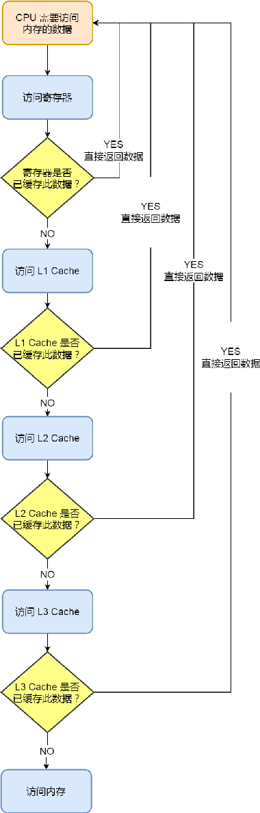

## 1. 存储器层次结构

* **寄存器**——半个CPU时钟中期内完成读写

  * 通用寄存器
  * 指令寄存器
  * 程序计数器

* **CPU Cache**

  

  * **L1 Cache**——每个CPU都有一个L1 Cache，其中数据和指令分开存放，分成L1数据缓存和L1指令缓存（访问需要2-4个CPU时钟周期）
  * **L2 Cache**——每个CPU都有一个L2 Cache（访问需要10-20个CPU时钟周期）
  * **L3 Cache**——多个CPU共享L3 Cache（访问需要20-60个CPU时钟周期）

* **内存**——访问需要200-300个CPU时钟周期

* **磁盘**

## 2. 存储体系下的数据访问

