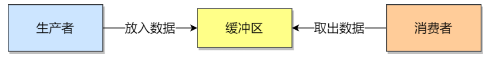

# 1. 互斥与同步

## 1.1 互斥

* **临界区**——访问共享资源的代码段，不能让多个线程同时执行
* **临界区是互斥的**——保证只有一个线程执行临界区代码，其他线程被阻止进入临界区


## 1.2 同步

* 并发进程/线程在一些关键点上可能需要互相等待与互通消息

* 线程1负责读入数据，线程2负责处理数据，线程2在没有收到线程1的唤醒通知时，一直阻塞等待，当线程1读取完数据后，唤醒线程2


# 2. 互斥与同步的实现

* 锁
* 信号量


## 2.1 锁

* 任何想进入临界区的线程，必须先执行加锁操作，成功加锁后才能进入临界区，如果加锁失败就必须阻塞等待锁的释放


## 2.2 信号量

* 信号量表示资源的数目，对应一个int变量sem，提供两个**原子操作**来控制信号量
  * **P操作**：将sem减1，减少后，如果sem<0，那么线程阻塞，进入等待队列
  * **V操作**：将sem加1，相加后，如果sem<=0，从等待队列中唤醒一个阻塞的线程

* **信号量可以实现临界区的互斥访问控制，还可以实现线程间的同步**
  * **信号量实现临界区的访问控制**——将sem的初始值设置为1
  * **信号量实现线程间的同步**——将sem的初始值设置为0


# 3. 生产者-消费者问题



* **问题描述**

  * 缓冲区有大小限制n

  * 生产者生成数据后，放入缓冲区，如果缓冲区已满要阻塞等待
  * 消费者从缓冲区取出数据，如果缓冲区没有数据要阻塞等待
  * 任何时刻，只能由一个生产者or消费者访问缓冲区

* **需要三个信号量**
  * 互斥信号量mutex：互斥访问缓冲区
  * 资源信号量fullBuffers：缓冲区中剩余数据量（初始化为0）
  * 资源信号量emptyBuffers：缓冲区中剩余可存储的数据量（初始化为n）

```c
//生产者
void producer(){
    while(TRUE){
        P(emptyBuffers);
        P(mutex);
        //将数据放入缓冲区
        V(mutex);
        V(emptyBuffers);
    }
}

//消费者
void consumer(){
    while(TRUE){
        P(fullBuffers);
        P(mutex);
        //从缓冲区取出数据消费
        V(mutex);
        V(fullBuffers);
    }
}
```


# 4. 哲学家就餐问题

* **问题描述**
  * n个哲学家围绕着一张桌子吃饭
  * 每2个哲学家间放一个叉子
  * 哲学家在思考or吃饭
  * 哲学家只有拿到了2只叉子才能吃饭，吃完饭将叉子放回去

## 4.1 全局互斥

* 维护一个全局互斥信号量，保证任何时候只有一个哲学家可以拿叉子
* **缺点**——至多只有一个哲学家可以吃饭


## 4.2 错开

* 给哲学家编号

  * 奇数编号的哲学家先拿左边的叉子再拿右边的叉子

  * 偶数编号的哲学家先拿右边的叉子再拿左边的叉子


## 4.3 状态数组

* 维护一个state数组，表示每一位哲学家是在进餐，思考，还是试图获取叉子
* 一个哲学家只有在左右2个邻居都没有进餐时，才可以进入进餐状态

```c
semaphore mutex;        //互斥信号量，初值为1
semaphore s[5];         //每个哲学家一个信号量，初值为0
int state[N];           //数组记录每个哲学家的状态

//哲学家主代码
void smart_person(int i){
    while(TRUE){
        think();        //思考
        take_forks(i);  //准备拿去叉子吃饭
        eat();          //就餐
        put_forks(i);   //吃完放叉子
    }
}

void test(int i){
    if(state[i]==HUNGRY&&state[LEFT]!=EATING&&state[RIGHT]!=EATING){
        state[i]=EATING;
        V(s[i]);
    }
}

void take_forks(int i){
    P(mutex);
    state[i]=HUNGRY;
    test(i);
    V(mutex);
    P(s[i]);
}

void put_forks(int i){
    P(mutex);
    state[i]=THINKING;
    test(LEFT);
    test(RIGHT);
    V(mutex);
}
```


# 5. 读者-写者问题

* **问题描述**
  * 读-读允许：允许多个读者同时读
  * 读-写互斥：没有写者时读者才能读，没有读者时写者才能写
  * 写-写互斥

