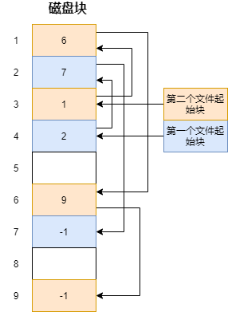

# 1. 文件系统结构

# 2. 文件系统基本组成

## 2.1 磁盘存储

* 文件系统将磁盘上的多个扇区组成一个逻辑块，每次读写的最小单位是逻辑块（4KB）

磁盘进行格式化时，会切分为三个存储区域——超级块，索引节点区，数据块区

* 超级块：存储文件系统的详细信息（比如块个数，块大小，空闲块）
* 索引节点区：存储索引节点(**inode**)
* 数据块区：存储文件或者目录数据

## 2.2 索引节点和目录项

* Linux中，一切皆文件，不仅仅是普通的文件和目录，连块设备，管道，socket等都是交由文件系统管理，都有对应的文件
* Linux文件系统为每个文件分配两个数据结构——index node索引节点和directory entry目录项
  * **index node**：记录文件的元信息（比如inode编号，文件大小，访问权限，创建时间，修改时间，数据在磁盘的位置），index node是文件的唯一标识，**存储在磁盘中**
  * **directory entry**：用来记录文件的名字，有一个指向索引节点的指针，以及和其他目录项的层级关系——目录项由内核维护，**存储在内存中**

## 2.3 Linux文件系统结构

* Linux将磁盘划分为一个个块组
* 每个快组的内容如下
  * 超级块：文件系统重要信息（inode总数，块总数，每个块组的inode个数，每个快组的块个数等，每个块组都包含了整个文件系统的重要信息）
  * 块组描述符：文件系统各个块组的状态（每个块组都包含了文件系统中所有块组的组描述符信息）
  * 数据位图：用来标识数据块是否空闲
  * inode位图：用来标识inode是否空闲
  * inode列表：块组中所有的inode
  * 数据块

## 2.4 文件访问过程

1. 根据要访问的文件路径，在内存中访问目录项树，找到对应的目录项
2. 根据目录项中的索引节点指针，找到对应的inode
3. 通过inode找到该文件对应的数据块，访问数据

# 3. 虚拟文件系统

* 虚拟文件系统：隐藏各种硬件细节，将文件系统操作和不同文件系统的具体实现分离开，为上层提供统一的接口

## 3.1 文件的使用

* 进程打开一个文件后，OS为每个进程维护一个文件列表，文件列表中维护着打开文件的状态和信息
  * 文件指针：跟踪上次读写位置作为当前⽂件位置指针
  * 文件打开计数器：⽂件关闭时，操作系统必须重⽤其打开⽂件表条⽬，否则表内空间不够⽤。因为多个进程可能打开同⼀个⽂件，所以系统在删除打开⽂件条⽬之前，必须等待最后⼀个进程关闭⽂件，该计数器跟踪打开和关闭的数量，当该计数为 0 时，系统关闭⽂件，删除该条⽬
  * 文件磁盘位置
  * 访问权限

# 4. 文件的存储

文件数据存储在磁盘上，有以下几种方式

* 连续空间存储
* 非连续空间存储
  * 链表方式
  * 索引方式

## 4.1 连续空间存储

* 文件存放在磁盘连续的物理空间中，文件的数据紧密相连，读写效率很高
* 使用连续空间存储，需要在文件头指定**起始块的位置**和**长度**
* **缺点**——磁盘空间碎片，文件长度不易拓展

## 4.2 非连续空间存储

### 4.2.1 链表方式

 链表分为——隐式链表和显示链接

#### 隐式链表

* 隐式链表——**inode(文件头)**包含起始块和末尾块的位置，每个数据块中都预留一个指针空间，存放下一个数据块的位置

* **缺点**
  
  * 不能直接访问数据块(不支持随机读写)，需要通过数据库中的指针顺序访问文件
  
  * 稳定性差，如果由于软件or硬件错误导致链表中指针丢失或损坏，会造成数据文件丢失

#### 显示链接

* 把用于链接文件各数据块的指针，存放在链接表中（整个磁盘仅有一张），每个表项中存放链接指针，指向下一个数据块号

* **缺点**
  * 不适用于大磁盘
  * 不能直接访问数据块(不支持随机读写)

### 4.2.2 索引方式

#### 常规索引方式

* 索引方式——为每个文件创建一个索引数据块，里面存储指向文件数据块的指针列表
* 文件的**inode(文件头)**中包含指向索引数据块的指针

* **优点**
  1. 文件的创建，增大，缩小很方便
  2. 不会有碎片问题
  3. 支持顺序读写和随机读写

#### 链式索引块

* 如果文件很大，一个索引数据块存放不下索引信息——使用链式索引块
* 在索引数据块中预留一个指向下一个索引数据块的指针

#### 多级索引块

* 索引数据块一层套一层

# 5. 空闲磁盘空间管理

* 空闲表法
* 空闲链表法
* 位图法

## 5.1 空闲表法

* 为所有的空闲空间建立一张空闲表——每个表项包含空闲区域的第一个块号和空闲区域的块个数

## 5.2 空闲链表法

* 每个空闲块都有一个指针指向下一个空闲块

## 5.3 位图法

* 利用二进制来表示磁盘中一个数据块的使用情况

* Linux使用位图法来管理**空闲数据块**和**inode空闲块**（2个位图）

* 值为0时，表示对应的数据块空闲，值为1时，表示对应的块已分配

# 6. 目录存储

* 普通文件的数据块中保存的是文件数据，目录的数据块中保存的是**文件信息**

* 目录中文件信息最简单的组织形式是列表，也可以使用哈希表

# 7. 软链接和硬链接

* Linux中可以通过Hard Link和Symbolic Link来给文件取别名

## 7.1 硬链接

我们通过硬链接给文件起别名后，会创建一个新的目录项

* 硬链接是让多个目录项的索引节点指针都指向同一个inode
* 每个文件系统都有自己的inode，所有硬链接不可以用于跨文件系统
* 只有删除所有的硬链接以及源文件，系统才会彻底删除该文件

## 7.2 软链接

* 软链接相当于重新创建了一个文件，这个文件有独立的inode，这个文件的内容是另一个文件的路径

* /home/xiaolin文件的别名为/home/jay，访问/home/jay的目录项，找到对应的inode200，根据inode200中的信息找到数据块，数据块中存储着文件路径/home/xiaolin，然后根据/home/xiaolin即可访问到真正的文件

* 软链接是可以跨文件系统的

