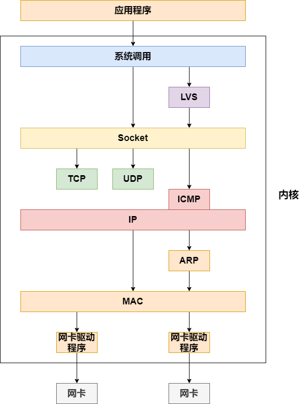
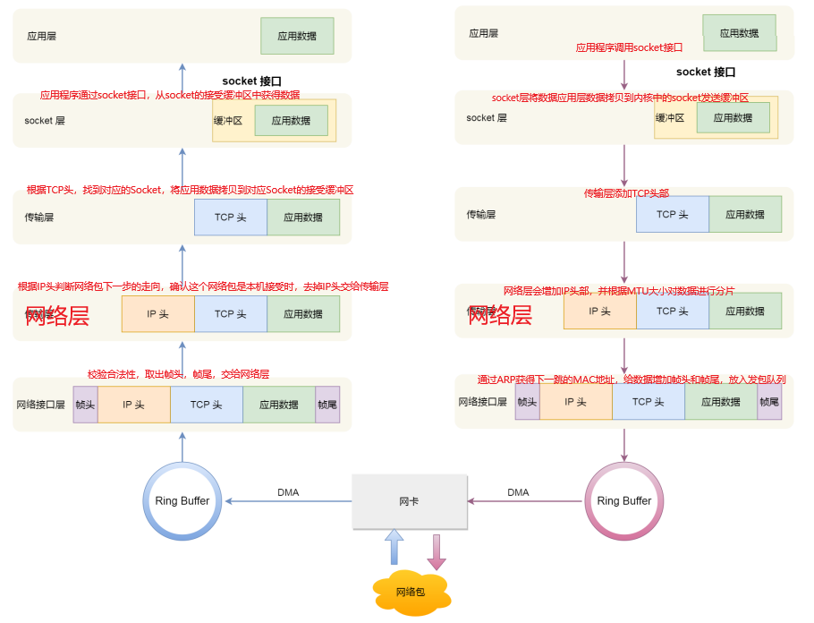

# 1. Linux网络协议栈

# 2. Linux收发网络包

## 2.1 Linux接受网络包

### 2.1.1 通用方案

1. 网卡负责接收和发送网络包，当网卡收到一个网络包后，会通过DMA技术，将网络包数据放入Ring Buffer
2. 网卡收到网络包后，触发一个中断给OS，让OS通过中断处理程序来读取网络包数据

* **缺陷**——在网络包很多的情况下，会触发非常多的中断，CPU收到中断后，会停下手里的事情，去处理这些网络包，处理完后再继续做自己的事情，频发触发中断，会导致CPU没完没了的处理中断，导致其他任务无法运行

### 2.1.2 Linux2.6后的NAPI机制

* Linux在2.6版本后引入了NAPI机制——混合中断和轮询来接收网络包

* NAPI的核心概念——不采用中断的方式读取数据，首先采用中断唤醒数据接收程序，然后数据接收程序采用poll来轮询数据

1. 网卡负责接收和发送网络包，当网卡收到一个网络包后，会通过DMA技术，将网络包数据放入Ring Buffer
2. 网卡发起硬件中断，OS执行网卡硬件中断处理程序，网卡硬件中断处理程序执行后，会后唤醒**软中断**来轮询处理数据，软中断会将Ring Buffer中的数据拷贝到内核的sk_buff缓冲区中，让数据作为一个网络包交给网络协议层进行处理，并且在此期间会暂时屏蔽中断，直到没有新数据时才恢复中断，

## 2.2 Linux发送网络包

1. 数据从应用层到达网络接口层（如上图）
2. 数据准备好后，触发软中断告诉网卡驱动程序，这里有新的数据包要发送，网卡驱动程序通过DMA从发包队列中读取网络包，由物理网卡发送出去

