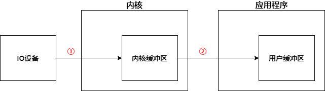
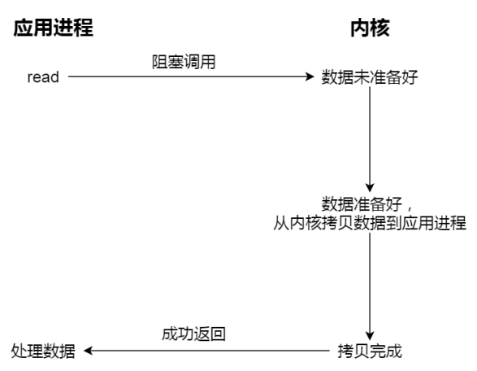
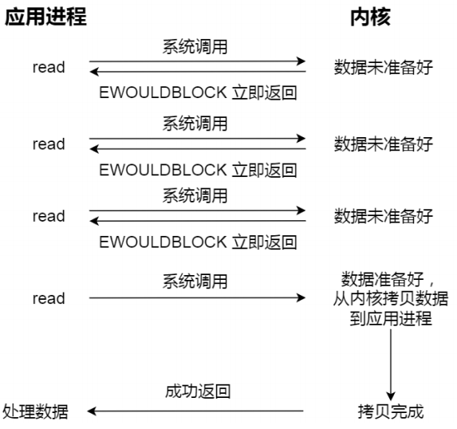
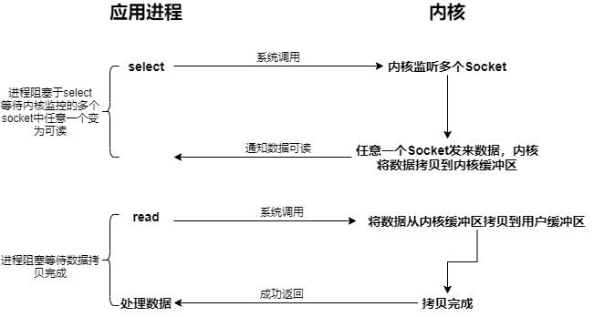
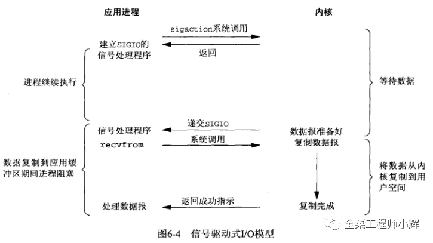
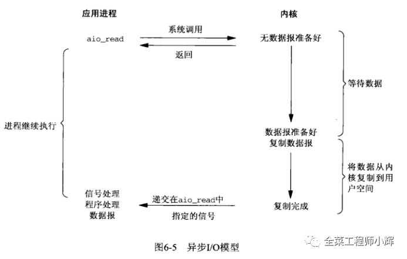

# 1. IO过程

应用进程发出IO请求后，分为2个过程

1. **内核准备数据**，将数据从IO设备读入内核缓冲区
2. **内核将数据从内核缓冲区拷贝到用户缓冲区**

# 2. IO类型

* **划分**
  * **缓冲与非缓冲**
    * **缓冲IO**：利用**标准库的缓存**实现文件的加速访问，程序访问标准库，标准库再通过系统调用访问文件
    * **非缓冲IO**：直接通过系统调用访问文件
  * **直接与非直接**
    * **直接IO**：不适用Page Cache，直接通过文件系统访问磁盘
    * **非直接IO**：使用Page Cache，读操作时，先在Page Cache中查看是否有要的数据，如果没有，数据从磁盘读入内核缓冲区，再由内核缓冲区拷贝到用户缓冲区；写操作时，数据从用户缓冲区拷贝到内核缓冲区，再由内核决定什么时候写入磁盘
      * **触发内核缓冲区写入磁盘**
        * 调用write时，数据是从用户缓冲区写入内核缓冲区，如果内核缓冲区中数据太多，就会将内核缓冲区写入磁盘
        * 用户调用sync
        * 内存不足时
        * 内核缓冲区中数据的缓存时间超过了指定时间
  * **阻塞与非阻塞**
    * **阻塞IO**：内核在准备数据时，应用程序阻塞等待
    * **非阻塞IO**：内核在准备数据时，应用程序继续干自己的事
  * **同步与异步**
    * **同步IO**：当内核准备好数据后，数据从内核缓冲区拷贝到应用缓冲区时，**应用进程阻塞等待**
    * **异步IO**：一切交由内核去做，当内核将数据拷贝到用户缓冲区后，通知应用程序，**应用进程不会阻塞等待**

* **五大类IO**
  * 同步IO
    * **同步阻塞IO**
    * **同步非阻塞IO**
    * **IO多路复用**
    * **信号驱动IO**
  * **异步IO**

## 2.1 同步阻塞IO

* 应用进程阻塞，直到内核将数据准备好，并将数据拷贝到用户缓冲区

## 2.2 同步非阻塞IO

* 应用进程不会阻塞，会不断询问内核是否将数据准备好
* 当内核将数据准备好后，应用进程通过系统调用让内核将数据从内核缓冲区拷贝到用户缓冲区，此时应用进程阻塞等待数据拷贝完成

## 2.3 IO多路复用

* 应用程序调用select，阻塞等待，内核会监听着多个Socket
* 当任意一个Socket上有数据到达时，内核会将数据拷贝到内核缓冲区，通过应用程序有数据到达
* 应用程序收到通知后，会调用read()，将数据从内核缓冲区拷贝到用户缓冲区

## 2.4 信号驱动IO

## 2.5 异步IO

* IO过程的两个阶段皆由内核完成，应用进程只管做自己的事情