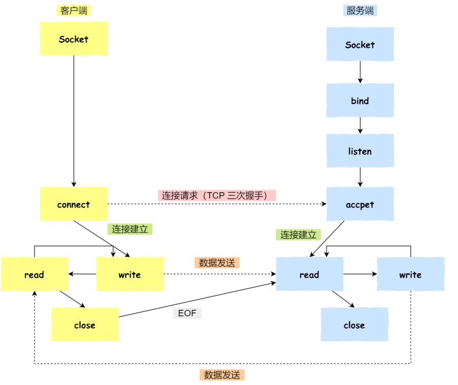
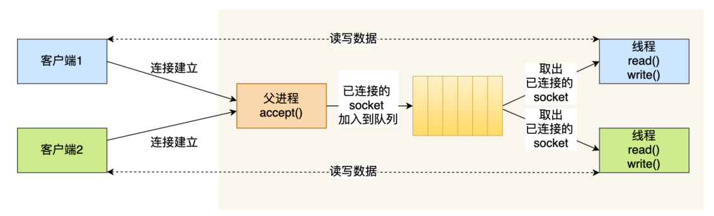

# 1. 最基本的socket模型



1. 服务端调用socket()创建一个socket，调用bind()，为该socket绑定IP和端口，然后调用listen()，让socket对端口开始监听**（监听Socket）**
2. 服务端接着可以通过调用accept()来从内核获得客户端的连接，如果没有客户端连接，会阻塞直到客户端连接到来
3. 客户端创建好socket后，通过connect()向服务端发起连接（三次握手）
4. 服务端可以通过accpet()获得一个**已连接的socket**

* OS内核中为每个Socket维护了两个队列
  * **半连接队列**
  * **全连接队列**
* Linux一切皆文件，在内核中Socket也是以文件形式存在，有对应的文件描述符


# 2. 多进程模型

* 多进程模型——为每个客户端分配一个进程来处理请求
* 主进程负责监听客户端的连接，一旦与客户端连接完成，accpet()返回一个已连接的Socket，此时通过fork()创建一个子进程——子进程会复制父进程的文件描述符，这样就可以直接使用已连接的Socket与客户端通信
* 父进程只需要关心监听Socket，子进程只需要关心已连接的Socket

* **缺点**——子进程退出时，内核还会保留进程的一些信息，会占用内存，如果没有做好回收工作，就会变成僵尸进程，耗尽系统资源


# 3. 多线程模型

* 通过线程池来管理线程，同时避免线程的频繁创建和销毁
* 主进程负责监听客户端的连接，一旦与客户端连接完成，accpet()返回一个已连接的Socket，此时将已连接的Socket的文件描述符放入一个队列
* 线程池里的线程从队列中取出已连接的Socket进行处理




# 4. IO多路复用

* 一个线程可以**监听多个Socket**，一旦某个Socket上有事件达到，那么会通知应用程序执行相应的读写操作
* select/poll/epoll是内核提供的多路复用系统调用

## 4.1 select

### 4.1.1 select代码

```c
typedef struct{
    unsigned long fds_bits[__FDSET_LONGS];//select中使用固定长度的bitmap来表示Socket文件描述符集合
} fd_set;

int select(int max_fd,fd_set* readset,fd_set* writeset,fd_set* exceptset,struct timeval* timeout);//返回就绪的文件描述符的数目
```


### 4.1.2 select使用

```c
fd_set fs;//所有已连接的Socket的文件描述符集合

while(1){
    //将整个Socket文件描述符集合拷贝到内核中，让内核去监听，应用进程阻塞等待select返回
    //内核会对集合中的每一个Socket进行监听，当内核监听到某个Socket上有网络事件产生，将Socket标记为可读/可写，然后内核将内核中的文件描述符集合拷贝回用户态
    //select返回就绪的Socket数目
    nfds=select(&fs);
    
    //应用进程从select返回，遍历Socket描述符集合，找到可读/可写的Socket，进行处理
}
```

1. 应用进程维护一个集合来保存所有已连接的Socket的文件描述符
2. 应用进程调用select()时，会将这个集合拷贝到内核中，**应用进程阻塞等待select返回**
3. 内核对集合中的每一个Socket进行监听，当内核监听到某个Socket上有网络事件产生，将Socket标记为可读/可写，然后内核将内核中的集合拷贝回用户态，**select会返回就绪的Socket的数目**
4. 应用进程从select返回，遍历Socket描述符集合，找到可读/可写的Socket，进行处理


### 4.1.3 select问题

* **select中**使用固定长度的BitsMap来表示Socket文件描述符集合（大小默认为1024，也就是说最多只能监听1024个Socket）
* **问题——两次拷贝，两次遍历，性能不是很高**


## 4.2 poll

### 4.2.1 poll代码

```c
struct pollfd{
    int fd;//需要内核监听的Socket的文件描述符
    short events;//需要内核监听的事件
    short revents;//实际发生的事件
}
int poll(struct pollfd fds[], nfds_t nfds,int timeout);//返回就绪的文件描述符的数目
```


### 4.2.2 poll使用

* **同select**，不过这里使用**数组**来表示文件描述符集合，所以没有文件描述符数目限制（但是还是会受OS限制）


## 4.3 epoll

### 4.3.1 epoll代码

* epoll核心结构是一个eventpoll对象
  * eventpoll对象中使用红黑树来跟踪所有已连接的Socket
  * epoll采用事件驱动机制，eventpoll对象中维护了一个**就绪链表**来存储就绪的Socket的文件描述符，当某个Socket上有事件发生时，通过回调函数将该Socket的文件描述符加入到该链表

```c
struct eventpoll{
    struct rb_root rbr;//红黑树的根节点  
    
    struct list_head rdlist;//就绪链表，存储就绪的Socket的文件描述符
};
//API
int epoll_create(int size);//在内核中创建一个eventpoll对象
int epoll_ctl();           //将一个Socket的文件描述符加入到epoll的内核红黑树中，让epoll进行监听
int epoll_wait();          //调用该方法会检查就绪链表中是否有就绪的Socket，如果没有，那么进程阻塞等待，如果有，返回就绪的Socket的数目
```


### 4.3.2 epoll使用

```c
epfd=epoll_create(256);//在内核中创建eventpoll对象

epoll_ctl(epfd,EPOLL_CTL_ADD,listenfd,$ev);//将需要被监听的Socket的文件描述符放入到eventpoll对象中,让epoll进行监听

while(1){
    nfds=epoll_wait(epfd); //阻塞等待，该方法会返回就绪的Socket数目
    //处理
}
```

### 4.3.3 epoll缺点

* epoll是能在Linux下运行


### 4.3.4 epoll工作模式

epoll有两种工作模式——LT和ET

* 边缘触发模式LT——如果一个Socket中还有数据可读，那么epoll_wait每次都会返回这个Socket的文件描述符，提醒用户去处理
* 水平触发模式ET——如果一个Socket可读，那么只会提醒一次，在下次有新的数据流入Socket前都不会再有提示


## 4.4 三者比对

|                      |   select   |   poll   |                     epoll                     |
| :------------------: | :--------: | :------: | :-------------------------------------------: |
|       数据结构       |   bitmap   |   数组   |                  红黑树+链表                  |
|    最大Socket数目    |    1024    | 受限于OS |                   受限于OS                    |
|      Socket拷贝      | 每次select | 每次poll | 只有首次调用epoll_ctl才拷贝，epoll_wait补考呗 |
| 事件发生后的处理效率 |  遍历O(N)  | 遍历O(N) |                   回调O(1)                    |

