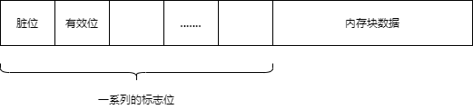
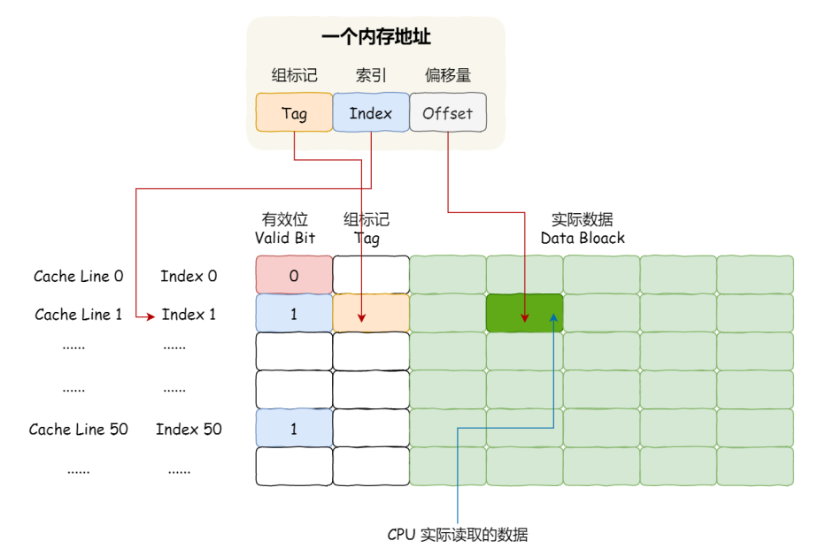
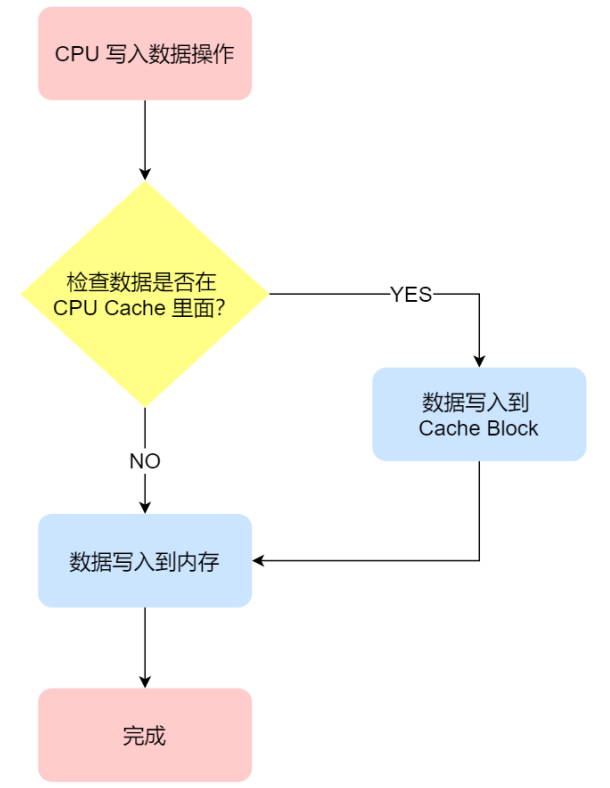
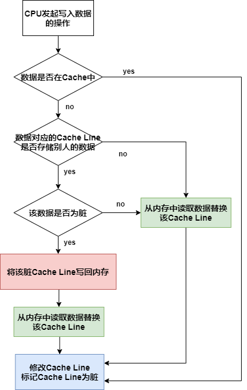
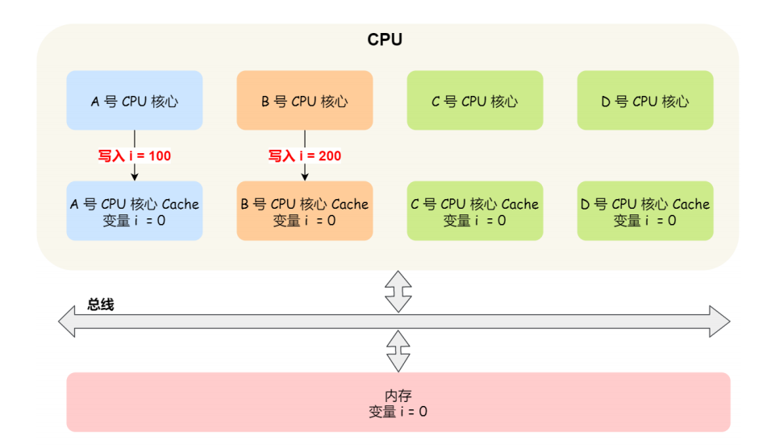
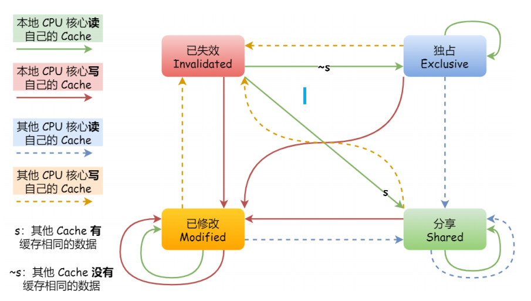
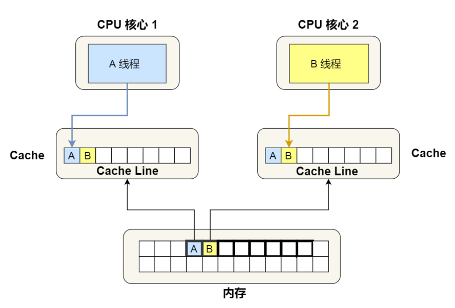

# 1. Cache与内存

* 将内存划分为一个个内存块（64B）
* Cache的基本单位是行(line)，Cache中的一行=各种标志位+数据块
* Cache中的数据是从内存中读取过来的，以内存块为单位，读入Cache

# 2. 内存与Cache的映射方式

## 2.1 直接映射

**直接映射**——内存中一个固定的内存块映射到Cache中的固定一行

## 2.2 全相连映射

**全相联映射**——内存中一个固定的内存块随机映射到Cache中的一行

## 2.3 组相连映射

**组相连映射**——将Cache中的行分为多组，内存中一个固定的内存块映射到固定的一组中的随机的一行

# 3. 使用Cache提供效率

* 对于L1数据缓存——我们在遍历数据的时候，应该按照内存布局的顺序操作，这是因为 CPU Cache 是根据 CPU Cache Line 批量操作数据的，所以顺序地操作连续内存数据时，性能能得到有效的提升
* 对于L1指令缓存——有规律的条件分⽀语句能够让 CPU 的分⽀预测器发挥作⽤，进⼀步提⾼执⾏的效率
* 对于多核 CPU 系统，线程可能在不同 CPU 核⼼来回切换，这样各个核⼼的缓存命中率就会受到影响，于是要想提⾼进程的缓存命中率，可以考虑把线程绑定 CPU 到某⼀个 CPU 核⼼

# 4. 缓存一致性

## 4.1 Cache写回内存策略

### 4.1.1 写直达

写操作时——同时将数据写入内存和Cache

### 4.1.1 写回

发生写操作时，数据只会写入Cache中，当某个Cache行被替换时，会判断该被替换的Cache Line是否被修改过，如果修改过，会将脏数据写回内存

## 4.2 多核下的缓存一致性问题

CPU是多核的，L1 Cache和L2 Cache多个核心独自拥有，会带来多核心的缓存一致性问题

要解决多核心的缓存一致性问题，需要做到2点

* **写传播**——某个CPU的Cache数据更新时，要传播到其他核心的Cache
* **事务的串行化**——多个CPU对某个数据进行操作，这多个CPU对数据的操作顺序在所有CPU看起来顺序是一样的

### 4.2.1 总线嗅探

总线嗅探实现了**写传播**——CPU监听总线上的一切活动，CPU的Cache数据更新时，都会通过总线进行广播

### 4.2.2 MESI

* MESI实现了**事务的串行化**

* MESI使用四个状态来标记Cache Line的四种不同状态
  * Modified已修改（Cache Line数据是脏的，与内存不一致，可以自由的写入，无需通知其他CPU）
  * Exclusive独占（Cache Line数据是干净的，与内存一致，仅有一个CPU的Cache有该数据，可以自由的写入，无需通知其他CPU，独占状态下的数据，如果有其他核心从内存中也读取了该数据，那么状态要变为共享）
  * Shared共享（Cache Line数据是干净的，与内存一致，多个CPU的Cache有该数据，不能直接修改，需要向其他CPU广播，让其他CPU将对应的Cache Line标记为已失效，然后再更新其中的数据）
  * Invalidated已失效（数据已经失效，需要重新从内存中加载）

# 5. 伪共享问题

两个CPU运行着两个不同的线程，同时从内存中读取两个不同的数据，分别是long变量A和long变量B，这两个数据在内存上连续（位于同一个内存块）

CPU1在自己的Cache中读写变量A，CPU2在自己的Cache中读写变量B

由MESI我们可以知道，如果CPU1修改了变量A，那么A的Cache中该行就变成了Modified状态，B的Cache中该行变成无效状态，CPU2如果要访问变量B，那么需要让CPU1先将Cache Line同步到内存中，然后重新从内存中读取数据到自己的Cache中（反过来CPU2修改了变量B也是一样）

如果CPU1和CPU2交替修改变量A和变量B，那么会重复上述过程，Cache并没有起到缓存作用

**多个线程同时读写同一个Cache Line中的不同变量，导致Cache失效的现象称为伪共享**

## 避免伪共享的方法

* 对于多个线程共享的热点数据，避免这些数据刚好处在同一个Cache Line中

