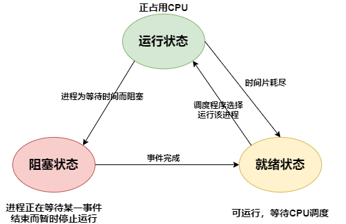
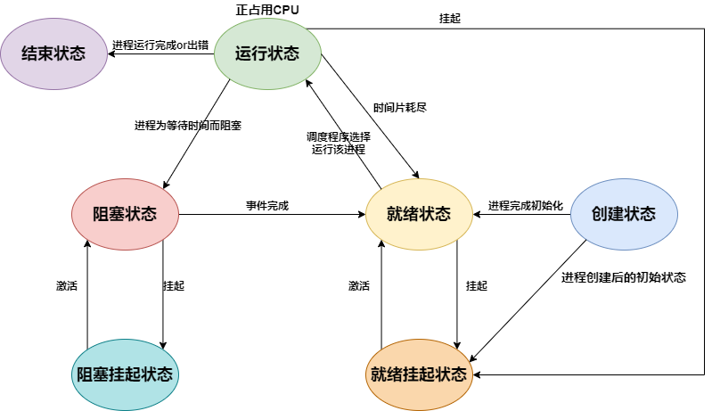
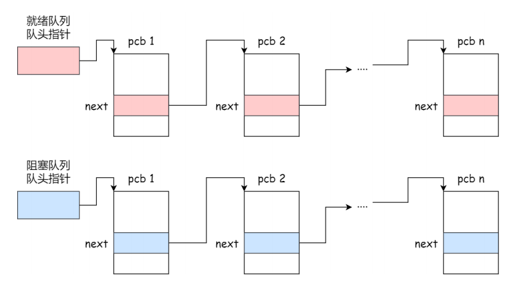
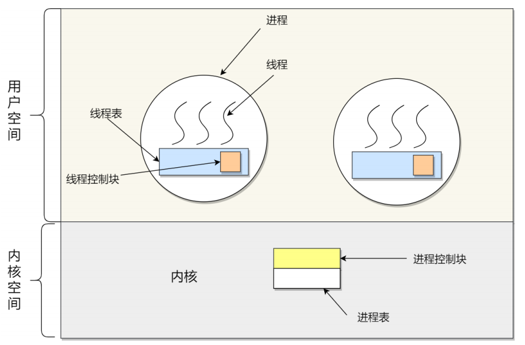
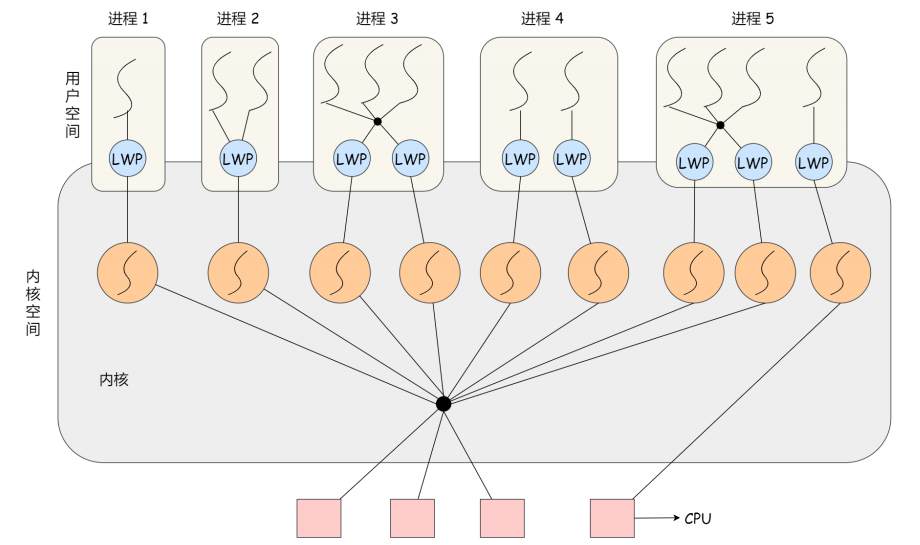

# 1. 进程

## 1.1 进程的概念和组成

* **进程**——OS为正在运行的程序提供的抽象，是OS进行资源调度和分配的基本单位，实现了OS的并发

* **OS**通过**时分复用技术**来虚拟化CPU

## 1.2 进程状态

### 1.2.1 三状态模型

### 1.2.2 五状态模型

* 如果有大量处于阻塞状态的进程，这些进程占用着物理内存，这不是我们希望看到的——所以OS通常会将阻塞状态的进程占用的物理内存交换到磁盘上，等再次需要运行的时候，再从磁盘换入内存

### 1.2.3 七状态模型

* 引入挂起状态，进程有三种情况会处于挂起状态
  * 进程的物理内存被交换到了磁盘上
  * 通过sleep将进程挂起
  * 用户希望挂起一个程序的执行，比如Linux中用 **Ctrl+Z**挂起进程

## 1.3 进程的控制结构PCB

* 在OS中，使用进程控制块（PCB）来描述进程状态

* PCB是进程的唯一标识

### 1.3.1 PCB包含的信息

* **进程描述信息**
  * 进程标识符：进程的唯一标识符
  * 用户标识符：进程归属的用户
* **进程控制和管理信息**
  * 进程状态
  * 进程优先级
* **资源分配清单**
  * 有关进程地址空间的信息
  * 进程打开的所有文件的文件描述符列表
  * 进程使用的IO设备信息
* **上下文信息**
  * 进程上一次结束调度时的上下文信息（各个寄存器值）

### 1.3.2 PCB组织方式

#### 1.3.2.1 链表

PCB是通过链表的方式进行组织——将具有相同状态的进程放在一起，组成一个队列

#### 1.3.2.2 索引

将同一状态的进程的PCB放在同一个索引表中，索引表项指向相应的PCB，不同的状态对应不同的索引表

# 2. 线程

## 2.1 线程概念

* 线程是程序中的一条执行流
* 同一个进程中的多个线程共享代码段，数据段，打开的文件列表等资源，但是每个线程都有自己独属的寄存器和栈——确保线程的控制流是相对独立的

## 2.2 进程与线程的区别

1. - 进程是OS为正在运行的程序提供的抽象，是OS进行资源管理和调度的基本单位，实现了OS的并发
   
   - 线程是OS进行任务执行和调度的基本单位，是程序内的一条执行流，实现了进程内部的并发

2. * 进程之间是相互独立的，每个进程都拥有一个完整的独属于自己的资源平台
   
   * 线程之间共享进程的地址空间，打开的文件描述符列表等资源，只拥有少量独属于自己的资源（程序计数器，栈）

3. **线程的时间效率，空间效率都优于进程**
   
   * **线程的创建比进程更快**，因为进程在创建过程中，需要分配的资源更多
   
   * **线程的终止比进程更快**，因为线程释放的资源更少
   
   * **线程切换开销更小**，线程切换只需要保存和切换少量数据即可，进程切换需要保存和切换大量的上下文数据（地址空间的数据，页表的数据，寄存器的数据）
   
   * 线程间的通信比进程间通信效率更高，因为线程共享进程的内存与文件资源

4. * 进程之间互不影响，进程崩溃不会影响其他进程
   
   * 一个线程挂掉可能会导致整个进程挂掉

## 2.3 线程的实现

线程有三种实现方式

* **用户线程**：在用户空间实现的线程，不是由内核管理，由用户态的线程库来完成线程的管理
* **内核线程**：在内核中实现的线程，由内核管理
* **轻量级进程（Light-weight)**：用户线程与内核线程组合实现

### 2.3.1 用户线程

* 用户态的线程库来实现用户线程，OS完全不知道用户线程的存在

* 线程控制块(TCB)也是在用户态的线程库中实现的，OS看不到TCB

* 用户线程的管理和调度，是由用户态的线程库函数来完成，OS不直接参与

* 每个进程在用户空间维护一个用户线程的TCB列表

* **优点**
  * 用户线程切换不需要使用内核空间，速度快
  * 用户线程调度由进程自己决定
* **缺点**
  * OS不知道用户线程的存在，**OS调度时是对进程进行调度**，只会**给进程分配一个CPU**，只能有一个用户线程运行，无法利用多核CPU
  * 如果用户线程发起系统调用被阻塞，进程中的其他用户线程也无法获得CPU资源，整个进程被阻塞

### 2.3.2 内核线程

* 内核线程由OS管理，OS内核中为每个内核线程都维护了一个TCB
* OS内核维护一个内核线程的TCB列表，内核线程的管理和调度都由OS负责

* **优点**
  * OS调度是对**内核线程**进行调度，一个进程可以分配到多个CPU资源，同时有多个内核线程并行运行
  * 如何一个内核线程发起系统调用被阻塞了，其他内核线程不会受到影响
* **缺点**
  * 由内核来维护PCB和TCB，并且线程的管理和调度都是通过系统调用进行，开销比较大

### 2.3.3 轻量级进程(Light-weight process)

* 一个进程可以有多个LWP

* 每个LWP都由一个内核线程支持

* 内核线程与用户线程的对应关系有三种
  
  * 1：1
  * 1：N
  * M：N

## 2.4 线程通信方式

* 共享内存
  
  * 线程通过内存中某些变量进行隐式通信

* 消息传递
  
  * 线程向另一个线程发送信息来显示通信
